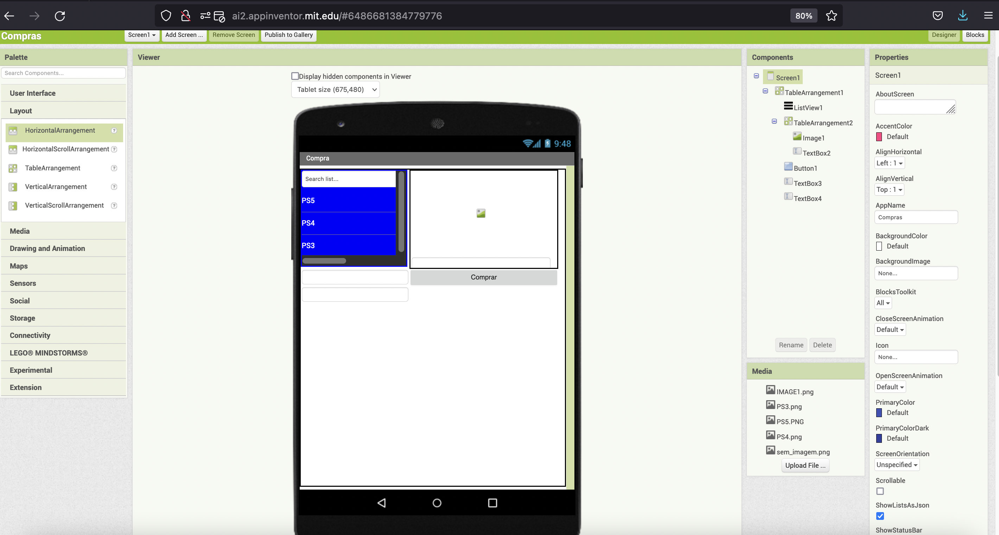
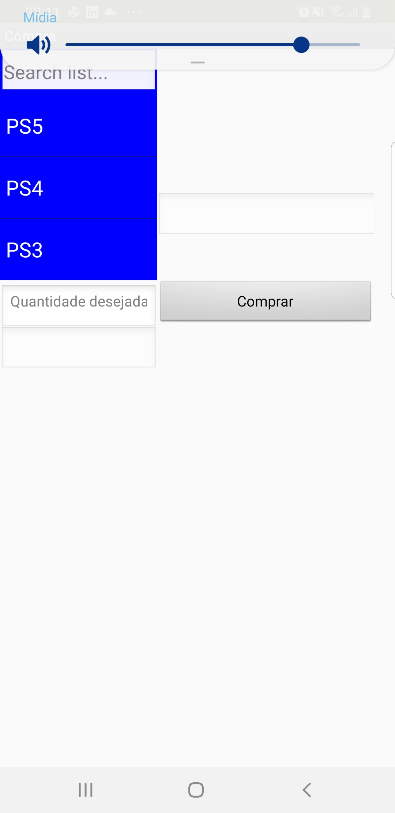
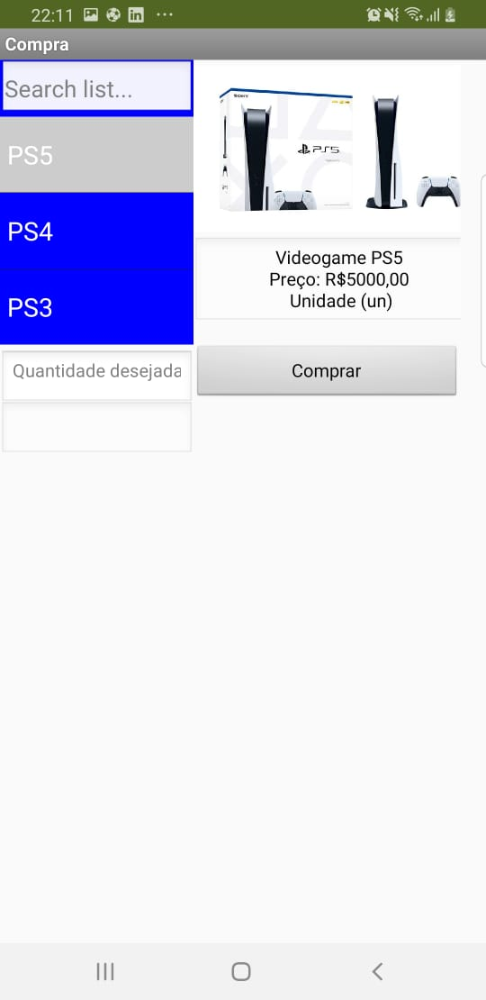
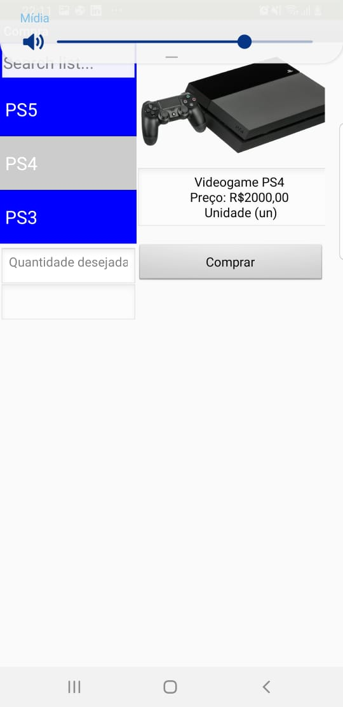
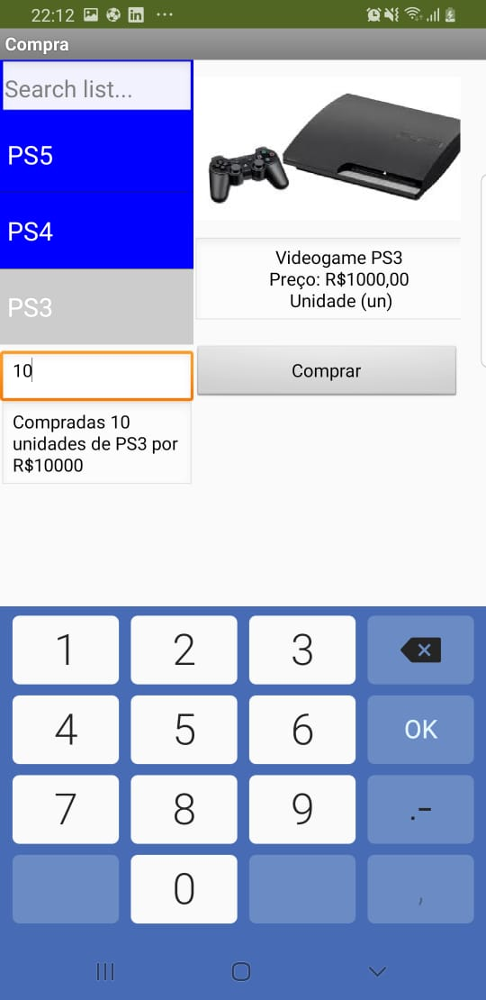
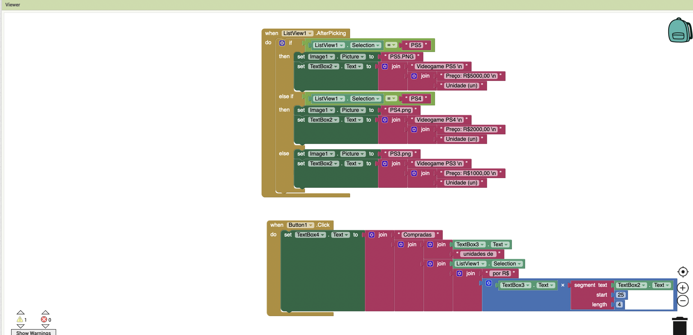
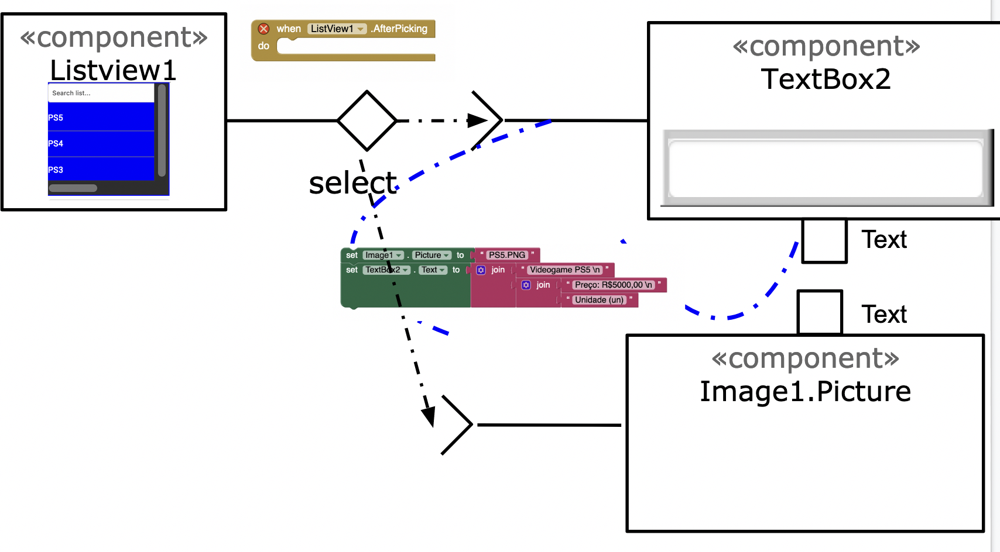
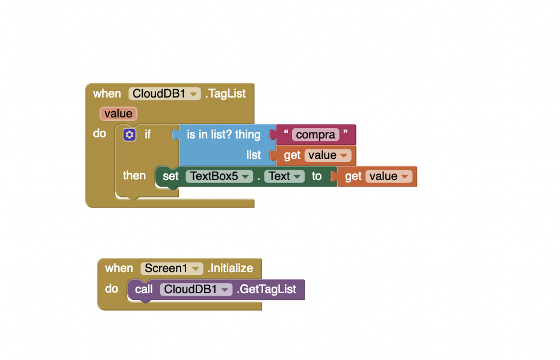

# Modelo para Apresentação do Lab03 - MVC

Estrutura de pastas:

~~~
├── README.md  <- arquivo apresentando a tarefa
│
├── images     <- arquivos de imagens usadas no documento
│
└── app        <- app do MIT App Inventor exportado em formato `aia`
~~~

# Aluno
* Rodrigo Leonel Sartorato

# Tarefa 1 - App no MIT App Inventor

> 
> 
> 
> 
> 
> 
> 

> 

# Tarefa 2 - Diagrama de Componentes dirigida a Eventos

> 

# Tarefa 3 - App com CoudDB

> 
> 
> 
> 

> 
