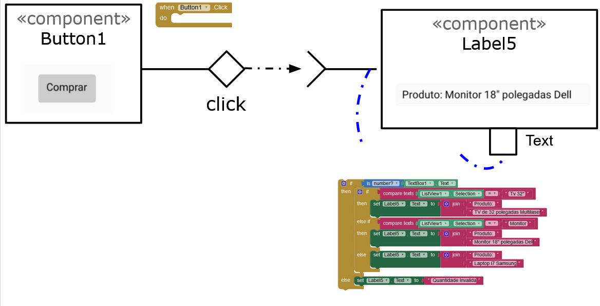
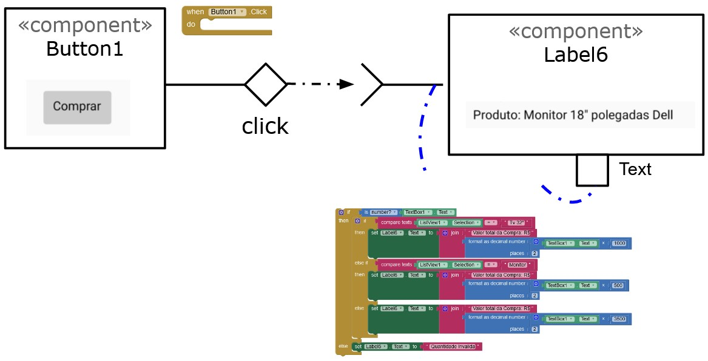
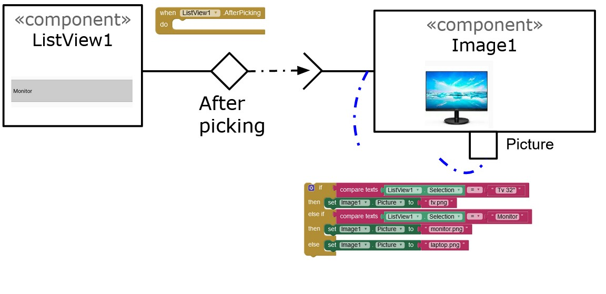
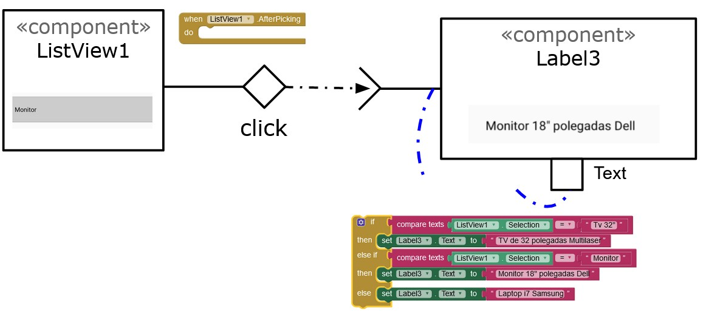
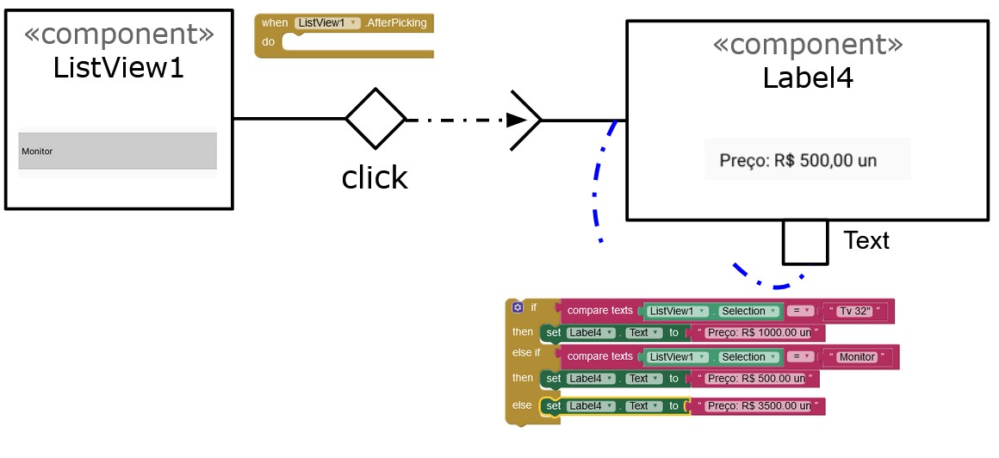

# Aluno
* André Fagundes Carvalho - ex150375

# Tarefa 1 - App no MIT App Inventor

> * tela 1 - captura da tela completa de design de interface
> 

> * tela 2 - captura de tela do app com nenhum produto selecionado

     

> * tela 3 - captura de tela do app com primeiro produto selecionado

     

> * tela 4 - captura de tela do app com segundo produto selecionado

     

> * tela 5 - compra de um dos produtos efetivada

     

> * tela 6 - diagrama de blocos do aplicativo

     

> Arquivo do aplicativo exportado a partir do MIT App Inventor em formato `aia`.
> 

# Tarefa 2 - Diagrama de Componentes dirigida a Eventos

> Diagrama evento Button1 para Label5
> 

> Diagrama evento Button1 para Label6
> 

> Diagrama evento ListView1 para Image1
> 

> Diagrama evento ListView1 para Label3
> 

> Diagrama evento ListView1 para Label4
> 

# Tarefa 3 - App com CoudDB

> Coloque as imagens PNG da captura de quatro telas do seu aplicativo:
> * tela 1 - captura da tela completa de design de interface

     

> * tela 2 - captura de tela do app com nenhum produto selecionado

     

> * tela 3 - captura de tela do app com dois com compra efetivados e aparecendo na **Lista de Produtos a Serem Comprados**

     

> * tela 4 - diagrama de blocos do aplicativo mostrando apenas aqueles relacionados com o CloudDB

     

> Link para o arquivo do aplicativo exportado a partir do MIT App Inventor em formato `aia`.
> 

