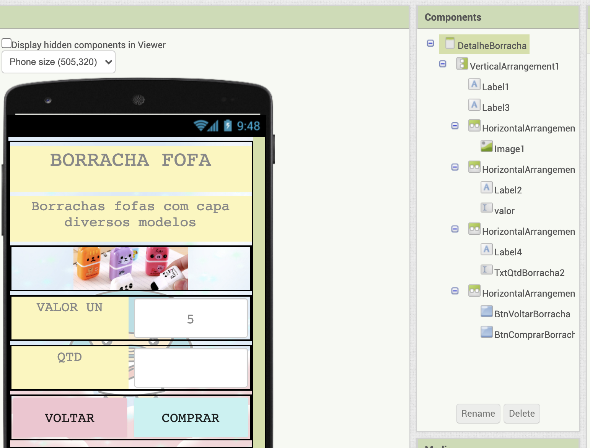

# Lab03 - MVC

Estrutura de pastas:

~~~
├── README.md  <- arquivo apresentando a tarefa
│
├── images     <- arquivos de imagens usadas no documento
│
└── app        <- apps do MIT App Inventor exportados em formato `aia`
~~~

# Aluno
* `Amanda Souza Macedo Bacelli`

# Tarefa 1 - App no MIT App Inventor

### App no MIT App Inventor
* [Link Aplicativo](app/INF331Lab3.aia)

# Tarefa 2 - Diagrama de Componentes dirigida a Eventos

# Tarefa 3 - App com CoudDB
> Obs: não consegui finalizar :cry:
* [Link Aplicativo com CloudDB](app/INF331Lab3CloudDB.aia)
