# Lab03 - MVC

Estrutura de pastas:

~~~
├── README.md  <- arquivo apresentando a tarefa
│
├── images     <- arquivos de imagens usadas no documento
│
└── app        <- apps do MIT App Inventor exportados em formato `aia`
~~~

# Aluno
* `Juliana Fernandes`

# Tarefa 1 - App no MIT App Inventor

> * Tela 1 - Captura da tela completa de design de interface
> 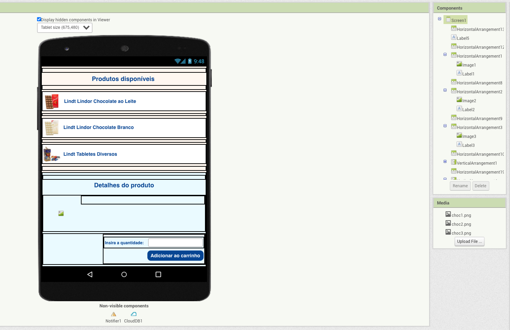

> * Tela 2 - Captura de tela do app com nenhum produto selecionado
> 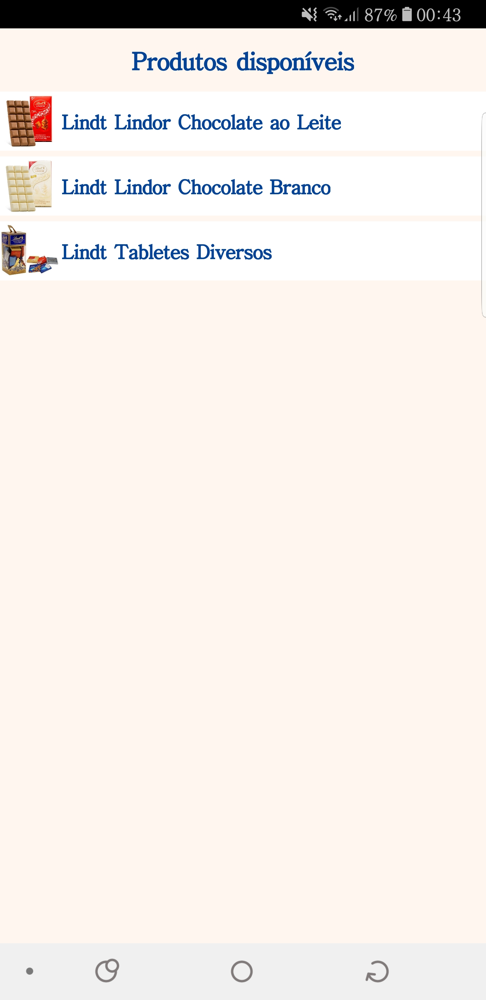

> * Tela 3 - Captura de tela do app com primeiro produto selecionado
> 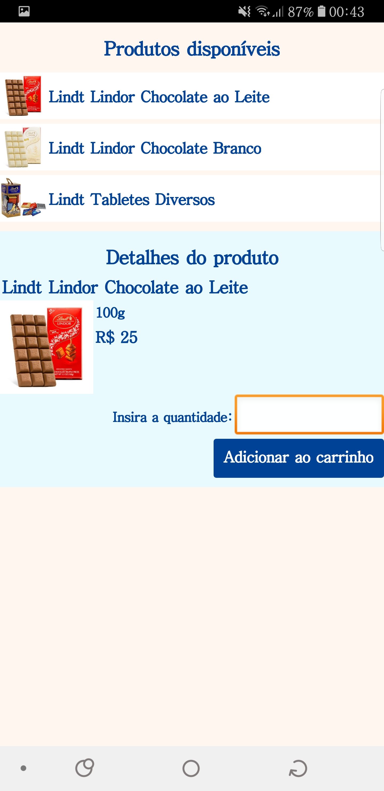

> * Tela 4 - Captura de tela do app com segundo produto selecionado
> 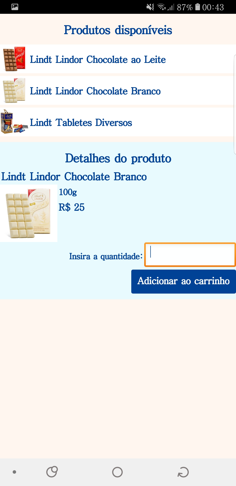

> * Tela 5 - Compra de um dos produtos efetivada
> 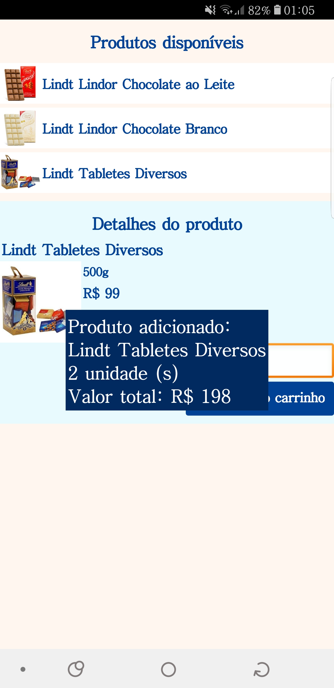

> * Tela 6 - Diagrama de blocos do aplicativo
> 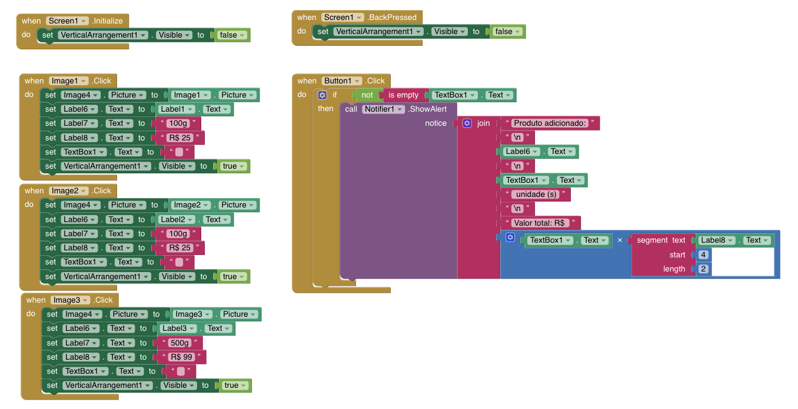

> [Arquivo do aplicativo exportado a partir do MIT App Inventor em formato `aia` em `app/inf331_lab03_tarefa1.aia`](app/inf331_lab03_tarefa1.aia)

# Tarefa 2 - Diagrama de Componentes dirigida a Eventos

> 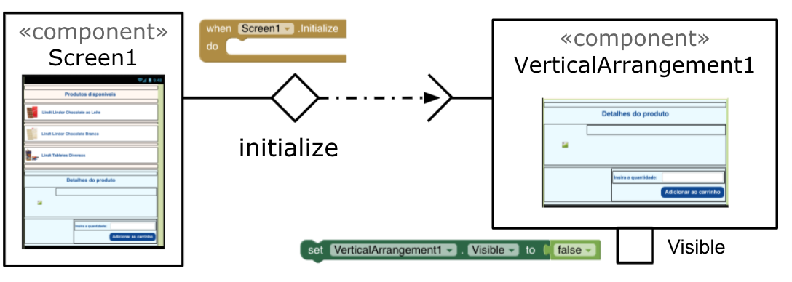

> 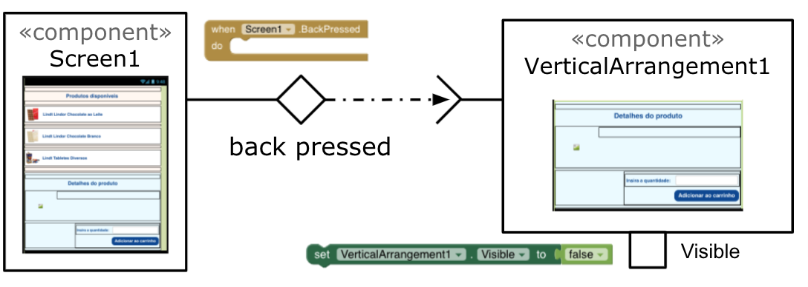

> 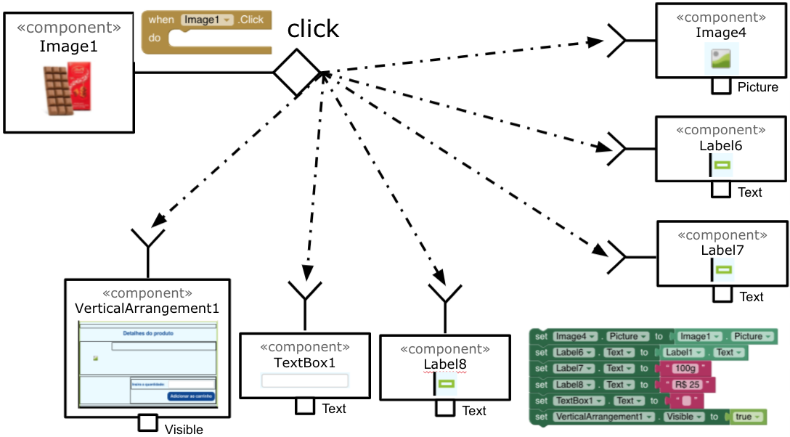

> 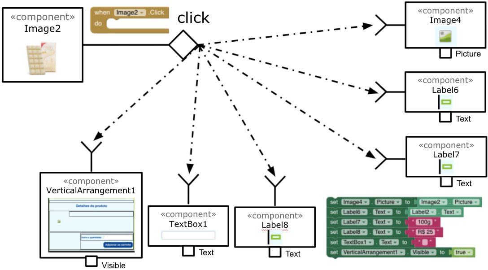

> 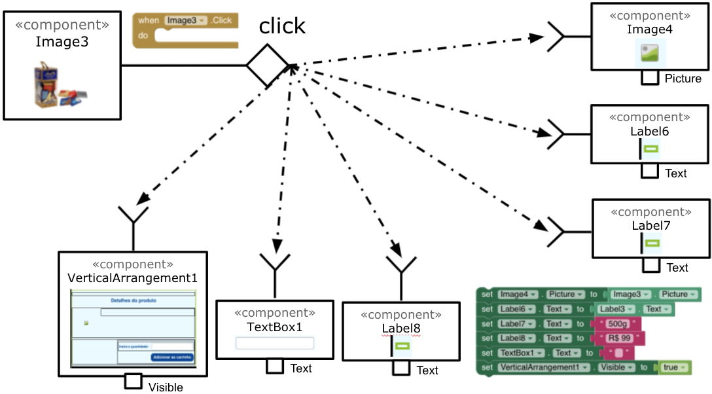

> 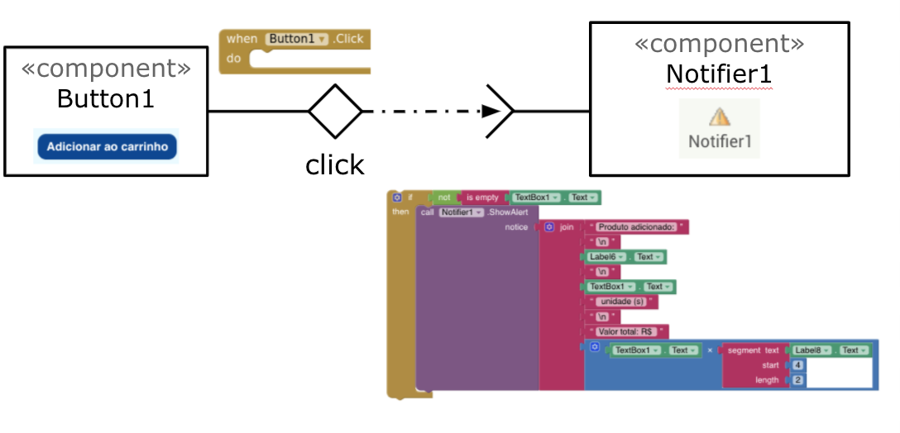

# Tarefa 3 - App com CoudDB

> * Tela 1 - Captura da tela completa de design de interface
> 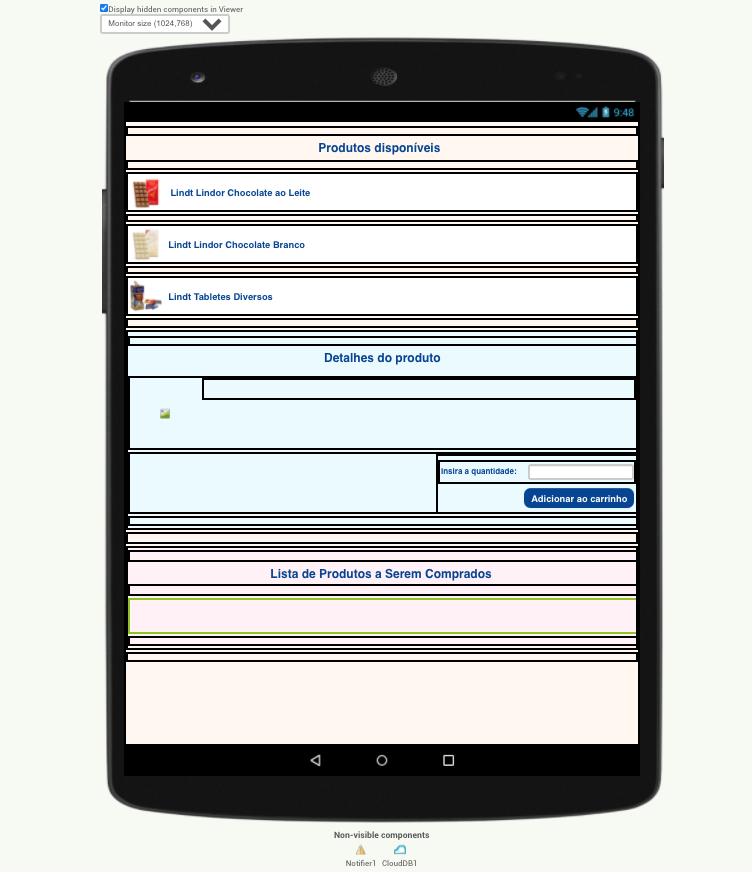

> * Tela 2 - Captura de tela do app com nenhum produto selecionado
> 

> * Tela 3 - Captura de tela do app com dois produtos com compra efetivados e aparecendo na **Lista de Produtos a Serem Comprados**
> 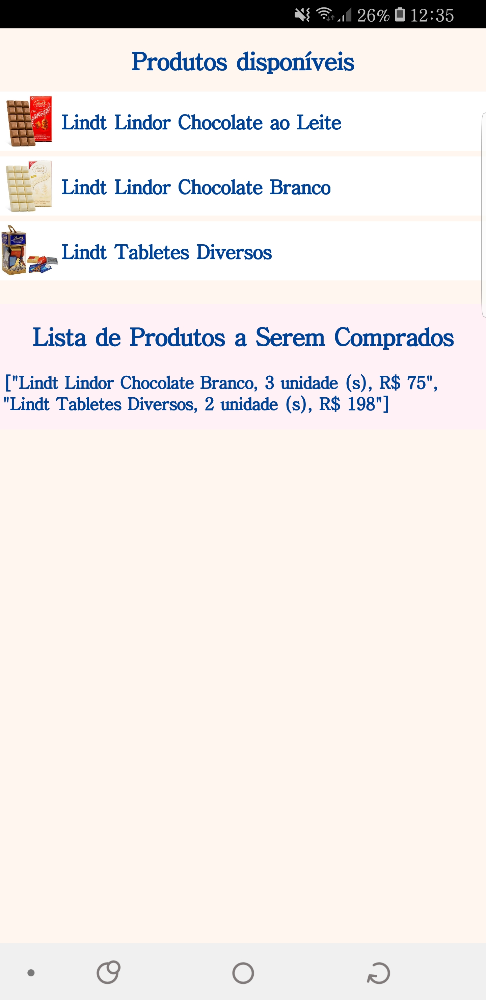

> * Tela 4 - Diagrama de blocos do aplicativo mostrando apenas aqueles relacionados com o CloudDB
> 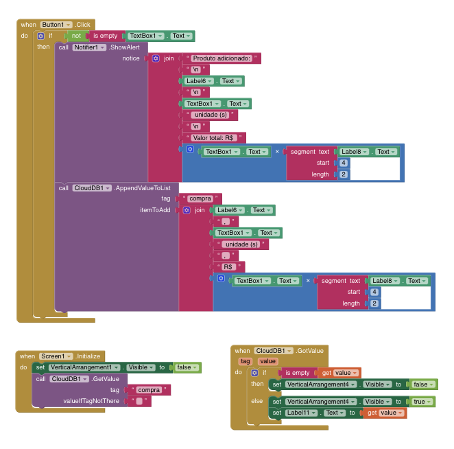

> [Arquivo do aplicativo exportado a partir do MIT App Inventor em formato `aia` em `app/inf331_lab03_tarefa3.aia`](app/inf331_lab03_tarefa3.aia)
