# Aluno
* `Matheus Raposo Frauches Vieira Sias | ex150340`

# Tarefa 1 - App no MIT App Inventor

> * Tela 1 - captura da tela completa de design de interface
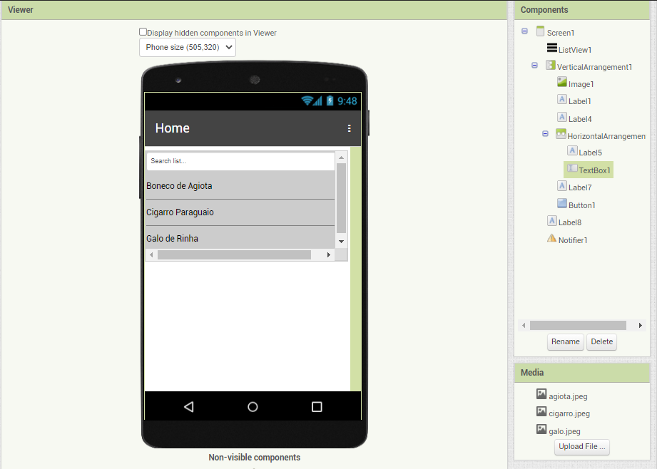

> * tela 2 - captura de tela do app com nenhum produto selecionado
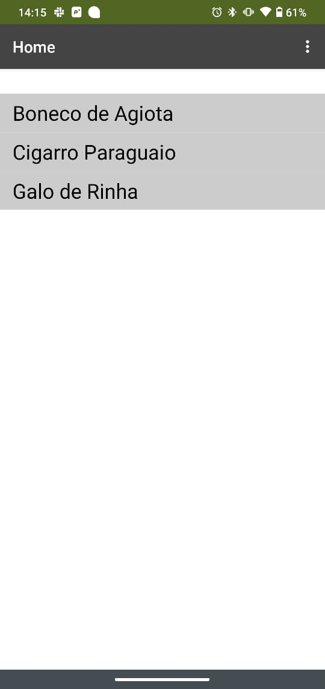

> * tela 3 - captura de tela do app com primeiro produto selecionado
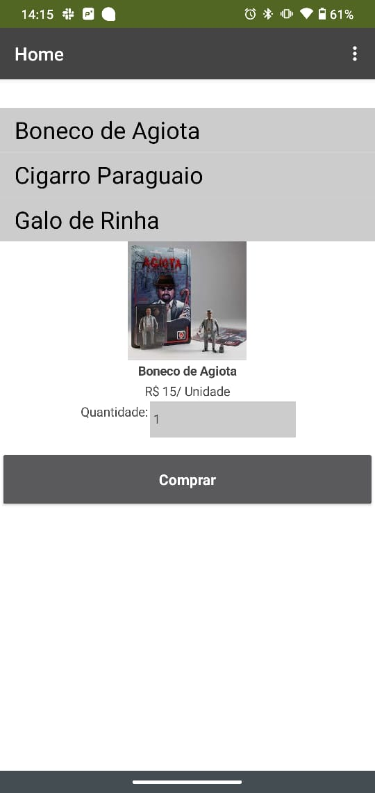

> * tela 4 - captura de tela do app com segundo produto selecionado
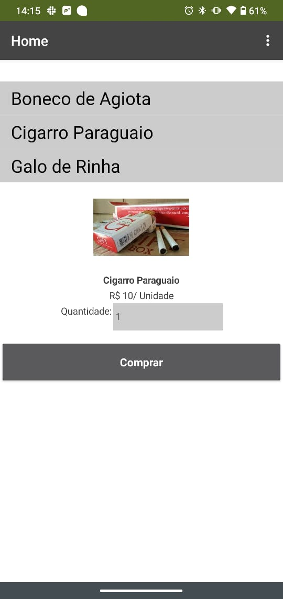

> * tela 5 - captura de tela do app com terceiro produto selecionado
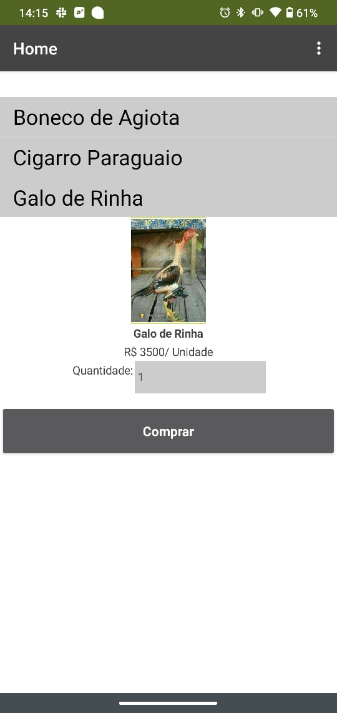

> * tela 6 - compra de um dos produtos efetivada

> * tela 7 - diagrama de blocos do aplicativo
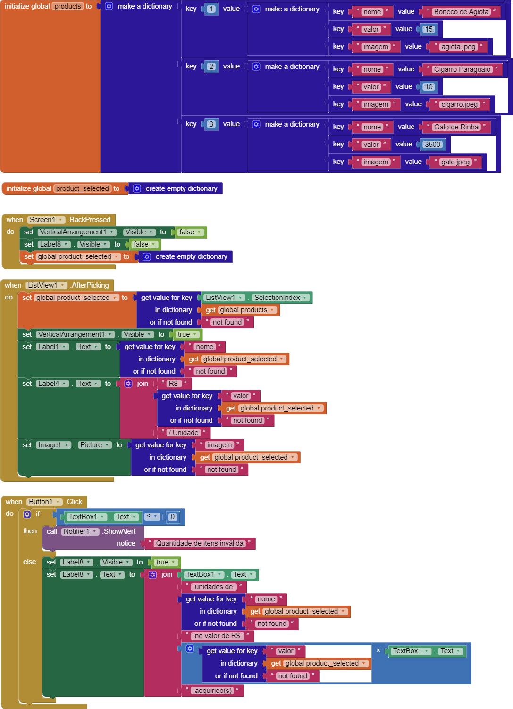

Para acessar o arquivo do projeto [clique aqui](./app/frauches_marketplace.aia)

# Tarefa 2 - Diagrama de Componentes dirigida a Eventos

> Coloque a imagem PNG do diagrama, conforme exemplo a seguir:
>
> 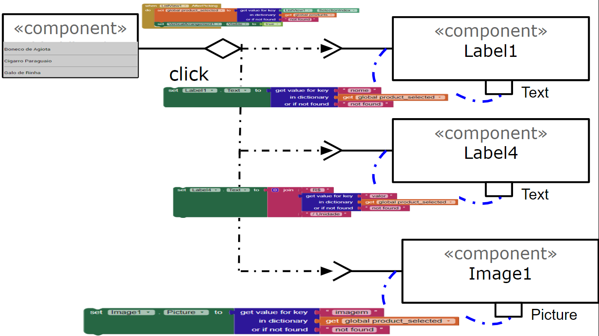

# Tarefa 3 - App com CoudDB

> Coloque as imagens PNG da captura de quatro telas do seu aplicativo:
> * tela 1 - captura da tela completa de design de interface
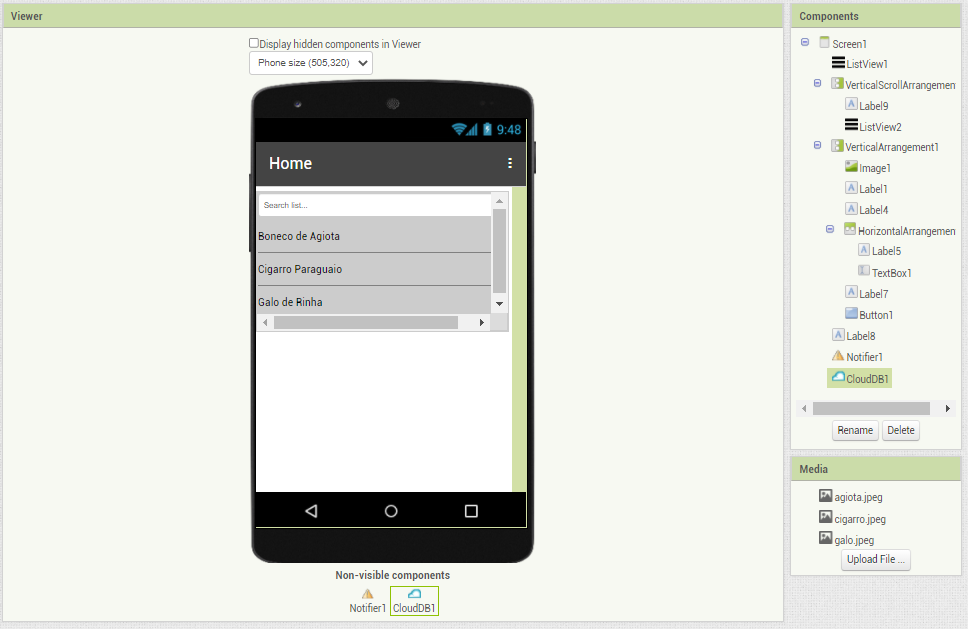

> * tela 2 - captura de tela do app com nenhum produto selecionado

> * tela 3 - captura de tela do app com dois com compra efetivados e aparecendo na **Lista de Produtos a Serem Comprados**
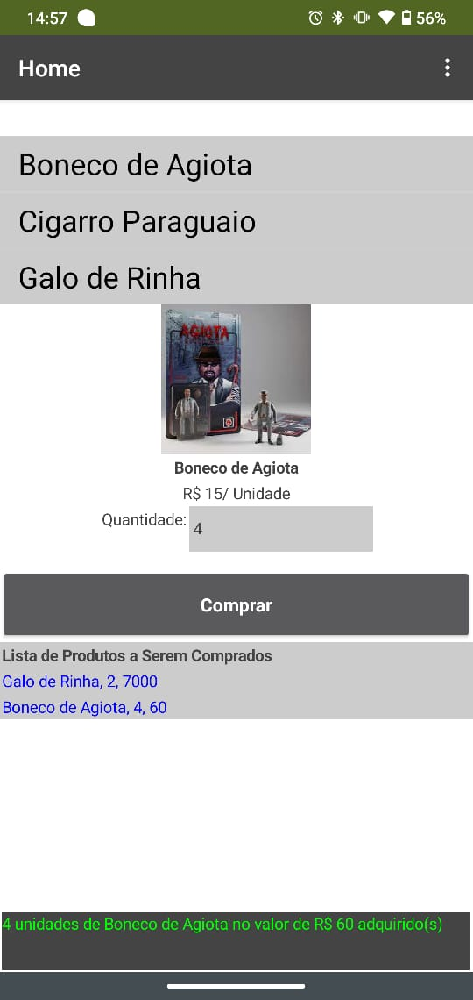

> * tela 4 - diagrama de blocos do aplicativo mostrando apenas aqueles relacionados com o CloudDB
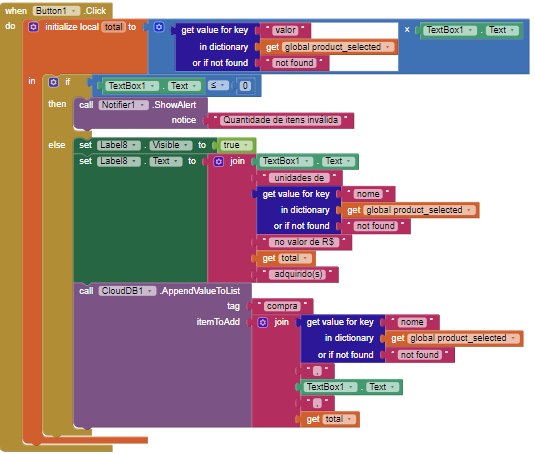
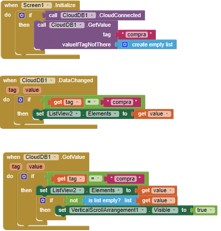

Para acessar o arquivo do projeto [clique aqui](./app/frauches_marketplace_clouddb.aia)
