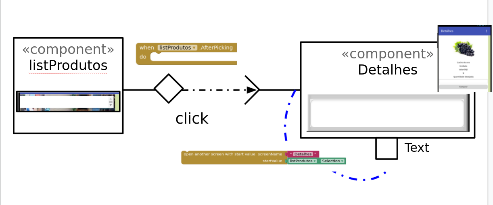

 # Modelo para Apresentação do Lab03 - MVC

Estrutura de pastas:

~~~
├── README.md  <- arquivo apresentando a tarefa
│
├── images     <- arquivos de imagens usadas no documento
│
└── app        <- apps do MIT App Inventor exportados em formato `aia`
~~~

# Aluno
* Felipe Iada Tomitar Vilar

# Tarefa 1 - App no MIT App Inventor

1 - Captura da tela completa de design de interface
> 
> 
> 

2 - Captura de tela do app com nenhum produto selecionado
> 

3 - Captura de tela do app com primeiro produto selecionado na lista
> 
> 

4 - Captura de tela do app com segundo produto selecionado na lista
> 
> 

5 - Compra
> 
> 
> 

6 - Diagrama de blocos
> 
> 
> 

7 - Link da aplicação
> 

# Tarefa 2 - Diagrama de Componentes dirigida a Eventos

> 
> 
> 

# Tarefa 3 - App com CoudDB

1- Captura do design das Telas
> 
> 
> 

2 - Captura de tela do app com nenhum produto selecionado
e
3 - Captura de tela do app com dois com compra efetivados e aparecendo na **Lista de Produtos a Serem Comprados**
> 

4 - Diagrama de blocos do aplicativo mostrando apenas aqueles relacionados com o CloudDB
> 
> 

5 - Link da aplicação
> 
