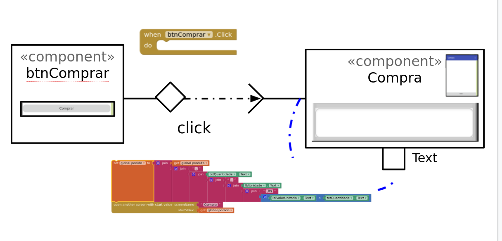

 # Modelo para Apresentação do Lab03 - MVC

Estrutura de pastas:

~~~
├── README.md  <- arquivo apresentando a tarefa
│
├── images     <- arquivos de imagens usadas no documento
│
└── app        <- apps do MIT App Inventor exportados em formato `aia`\
~~~

# Aluno
* Felipe Iada Tomitar Vilar

# Tarefa 1 - App no MIT App Inventor

1 - Captura da tela completa de design de interface\
`Tela 1`\
\
`Tela 2`\
\
`Tela 3`\

2 - Captura de tela do app com nenhum produto selecionado\
`Tela sem produtos selecionados`\

3 - Captura de tela do app com primeiro produto selecionado na lista\
`Tela com produto selecionado`\
\
`Descrição`\

4 - Captura de tela do app com segundo produto selecionado na lista\
`Tela com produto selecionado`\
\
`Descrição`\

5 - Compra\
`Compra - Seleção de produto`\
\
`Compra - Detalhe do produto`\
\
`Compra - Compra efetivada`\

6 - Diagrama de blocos\
`Diagrama de blocos - tela 1`\
\
`Diagrama de blocos - tela 2`\
\
`Diagrama de blocos - tela 3`\

7 - Link da aplicação\
`Link do App`\
\

# Tarefa 2 - Diagrama de Componentes dirigida a Eventos

`Diagrama Eventos 1`\
\
`Diagrama Eventos 2`\
\
`Diagrama Eventos 3`\

# Tarefa 3 - App com CoudDB

1- Captura do design das Telas\
`Tela 1`\
\
`Tela 2`\
\
`Tela 3`\

2 - Captura de tela do app com nenhum produto selecionado
e
3 - Captura de tela do app com dois com compra efetivados e aparecendo na **Lista de Produtos a Serem Comprados**\
`Vídeo ilustrando a compra de 2 produtos`\

4 - Diagrama de blocos do aplicativo mostrando apenas aqueles relacionados com o CloudDB\
`Tela de detalhes`\
\
`Tela de compra`\

5 - Link da aplicação\
`Link do App`\
\

