# Modelo para Apresentação do Lab03 - MVC

Estrutura de pastas:

~~~
├── README.md  <- arquivo apresentando a tarefa
│
├── images     <- arquivos de imagens usadas no documento
│
└── app        <- apps do MIT App Inventor exportados em formato `aia`
~~~

# Aluno
* `Hélio De Rosa Junior`

# Tarefa 1 - App no MIT App Inventor

Captura da tela completa de design de interface

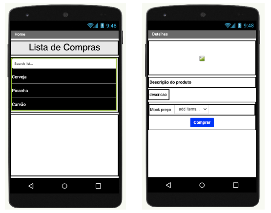

Captura de tela do app com nenhum produto selecionado

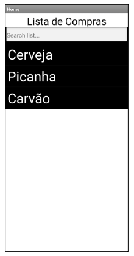

Captura de tela do app com primeiro produto selecionado

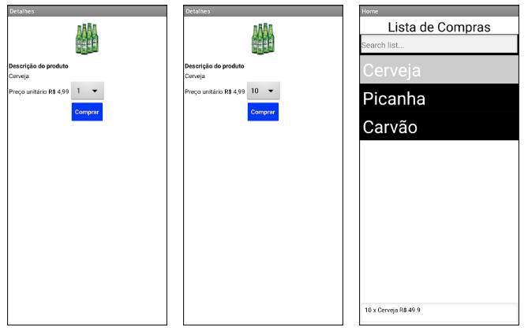

Captura de tela do app com segundo produto selecionado

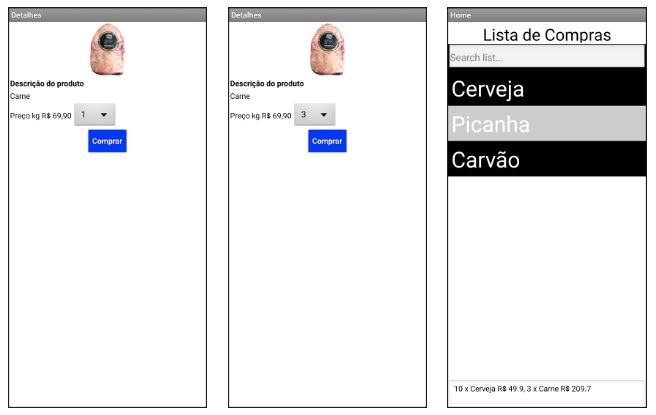

Compra de um dos produtos efetivada

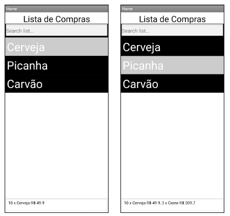

Diagrama de blocos do aplicativo

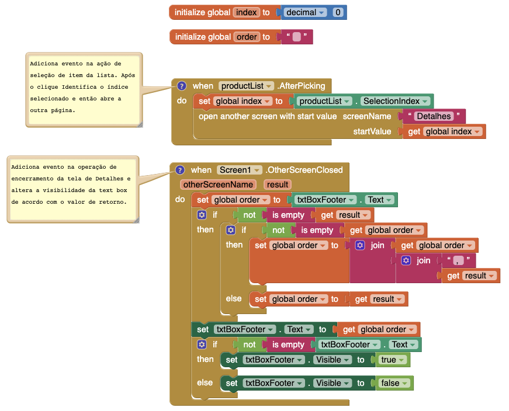

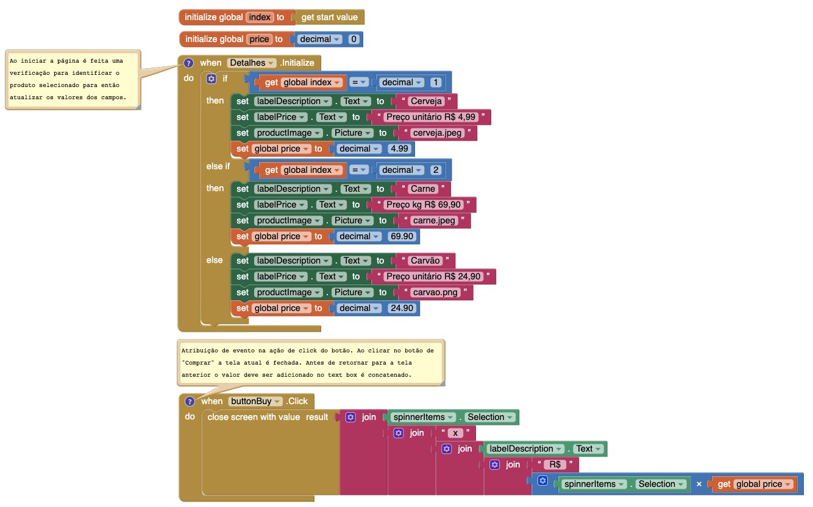

 [Arquivo aia tarefa 1](app/listaCompras.aia).

 # Tarefa 2 - Diagrama de Componentes dirigida a Eventos

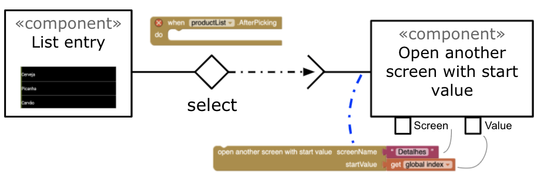

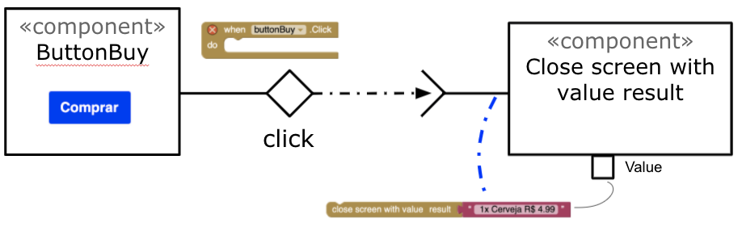

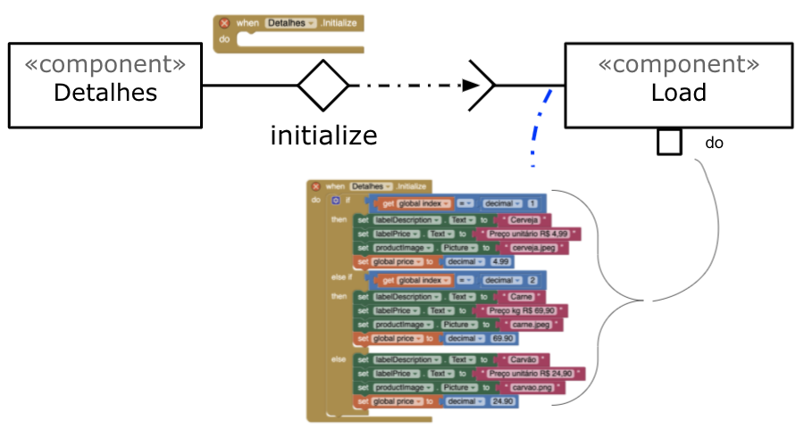

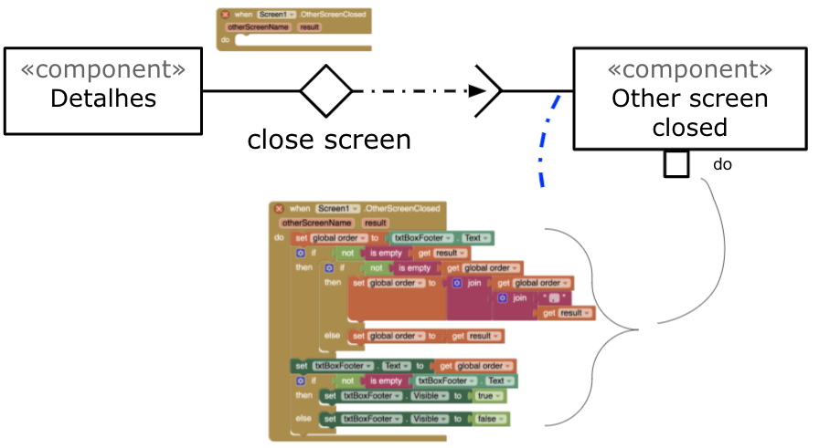