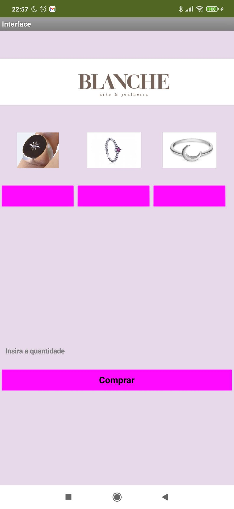
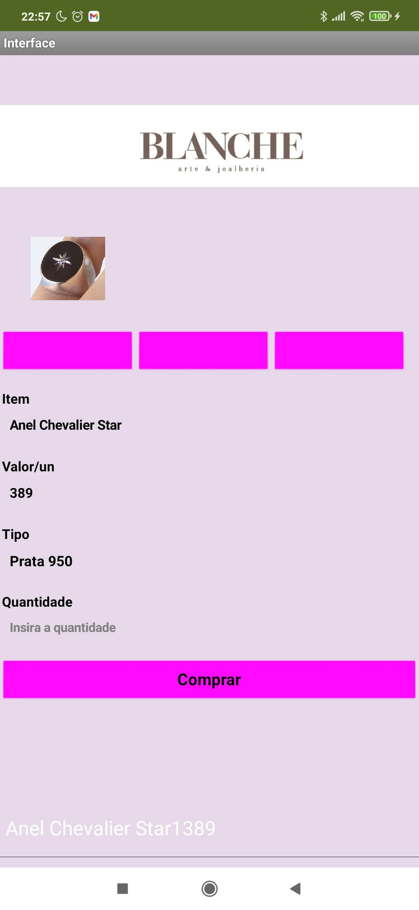
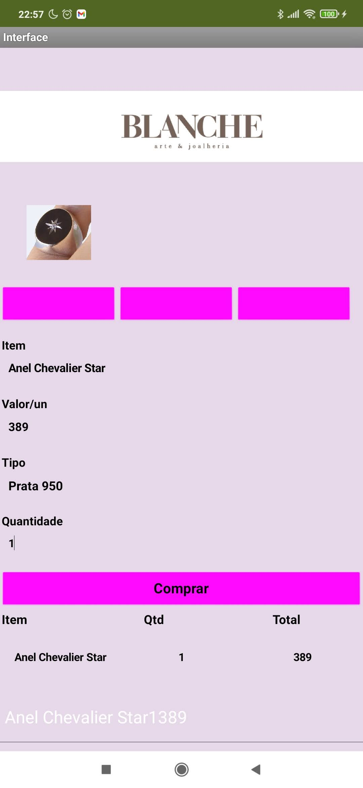
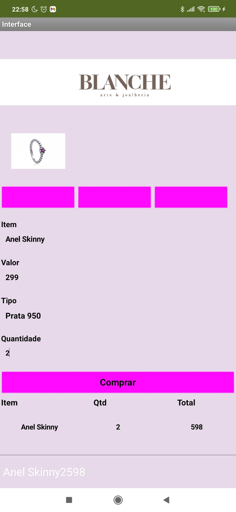
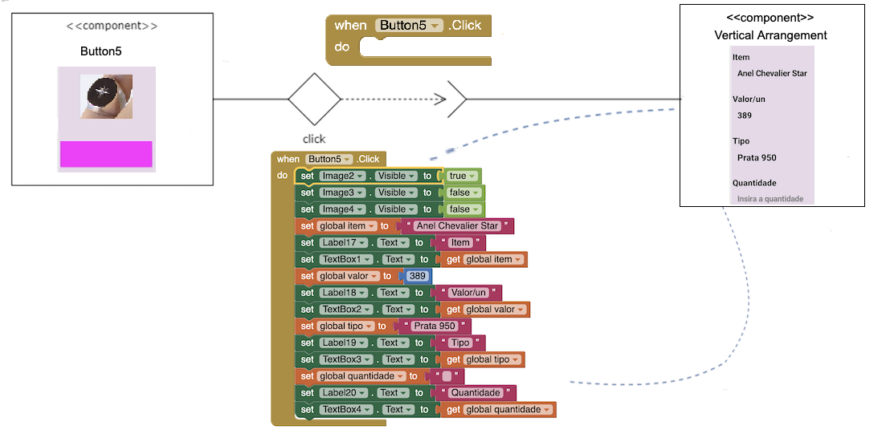
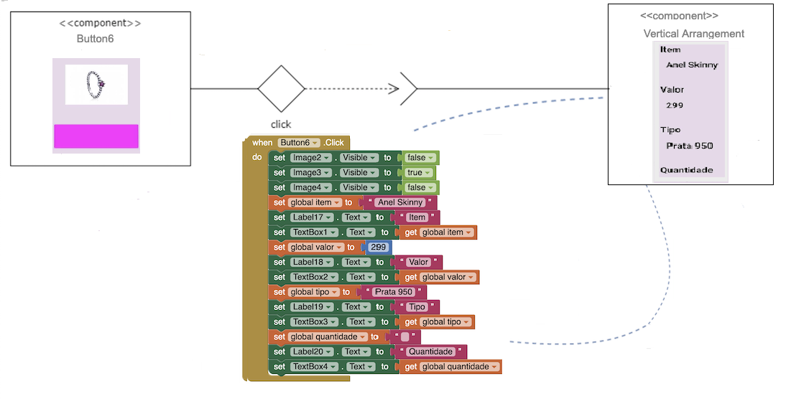
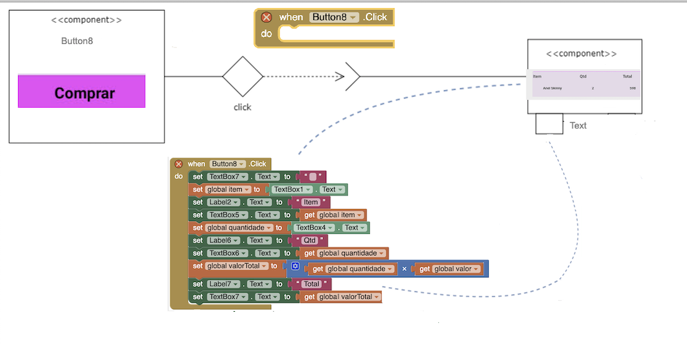
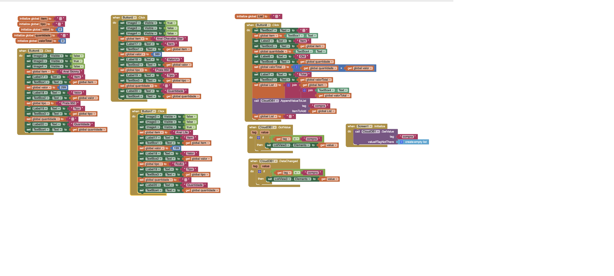

# Aluno
* Isadora Mendonça de Oliveira  ex150703

### Imagens Interface e Telas

### Imagens Diagramas

### Arquivo 'aia'
> Link para o arquivo *.aia do projeto MIT App Inventor:
>[MIT APP Inventor](./app/Trabalho_3.aia)

