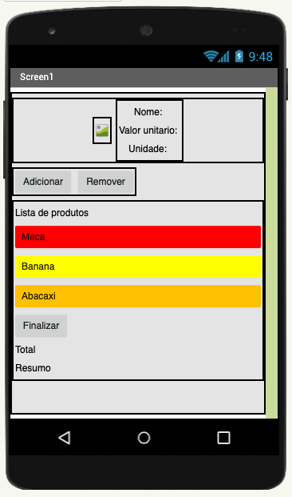
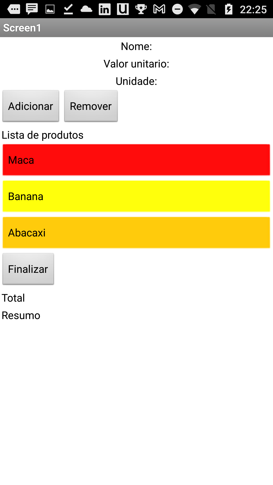
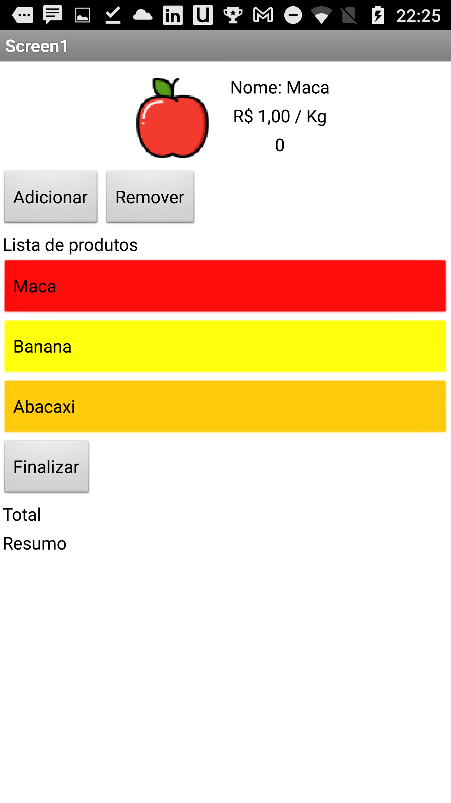
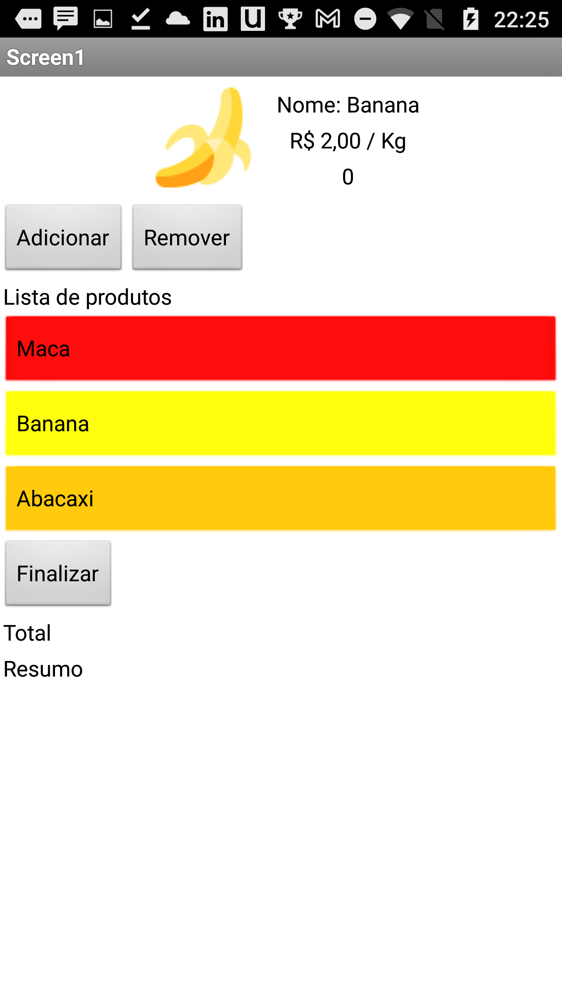
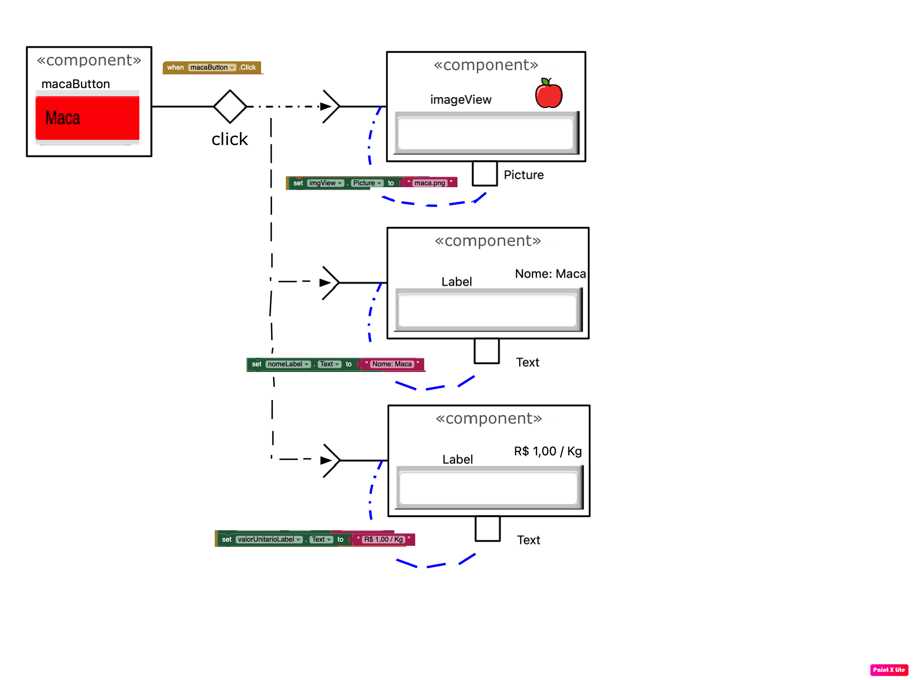

# Modelo para Apresentação do Lab03 - MVC

# Aluno
* `Tiago Fernandes de Oliveira`

# Tarefa 1 - App no MIT App Inventor

# Tarefa 2 - Diagrama de Componentes dirigida a Eventos

# Tarefa 3 - App com CoudDB

