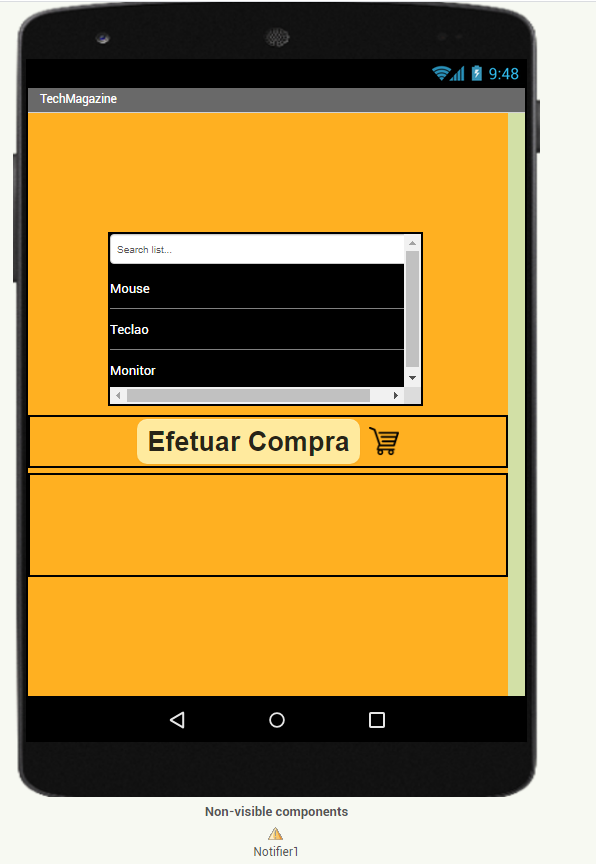
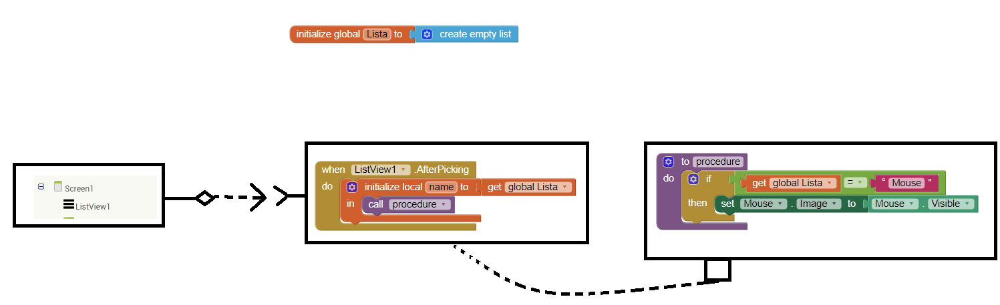
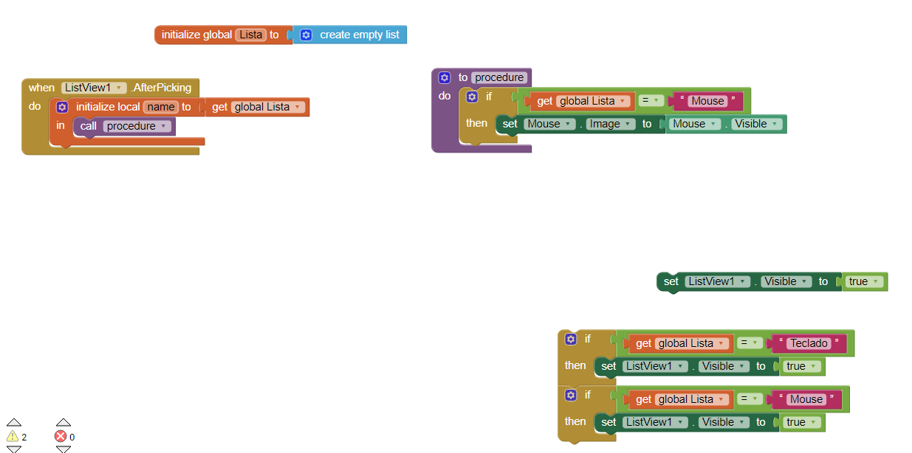

# Modelo para Apresentação do Lab03 - MVC

Estrutura de pastas:

~~~
├── README.md  <- arquivo apresentando a tarefa
│
├── images     <- arquivos de imagens usadas no documento
│
└── app        <- apps do MIT App Inventor exportados em formato `aia`
~~~

# Aluno
* `Jean Costa Campos da Silva - EX150334`

> Caro professor André e monitor Marcos, com pesar e vergonha que venho por meio deste entregar a tarefa refente ao LAB-3 do curso INF-331 incompleta.
>
> Confesso que tentei por inúmeras vezes completar o requerido, porém sem sucesso.
> 
>Lamento ter falhado no cumprimento do objetivo.
>
> Envio abaixo o que consegui realizar.
>
> O mais difícil na realização da tarefa, foi entender a lógica do inserir a "programação" no bloco.
>
> Sinceras desculpas,
>
> Jean Silva

# Tarefa 1 - App no MIT App Inventor

> Coloque as imagens PNG da captura de seis telas do seu aplicativo:
> * 
> * tela 2 - captura de tela do app com nenhum produto selecionado **Falhei**
> * tela 3 - captura de tela do app com primeiro produto selecionado **Falhei**
> * tela 4 - captura de tela do app com segundo produto selecionado **Falhei**
> * tela 5 - compra de um dos produtos efetivada **Falhei**
> * tela 6 - diagrama de blocos do aplicativo **Falhei**
> [Arquivo exportado a partir do MIT App Inventor em formato aia - lista_de_compras_jeancostacampos.aia](lista_de_compras_jeancostacampos.aia)
>

# Tarefa 2 - Diagrama de Componentes dirigida a Eventos

> Coloque a imagem PNG do diagrama, conforme exemplo a seguir:
>
> 

# Tarefa 3 - App com CloudDB

> Coloque as imagens PNG da captura de quatro telas do seu aplicativo:
> * tela 1 - captura da tela completa de design de interface **Falhei**
> * tela 2 - captura de tela do app com nenhum produto selecionado **Falhei**
> * tela 3 - captura de tela do app com dois com compra efetivados e aparecendo na **Lista de Produtos a Serem Comprados** **Falhei**
> * tela 4 - diagrama de blocos do aplicativo mostrando apenas aqueles relacionados com o CloudDB **Falhei**
>
> [Arquivo exportado a partir do MIT App Inventor em formato aia - lista_de_compras_jeancostacampos.aia](lista_de_compras_jeancostacampos.aia)
>
> As telas devem ser apresentadas conforme exemplos a seguir.
>
> Exemplo de uma captura de tela completa de design de interface:
>
> **Não consegui realizar a tarefa**
>
> Exemplo de uma captura de tela do app:
>
> **Não consegui realizar a tarefa**
>
> Tela do diagrama de blocos:
>
> 