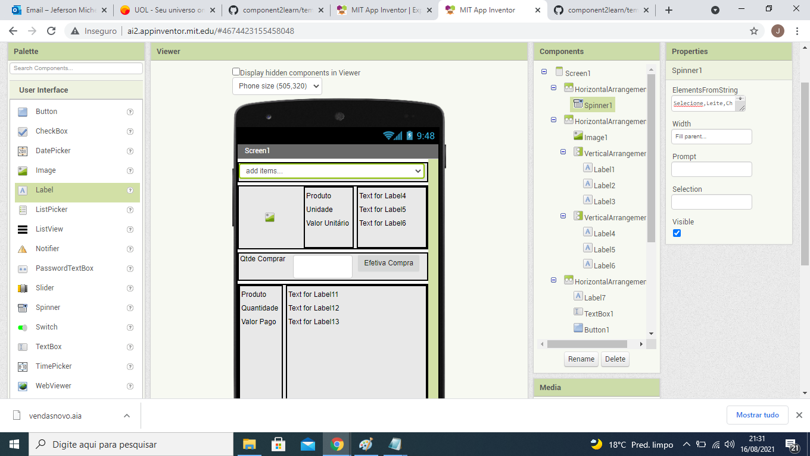
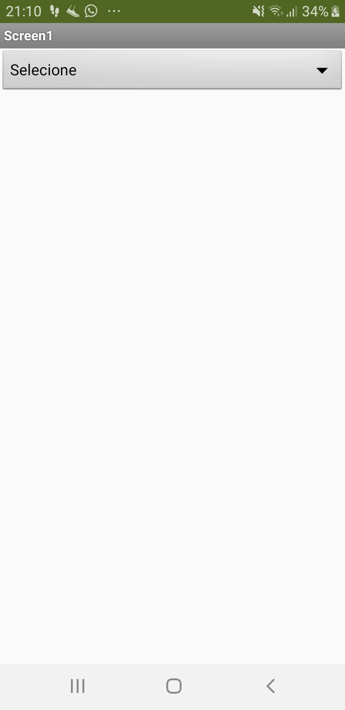
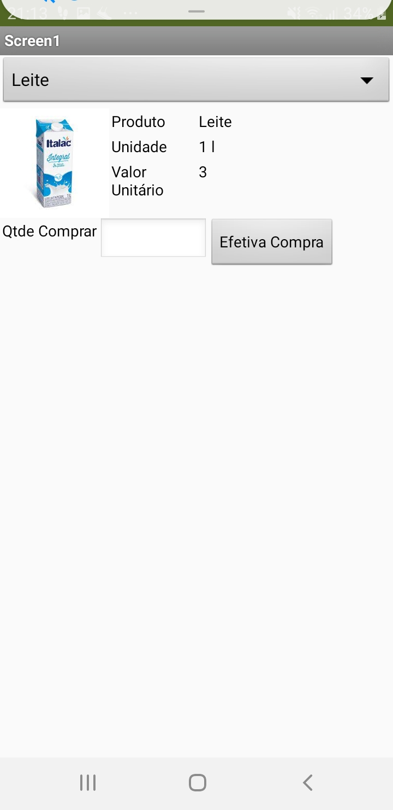
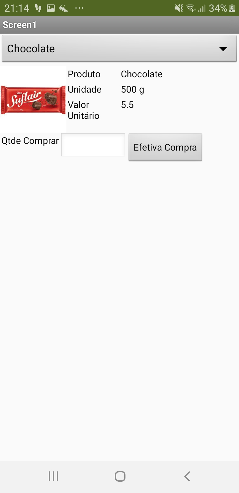
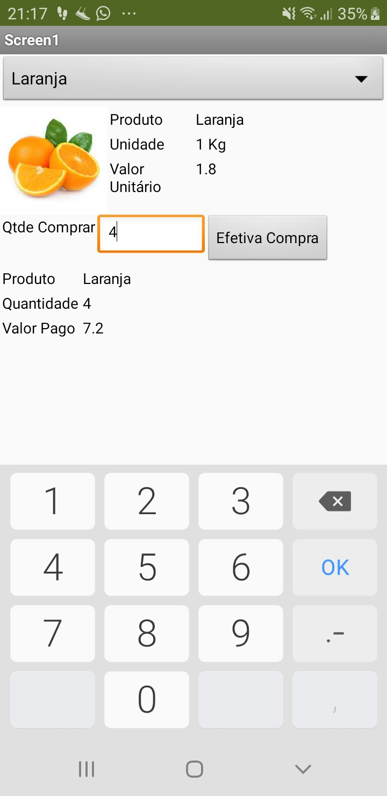
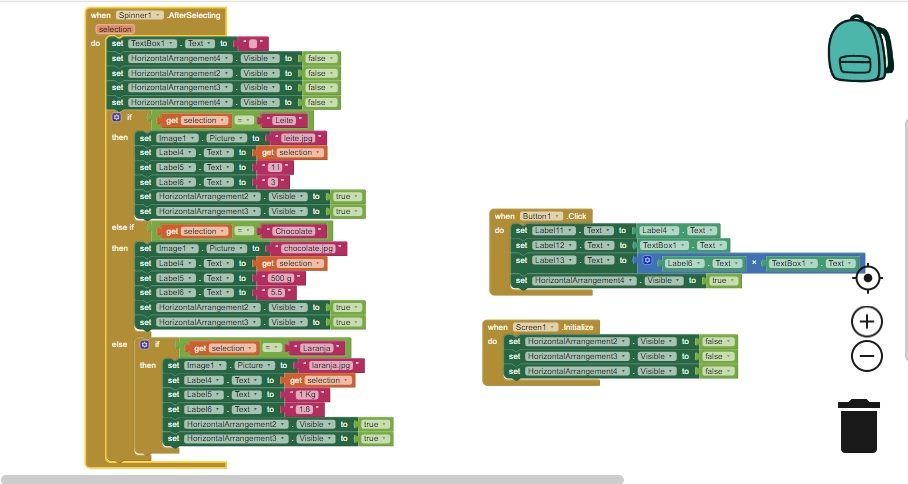

# Modelo para Apresentação do Lab03 - MVC

# Aluno
* Jeferson Luis Micuelan

# Tarefa 1 - App no MIT App Inventor

> * tela 1 - captura da tela completa de design de interface

> * tela 2 - captura de tela do app com nenhum produto selecionado

> * tela 3 - captura de tela do app com primeiro produto selecionado

> * tela 4 - captura de tela do app com segundo produto selecionado

> * tela 5 - compra de um dos produtos efetivada

> * tela 6 - diagrama de blocos do aplicativo

> * Arquivo do aplicativo exportado a partir do MIT App Inventor em formato aia
[App Tarefa1](app/tarefa1.aia)

# Tarefa 2 - Diagrama de Componentes dirigida a Eventos

> * Imagens dos diagramas

# Tarefa 3 - App com CoudDB

> Coloque as imagens PNG da captura de quatro telas do seu aplicativo:
> * tela 1 - captura da tela completa de design de interface
> * tela 2 - captura de tela do app com nenhum produto selecionado
> * tela 3 - captura de tela do app com dois com compra efetivados e aparecendo na **Lista de Produtos a Serem Comprados**
> * tela 4 - diagrama de blocos do aplicativo mostrando apenas aqueles relacionados com o CloudDB
>
> Coloque um link para o arquivo do aplicativo exportado a partir do MIT App Inventor em formato `aia`. Ele estará dentro da pasta `app`.
>
> As telas devem ser apresentadas conforme exemplos a seguir.
>
> Exemplo de uma captura de tela completa de design de interface:
>
> 
>
> Exemplo de uma captura de tela do app:
>
> 
>
> Exemplo de uma tela do diagrama de blocos:
>
> 
