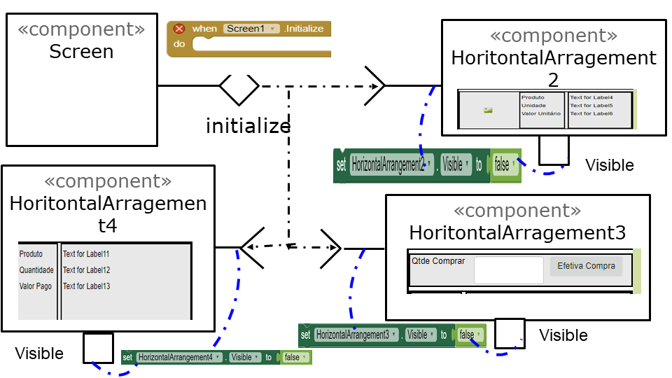

# Modelo para Apresentação do Lab03 - MVC

# Aluno
* Jeferson Luis Micuelan

# Tarefa 1 - App no MIT App Inventor

> * tela 1 - captura da tela completa de design de interface

> * tela 2 - captura de tela do app com nenhum produto selecionado

> * tela 3 - captura de tela do app com primeiro produto selecionado

> * tela 4 - captura de tela do app com segundo produto selecionado

> * tela 5 - compra de um dos produtos efetivada

> * tela 6 - diagrama de blocos do aplicativo

> * Arquivo do aplicativo exportado a partir do MIT App Inventor em formato aia
[App Tarefa1](app/tarefa1.aia)

# Tarefa 2 - Diagrama de Componentes dirigida a Eventos

> * Imagens dos diagramas

  
 
 
 

# Tarefa 3 - App com CoudDB

>Captura de quatro telas do seu aplicativo:
> * tela 1 - captura da tela completa de design de interface

> * tela 2 - captura de tela do app com nenhum produto selecionado

> * tela 3 - captura de tela do app com dois com compra efetivados e aparecendo na **Lista de Produtos a Serem Comprados**

> * tela 4 - diagrama de blocos do aplicativo mostrando apenas aqueles relacionados com o CloudDB

>
> * Arquivo do aplicativo exportado a partir do MIT App Inventor em formato aia
[App Tarefa3](app/tarefa3.aia)
