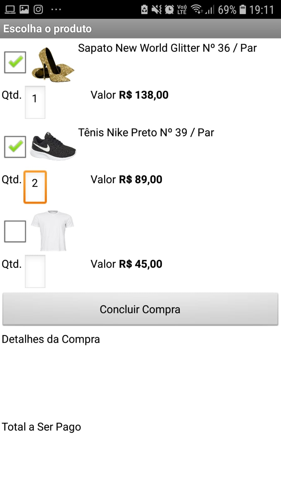

# Aluno
* Luciano Sávio de Oliveira

# Tarefa 1 - App no MIT App Inventor

> * tela 1 - captura da tela completa de design de interface
> 
> 
> * tela 2 - captura de tela do app com nenhum produto selecionado
> 
> 
> * tela 3 - captura de tela do app com primeiro produto selecionado
> 
>
> * tela 4 - captura de tela do app com segundo produto selecionado
> 
> 
> * tela 5 - compra de um dos produtos efetivada
> 
> 
> * tela 6 - diagrama de blocos do aplicativo
> 
>
> Link para o arquivo do aplicativo exportado a partir do MIT App Inventor em formato `aia`:
> [Tarefa_1](app/Tarefa_1.aia).

# Tarefa 2 - Diagrama de Componentes dirigida a Eventos

> Imagem PNG do diagrama:
>
> 
> 
> 
> 
> 
> 

# Tarefa 3 - App com CoudDB

> Imagens PNG da captura de quatro telas do aplicativo:
> * tela 1 - captura da tela completa de design de interface
> 
> 
> * tela 2 - captura de tela do app com nenhum produto selecionado
> 
> 
> * tela 3 - captura de tela do app com dois produtos com compra efetivados e aparecendo na **Lista de Produtos a Serem Comprados**.
> 
> 
> * tela 4 - diagrama de blocos do aplicativo mostrando apenas aqueles relacionados com o CloudDB.
> 
>
> Link para o arquivo do aplicativo exportado a partir do MIT App Inventor em formato `aia`:
> [Tarefa_3](app/Tarefa_3.aia).
