# Aluno
* Marcelo da Cruz Salvador
* Matricula: ex25564

# Tarefa 1 - App no MIT App Inventor

> * tela 1 - captura da tela completa de design de interface
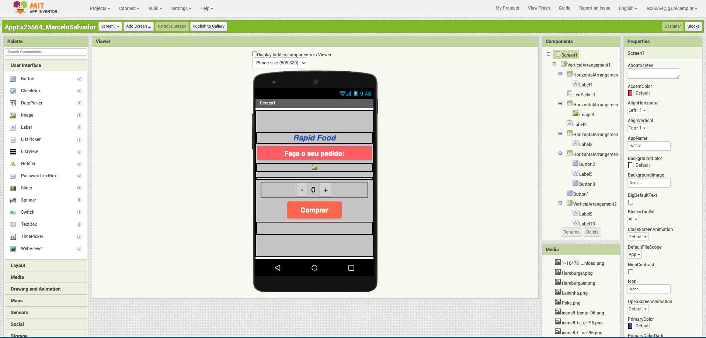

> * tela 2 - captura de tela do app com nenhum produto selecionado
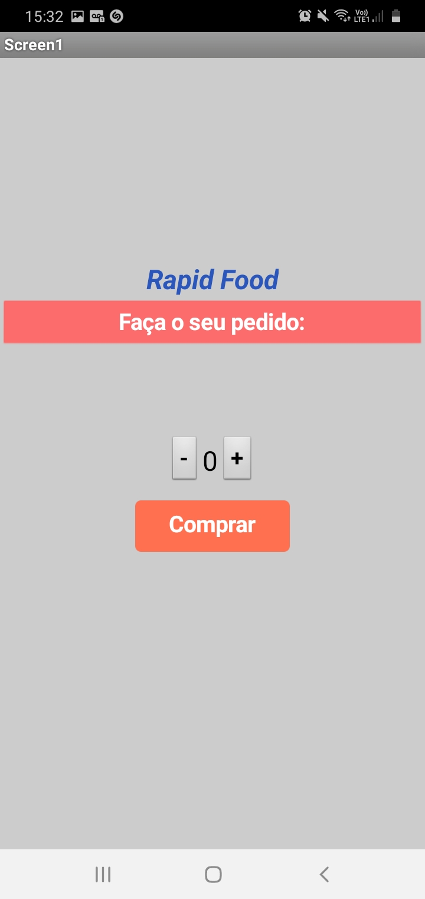

> * tela 3 - captura de tela do Menu de Refeições

> * tela 4 - captura de tela do app com a refeição selecionada
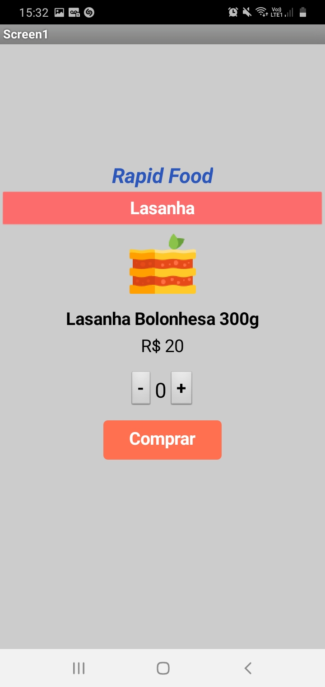

> * tela 5 - compra efetivada
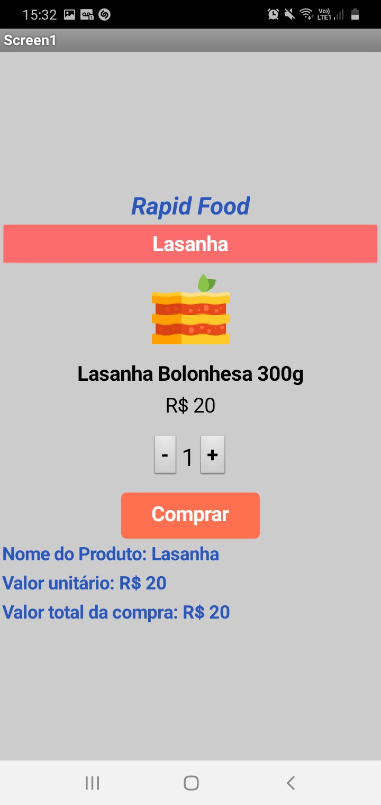

> * tela 6 - diagrama de blocos do aplicativo
- Bloco do listpicker
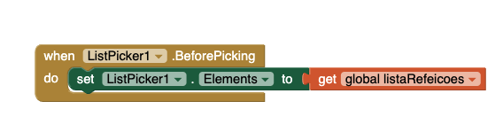

- Bloco da atualização de preços
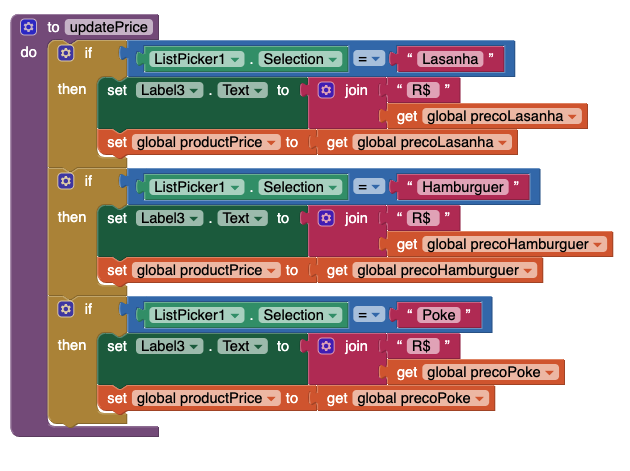

- Bloco da atualização de produtos
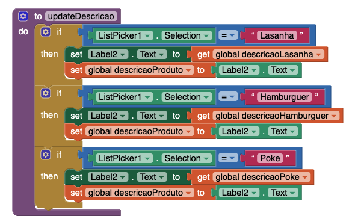

- Bloco dos botões de quantidade "+"
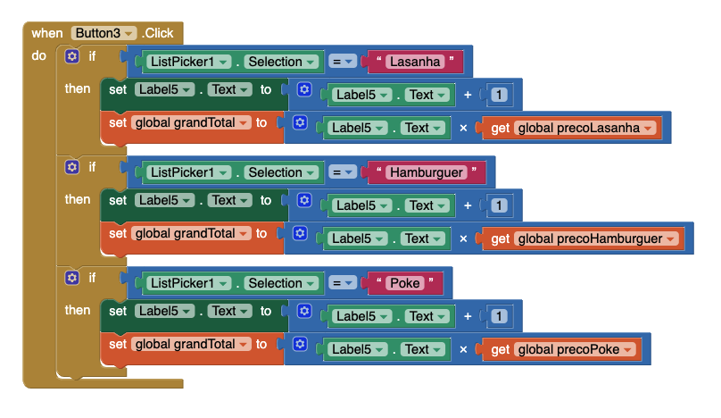

- Bloco dos botões de quantidade "-"
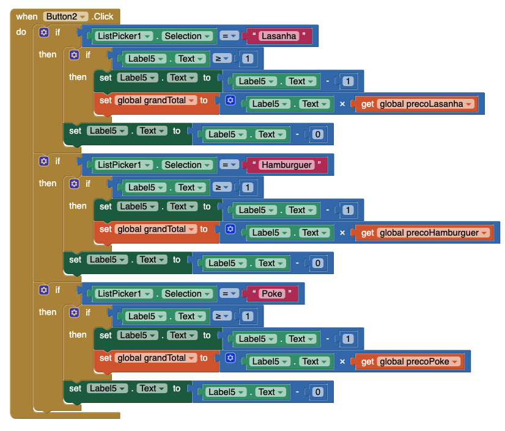

- Bloco do botão Comprar
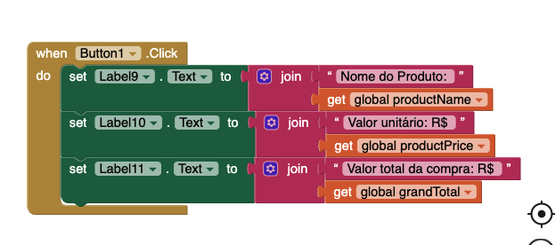

- Bloco do botão Comprar
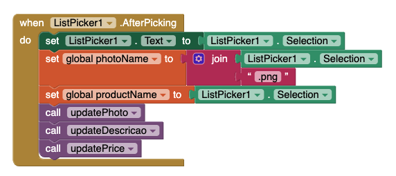

> Link para o arquivo *.aia do projeto MIT App Inventor: [AppEx25564_MarceloSalvador.aia](app/AppEx25564_MarceloSalvador.aia)

