# Modelo para Apresentação do Lab03 - MVC

Estrutura de pastas:

~~~
├── README.md  <- arquivo apresentando a tarefa
│
├── images     <- arquivos de imagens usadas no documento
│
└── app        <- apps do MIT App Inventor exportados em formato `aia`
~~~

# Aluno
* `Pablo Gabriel Rodrigues Neves Bedoya`

# Tarefa 1 - App no MIT App Inventor

> Tela 1 - captura da tela completa de design de interface:
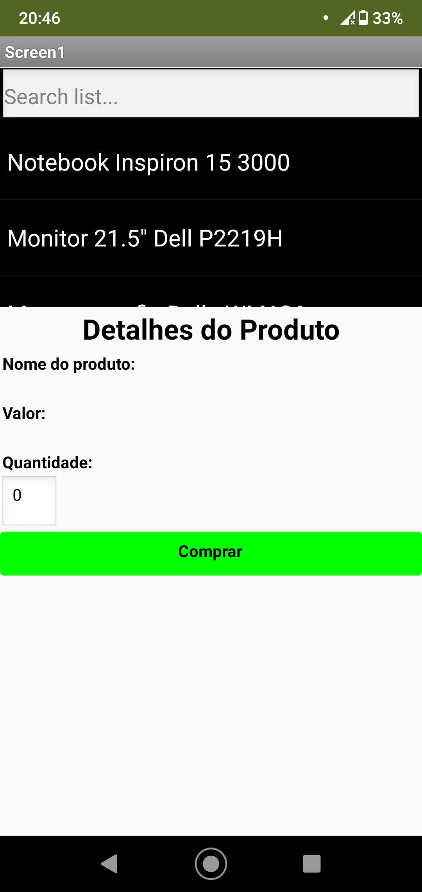

> Tela 2 - captura de tela do app com nenhum produto selecionado:

> Tela 3 - captura de tela do app com primeiro produto selecionado:
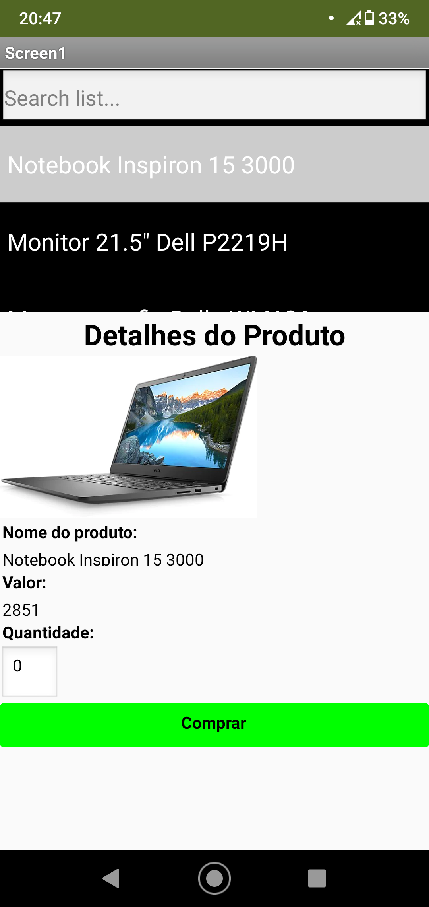

> Tela 4 - captura de tela do app com segundo produto selecionado:
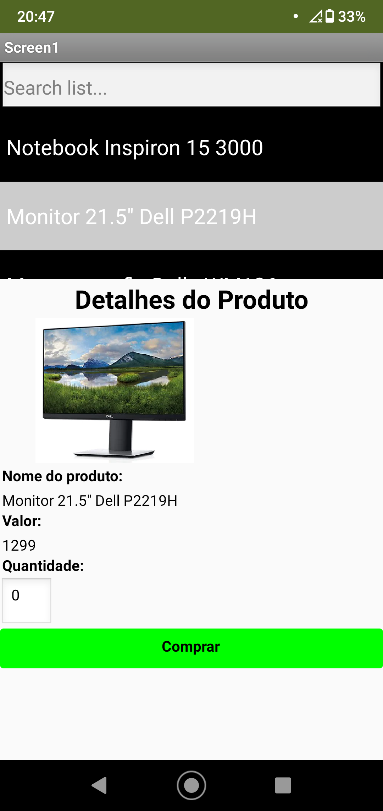

> Tela 5 - compra de um dos produtos efetivada:
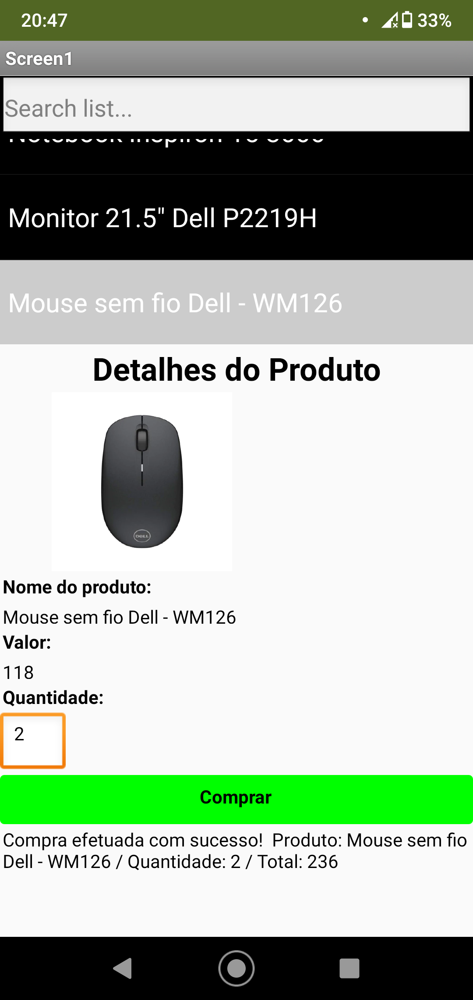

> Tela 6 - Diagrama de blocos do aplicativo:
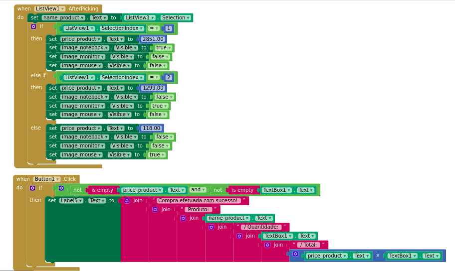

> [Link para arquivo exportado - Tarefa 1](images/tarefa-1-interface_compra.aia)

# Tarefa 2 - Diagrama de Componentes dirigida a Eventos

> Diagrama de eventos 1:
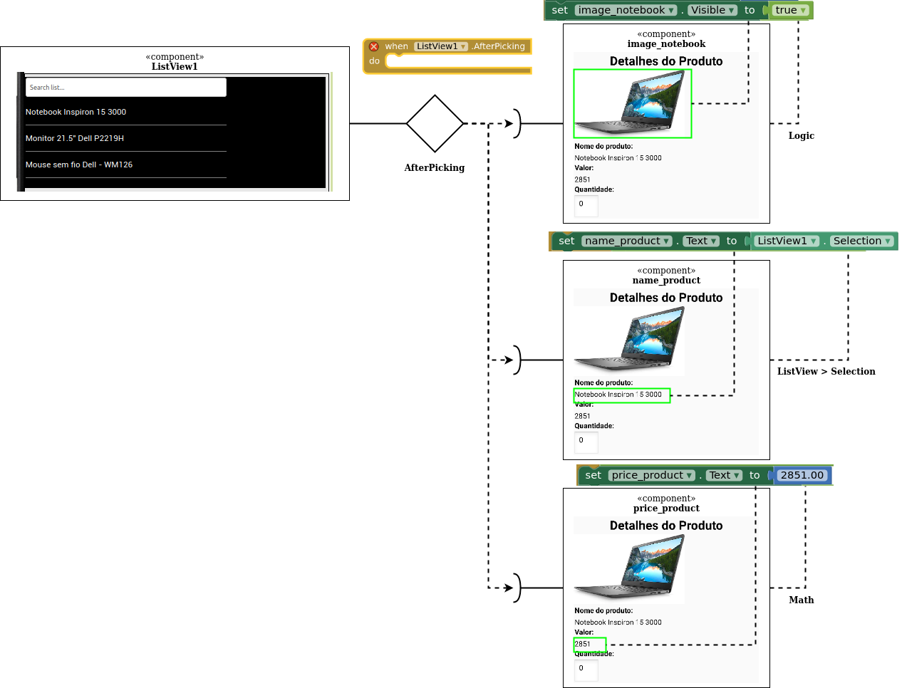

> Diagrama de eventos 2:
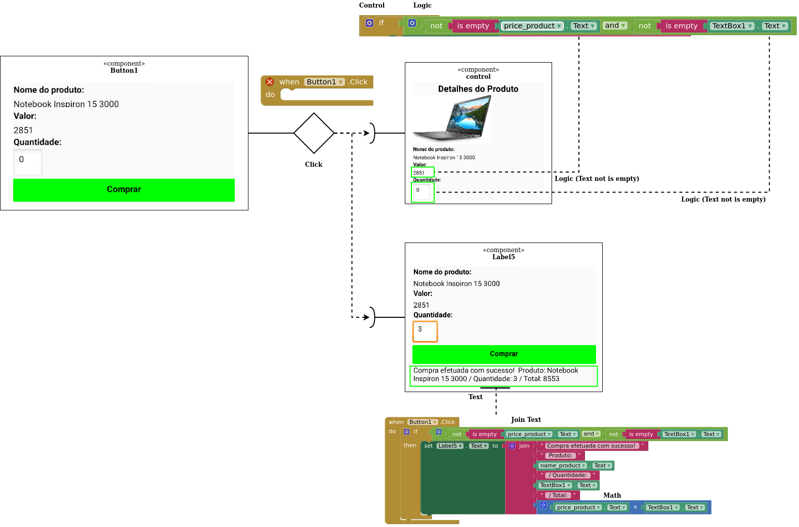

# Tarefa 3 - App com CoudDB

> Tela 1 - captura da tela completa de design de interface:
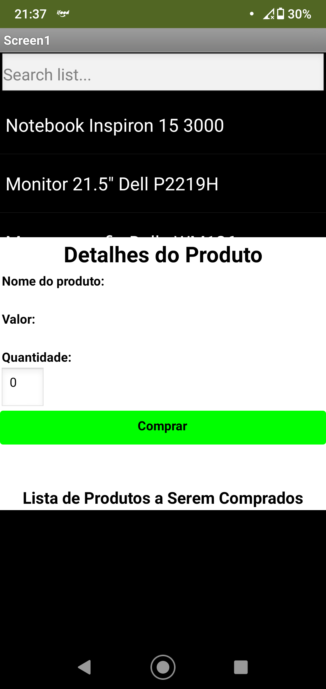

> Tela 2 - captura de tela do app com nenhum produto selecionado:
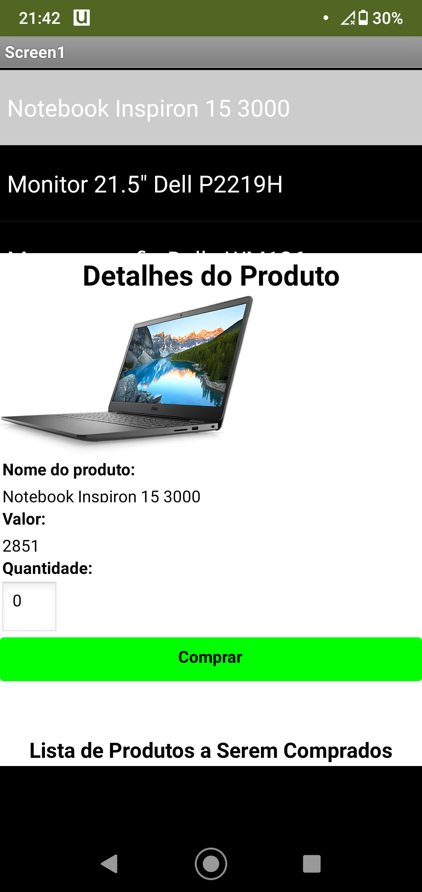

> Tela 3 - captura de tela do app com dois com compra efetivados e aparecendo na **Lista de Produtos a Serem Comprados**:
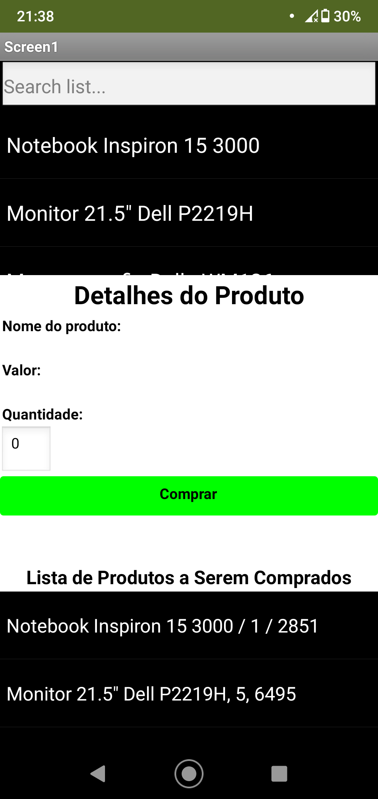

> Tela 4 - diagrama de blocos do aplicativo mostrando apenas aqueles relacionados com o CloudDB:
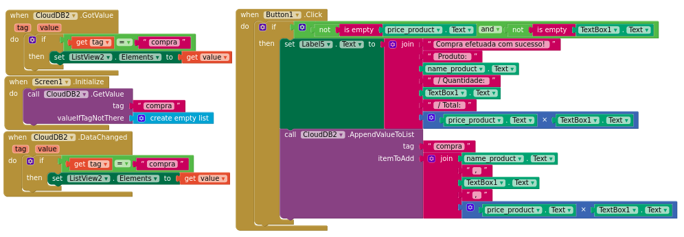

> [Link para arquivo exportado - Tarefa 3](images/tarefa-3-interface_compra.aia)
