# Modelo para Apresentação do Lab03 - MVC

Estrutura de pastas:

~~~
├── README.md  <- arquivo apresentando a tarefa
│
├── images     <- arquivos de imagens usadas no documento
│
└── app        <- apps do MIT App Inventor exportados em formato `aia`
~~~

# Aluno
* `Ronaldo Monteiro Lopes`

# Tarefa 1 - App no MIT App Inventor

> Coloque as imagens PNG da captura de seis telas do seu aplicativo:
> * tela 1 - captura da tela completa de design de interface
> 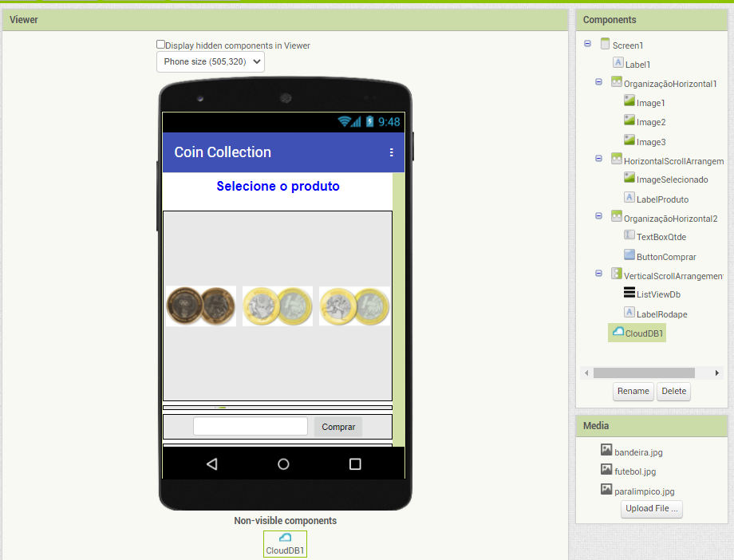
> * tela 2 - captura de tela do app com nenhum produto selecionado
> 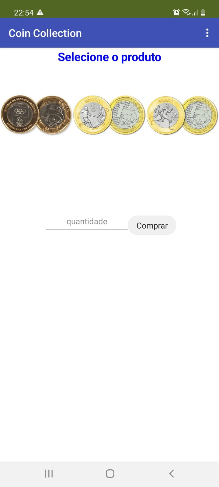
> * tela 3 - captura de tela do app com primeiro produto selecionado
> 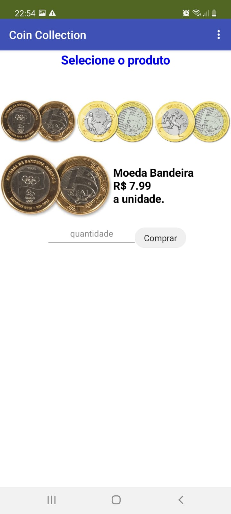
> * tela 4 - captura de tela do app com segundo produto selecionado
> 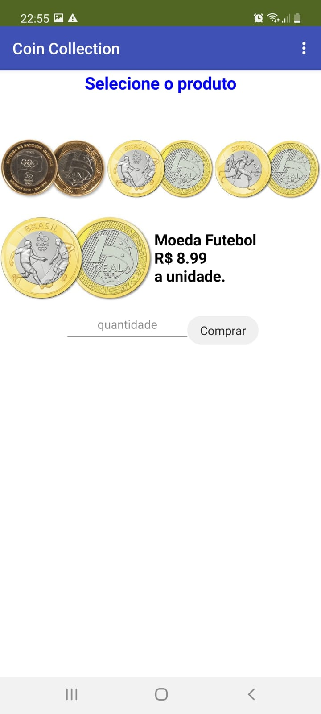
> * tela 5 - compra de um dos produtos efetivada
> 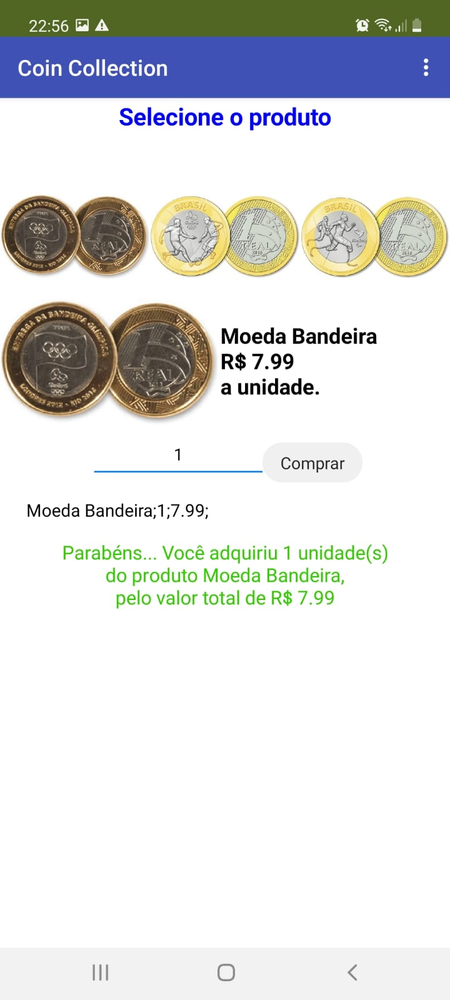
> * tela 6 - diagrama de blocos do aplicativo
> 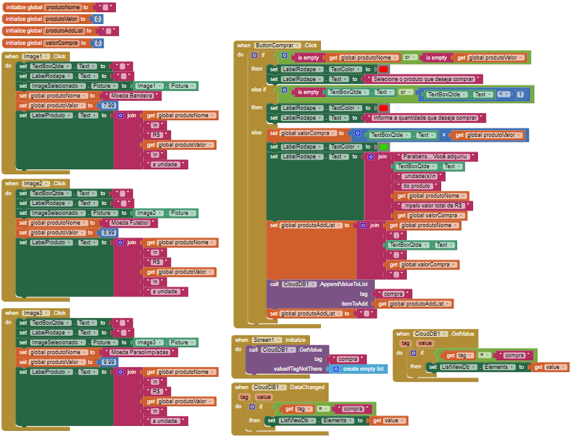
>
> Coloque um link para o arquivo do aplicativo exportado a partir do MIT App Inventor em formato `aia`. Ele estará dentro da pasta `app`.
[Link para o arquivo do MIT App Inventor.](app/lab03v2.aia)

# Tarefa 2 - Diagrama de Componentes dirigida a Eventos

> Coloque a imagem PNG do diagrama, conforme exemplo a seguir:
>
> 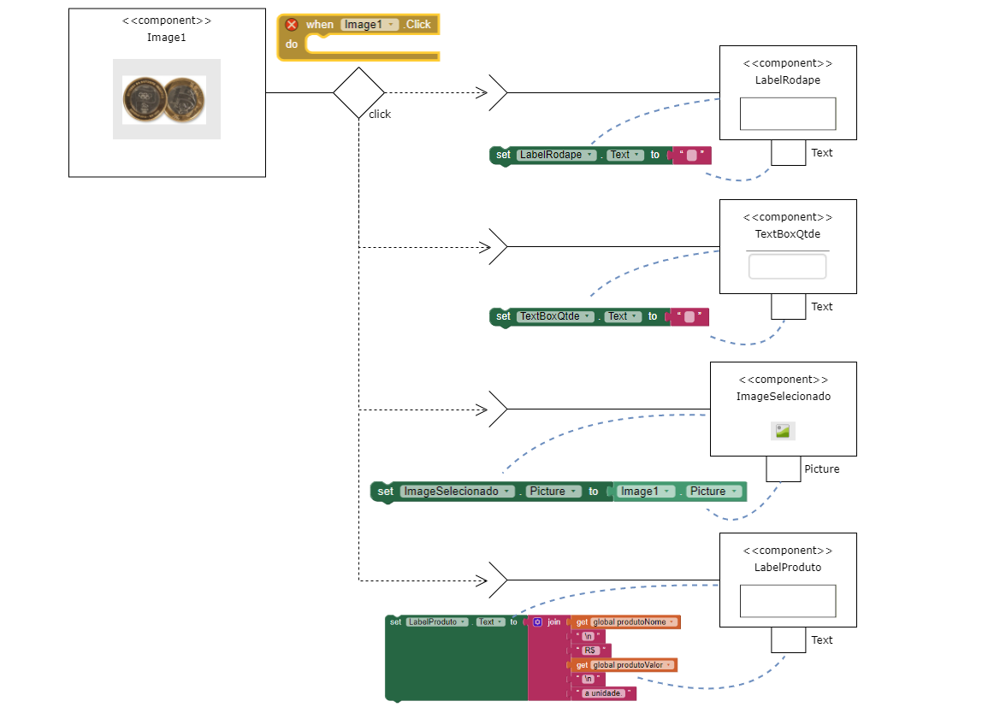
> 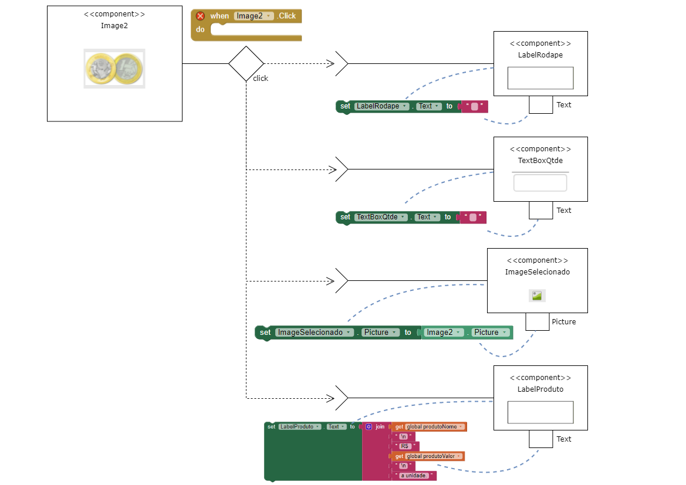
> 
> 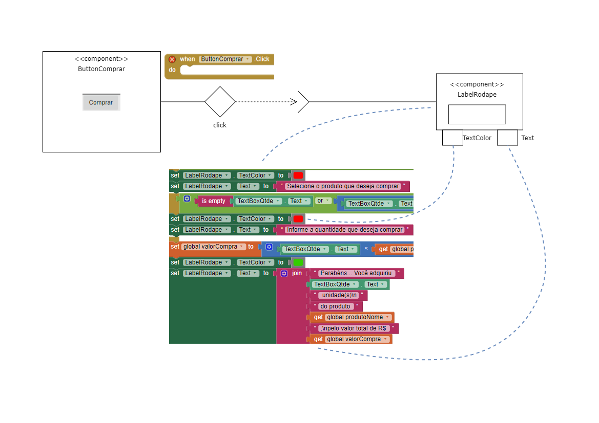

# Tarefa 3 - App com CoudDB

> Coloque as imagens PNG da captura de quatro telas do seu aplicativo:
> * tela 1 - captura da tela completa de design de interface
> 
> * tela 2 - captura de tela do app com nenhum produto selecionado
> 
> * tela 3 - captura de tela do app com dois com compra efetivados e aparecendo na **Lista de Produtos a Serem Comprados**
> 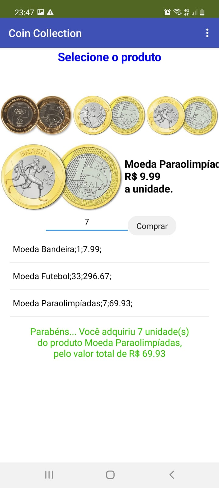
> * tela 4 - diagrama de blocos do aplicativo mostrando apenas aqueles relacionados com o CloudDB
> 
>

> Coloque um link para o arquivo do aplicativo exportado a partir do MIT App Inventor em formato `aia`. Ele estará dentro da pasta `app`.
[Link para o arquivo do MIT App Inventor.](app/lab03v2.1.0.aia)
>
> As telas devem ser apresentadas conforme exemplos a seguir.
>
> Exemplo de uma captura de tela completa de design de interface:
>
> 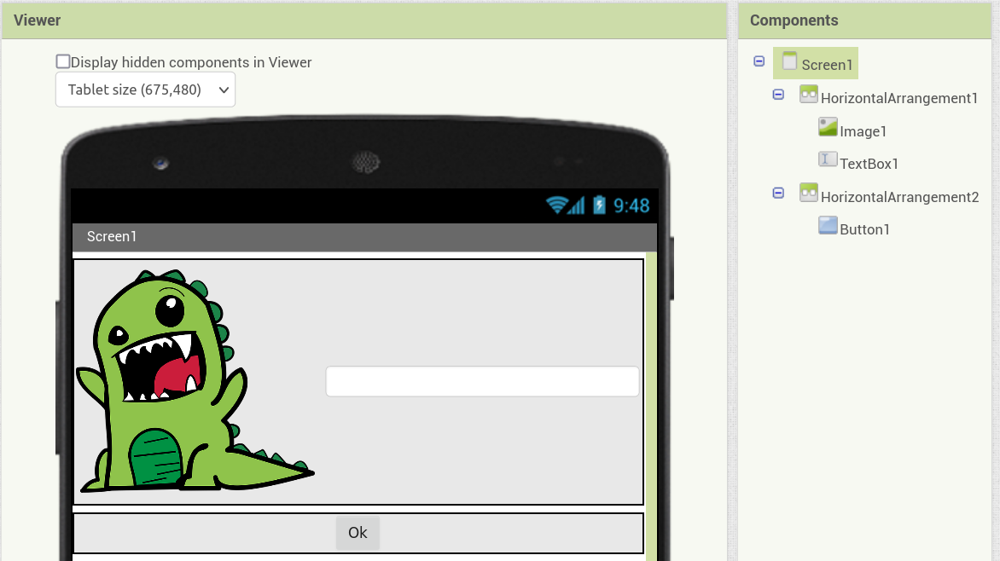
>
> Exemplo de uma captura de tela do app:
>
> 
>
> Exemplo de uma tela do diagrama de blocos:
>
> 
