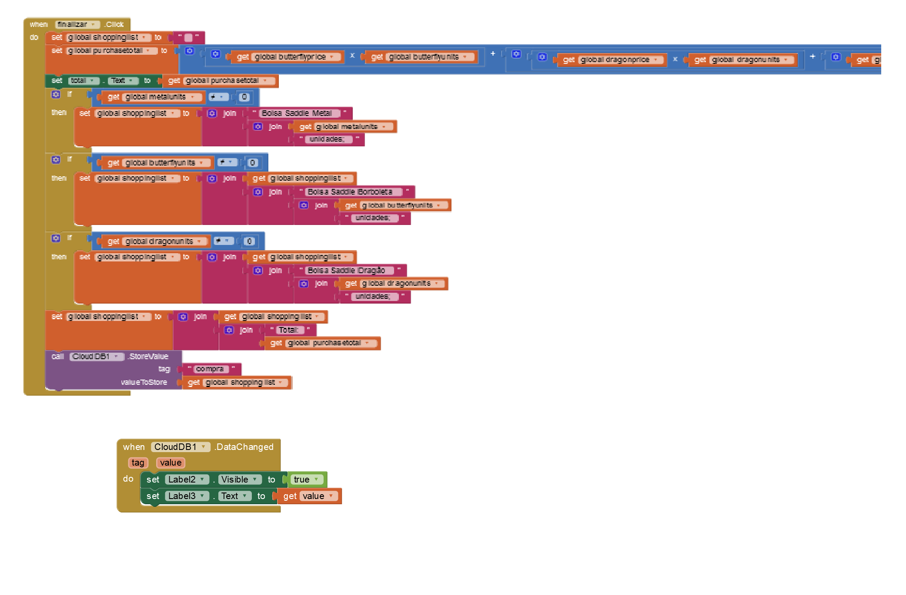

git # Aluno
* `Sophia Carvalho Lancini`

# Tarefa 1 - App no MIT App Inventor

* tela 1 - captura da tela completa de design de interface

* tela 2 - captura de tela do app com nenhum produto selecionado

* tela 3 - captura de tela do app com primeiro produto selecionado

* tela 4 - captura de tela do app com segundo produto selecionado

* tela 5 - captura de tela do app com terceiro produto selecionado

* tela 6 - compra de um dos produtos efetivada

* tela 7 - diagrama de blocos do aplicativo

O arquivo do aplicativo exportado a partir do MIT App Inventor em formato `aia` está [nesse link](app/tarefa1.aia)

# Tarefa 2 - Diagrama de Componentes dirigida a Eventos

# Tarefa 3 - App com CoudDB

* tela 1 - captura da tela completa de design de interface

* tela 2 - captura de tela do app com nenhum produto selecionado

* tela 3 - captura de tela do app com dois com compra efetivados e aparecendo na **Lista de Produtos a Serem Comprados**

* tela 4 - diagrama de blocos do aplicativo mostrando apenas aqueles relacionados com o CloudDB

O arquivo do aplicativo exportado a partir do MIT App Inventor em formato `aia` está [nesse link](app/tarefa3.aia)
