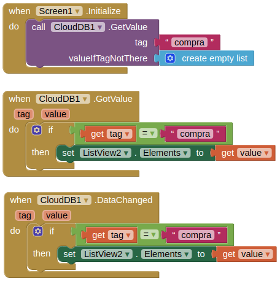

# Modelo para Apresentação do Lab03 - MVC

Estrutura de pastas:

~~~
├── README.md  <- arquivo apresentando a tarefa
│
├── images     <- arquivos de imagens usadas no documento
│
└── app        <- apps do MIT App Inventor exportados em formato `aia`
~~~

# Aluno
* `José Octavio Vitoriano Martines Penna`

# Tarefa 1 - App no MIT App Inventor

> ## tela 1 - captura da tela completa de design de interface
> 
> ## tela 2 - captura de tela do app com nenhum produto selecionado
> 
> ## tela 3 - captura de tela do app com primeiro produto selecionado
> 
> ## tela 4 - captura de tela do app com segundo produto selecionado
> 
> ## tela 5 - compra de um dos produtos efetivada
> 
> ## tela 6 - diagrama de blocos do aplicativo - tela principal (e.g. tela 1)
> 
> ## tela 7 - diagrama de blocos do aplicativo - telas de produtos (e.g. tela 2)
>   
>
 ## [**purchasefinal-1.aia**](app/purchasefinal-1.aia)

# Tarefa 2 - Diagrama de Componentes dirigida a Eventos

## Diagrama Eventos - Tela Principal
> 
## Diagrama Eventos - Tela de Produto
> 

# Tarefa 3 - App com CoudDB

> ## tela 1 - captura da tela completa de design de interface
> 
> ## tela 2 - captura de tela do app com nenhum produto selecionado
> 
> ## tela 3 - captura de tela do app com dois com compra efetivados e aparecendo na **Lista de Produtos a Serem Comprados**
> 
> ## tela 4 - diagrama de blocos do aplicativo mostrando apenas aqueles relacionados com o CloudDB
> 
> ## tela 5 - diagrama de blocos do aplicativo mostrando apenas aqueles relacionados com o CloudDB
> 

## [**purchasefinal-2.aia**](app/purchasefinal-3.aia)