# Modelo para Apresentação do Lab04 - Componentes, Mensagens, Eventos e Barramento

Estrutura de pastas:

```
├── README.md  <- arquivo apresentando a tarefa
│
└── images     <- arquivos de imagens usadas no documento
```

# Aluno

- `Gabriel Rodrigues Modesto`

## Tarefa 1 - Web Components e Tópicos

> Nível 1


```html
<dcc-button
  label="Mundo Política"
  topic="noticia/mundo/politica"
  message="Notícias sobre a política"
>
</dcc-button>

<dcc-button
  label="Brasil Política"
  topic="noticia/brasil/politica"
  message="Notícias sobre o Brasil política"
>
</dcc-button>

<dcc-button
  label="Brasil Dinos"
  topic="noticia/brasil/dinos"
  message="Notícias sobre dinossauros brasileiros"
>
</dcc-button>

<dcc-button
  label="Bahia Dinos"
  topic="noticia/bahia/dinos"
  message="Notícias sobre dinossauros bahianos"
>
</dcc-button>
```

---

> Nível 1 - Imagem

> > 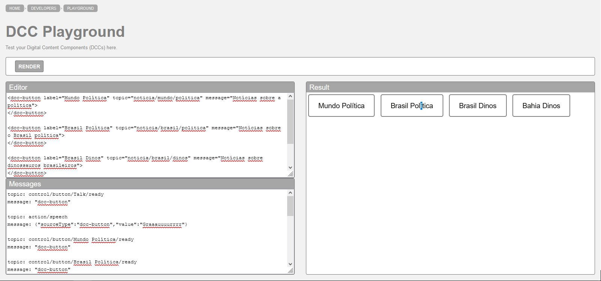

---

> Nível 2

```html
<dcc-button label="Notícias" topic="noticias/todas" message="Todas as notícias">
</dcc-button>

<dcc-button
  label="Política"
  topic="noticias/politica"
  message="Notícias sobre política"
>
</dcc-button>

<dcc-button
  label="Brasil"
  topic="noticias/brasil"
  message="Notícias sobre o Brasil"
>
</dcc-button>

<dcc-lively-talk
  character="https://harena-lab.github.io/harena-docs/dccs/tutorial/images/doctor.PNG"
  speech="Eu leio sobre: "
  subscribe="noticias/politica:speech"
>
</dcc-lively-talk>

<dcc-lively-talk
  character="https://harena-lab.github.io/harena-docs/dccs/tutorial/images/nurse.PNG"
  speech="Eu leio sobre: "
  subscribe="noticias/brasil:speech"
>
</dcc-lively-talk>

<dcc-lively-talk speech="Eu leio sobre: " subscribe="noticias/#:speech">
</dcc-lively-talk>

```

---

> Nível 2 - Imagens

> 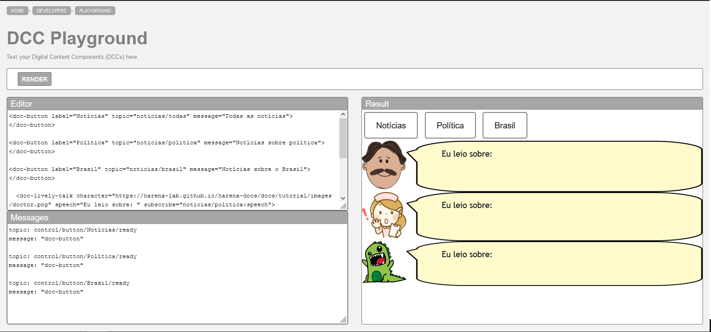
> 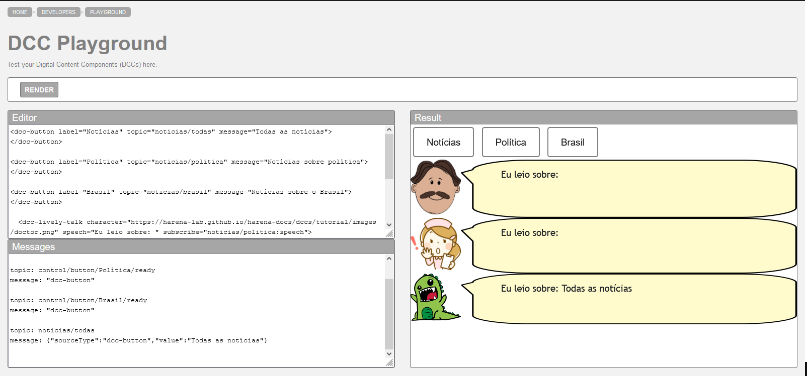
> 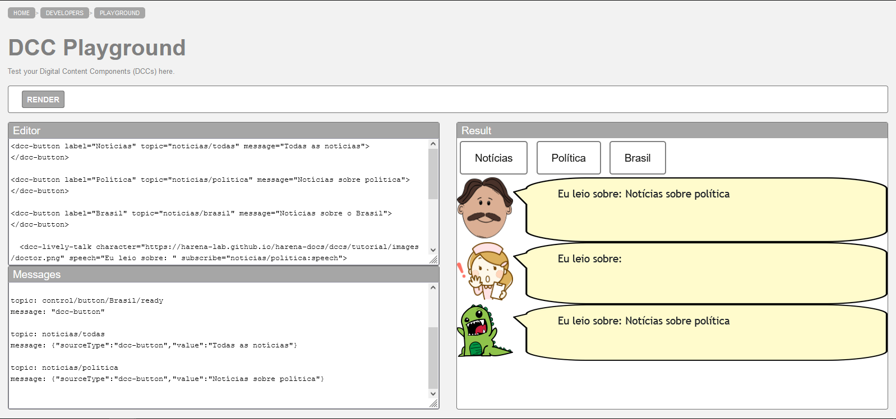
> 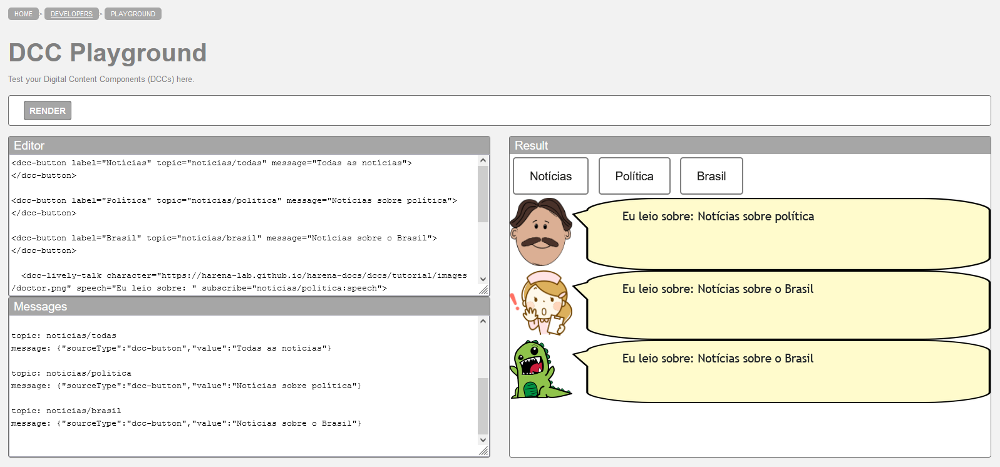

---

## Tarefa 2 - Web
Components e RSS > Escreva aqui o código da sua composição de componentes Web
seguida de uma imagem que captura o funcionamento, como foi feito na tarefa
anterior.

```html
<dcc-button label="Ciênicas Próxima" topic="next/rss/science">
</dcc-button>

<dcc-button label="Design Próxima" topic="next/rss/design">
</dcc-button>

<dcc-rss source="https://www.wired.com/category/science/feed" subscribe="next/rss/science:next" topic="rss/science">
</dcc-rss>


<dcc-rss source="https://www.wired.com/category/design/feed" subscribe="next/rss/design:next" topic="rss/design">
</dcc-rss>

<dcc-aggregator topic="aggregate/science" quantity="4" subscribe="rss/science">
</dcc-aggregator>

<dcc-lively-talk speech="Design: " subscribe="rss/design:speech">
</dcc-lively-talk>

<dcc-lively-talk character="https://harena-lab.github.io/harena-docs/dccs/tutorial/images/doctor.PNG" speech="Ciências Compactas: " subscribe="aggregate/science:speech">
</dcc-lively-talk>

<dcc-lively-talk character="https://harena-lab.github.io/harena-docs/dccs/tutorial/images/nurse.PNG" speech="Ciências: " subscribe="rss/science:speech">
</dcc-lively-talk>
```
> 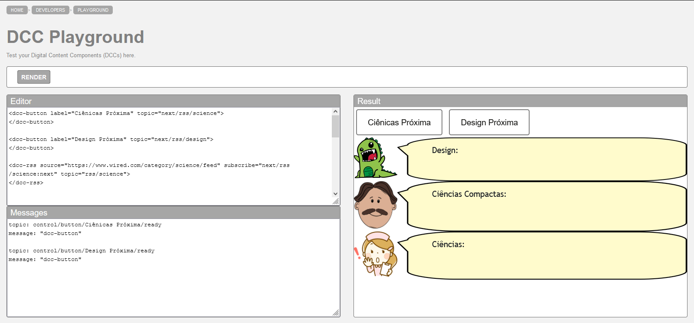
> 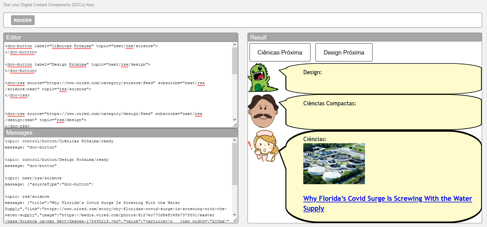
> 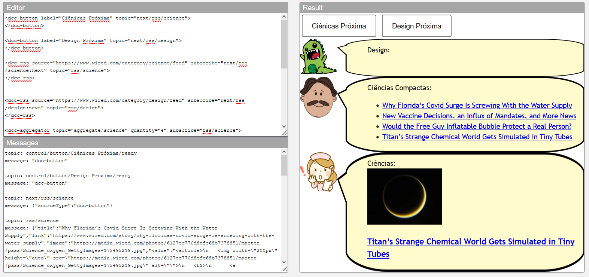
> 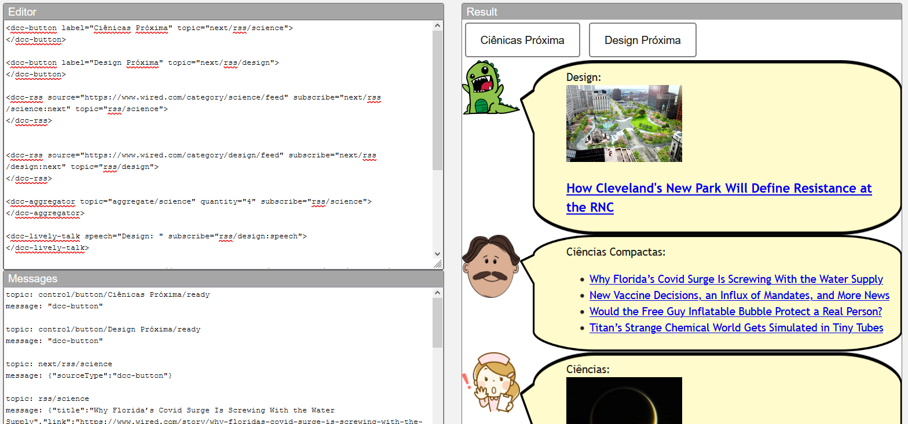
---

## Tarefa 3 - Painéis de Mensagens com Timer > Escreva aqui o código
da sua composição de componentes Web seguida de uma imagem que captura o
funcionamento, como foi feito na tarefa anterior.

```html
<dcc-button label="Inicia" topic="start/timer">
</dcc-button>

<dcc-timer cycles="10" interval="1000" topic="next/rss/science" subscribe="start/timer:start">
</dcc-timer>
<dcc-timer cycles="10" interval="2000" topic="next/rss/design" subscribe="start/timer:start">
</dcc-timer>
<dcc-timer cycles="5" interval="2000" topic="aggregate/next/rss" subscribe="start/timer:start">
</dcc-timer>

<dcc-rss source="https://www.wired.com/category/science/feed" subscribe="next/rss/science:next" topic="rss/science">
</dcc-rss>

<dcc-rss source="https://www.wired.com/category/design/feed" subscribe="next/rss/design:next" topic="rss/design">
</dcc-rss>

<dcc-aggregator topic="aggregate/next/rss" quantity="3" subscribe="rss/science">
</dcc-aggregator>

<dcc-lively-talk speech="Todas as notícias: " subscribe="aggregate/next/rss:speech">
</dcc-lively-talk>

<dcc-lively-talk character="https://harena-lab.github.io/harena-docs/dccs/tutorial/images/doctor.PNG" speech="Ciências Notícias: " subscribe="+/science:speech">
</dcc-lively-talk>

<dcc-lively-talk character="https://harena-lab.github.io/harena-docs/dccs/tutorial/images/nurse.PNG" speech="Design Notícias: " subscribe="+/design:speech">
</dcc-lively-talk>
```

> 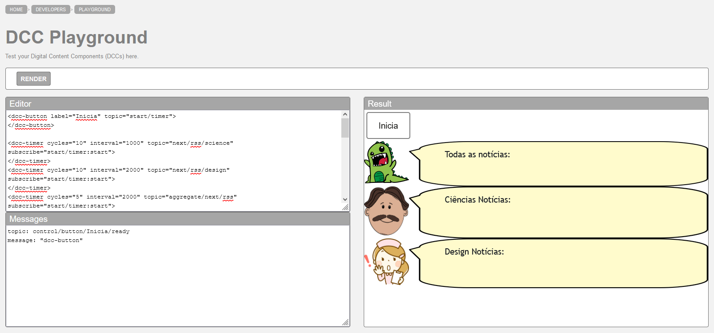
> 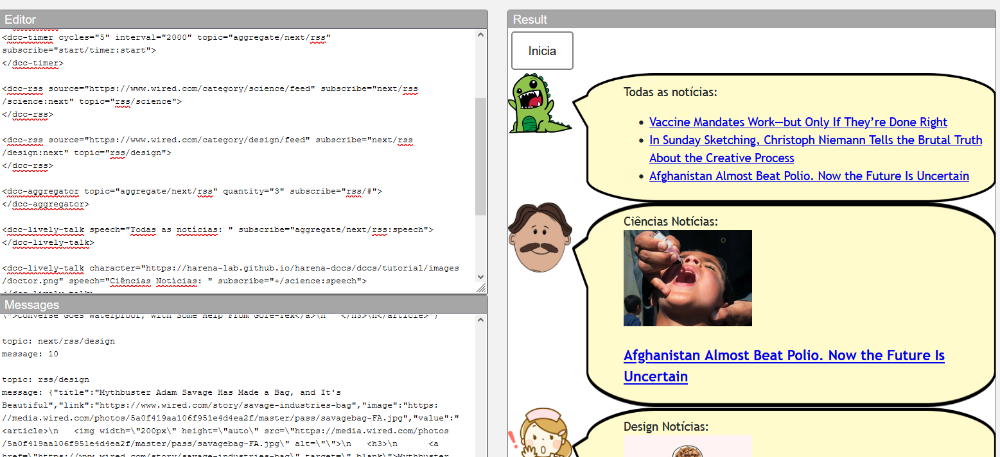