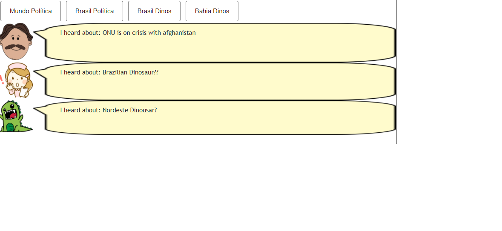
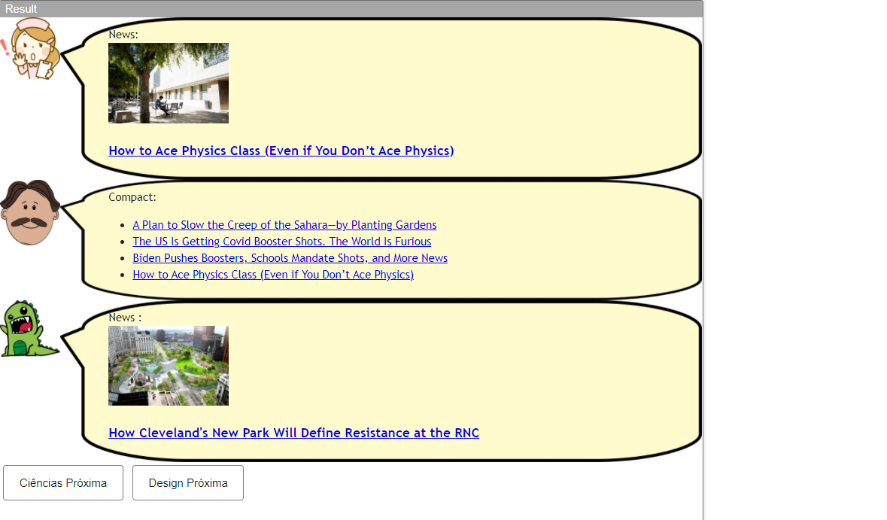

# Aluno
* `Gustavo henrique souza silva doll`

## Tarefa 1 - Web Components e Tópicos

~~~html
<dcc-button label="Mundo Política" topic="news/world/politic" message="ONU is on crisis with afghanistan">
</dcc-button>

<dcc-button label="Brasil Política" topic="news/brazil/politic" message="Brazil reopens trades">
</dcc-button>

<dcc-button label="Brasil Dinos" topic="news/brazil/dinosaur" message="Brazilian Dinosaur??">
</dcc-button>

<dcc-button label="Bahia Dinos" topic="news/bahia/dinosaur" message="Nordeste Dinousar?">
</dcc-button>

<dcc-lively-talk character="https://harena-lab.github.io/harena-docs/dccs/tutorial/images/doctor.png" speech="I heard about: " subscribe="#/politic:speech">
</dcc-lively-talk>

<dcc-lively-talk character="https://harena-lab.github.io/harena-docs/dccs/tutorial/images/nurse.png" speech="I heard about: " subscribe="news/brazil/#:speech">
</dcc-lively-talk>

<dcc-lively-talk speech="I heard about: " subscribe="news/#:speech">
</dcc-lively-talk>
~~~

~~~barramento
topic: control/button/Mundo Política/ready
message: "dcc-button"

topic: control/button/Brasil Política/ready
message: "dcc-button"

topic: control/button/Brasil Dinos/ready
message: "dcc-button"

topic: control/button/Bahia Dinos/ready
message: "dcc-button"

topic: news/world/politic
message: {"sourceType":"dcc-button","value":"ONU is on crisis with afghanistan"}

topic: news/brazil/politic
message: {"sourceType":"dcc-button","value":"Brazil reopens trades"}

topic: news/brazil/dinosaur
message: {"sourceType":"dcc-button","value":"Brazilian Dinosaur??"}

topic: news/bahia/dinosaur
message: {"sourceType":"dcc-button","value":"Nordeste Dinousar?"}
~~~

## Tarefa 2 - Web Components e RSS

~~~html
<dcc-rss source="https://www.wired.com/category/science/feed" subscribe="next/rss/science:next" topic="rss/science">
</dcc-rss>

<dcc-rss source="https://www.wired.com/category/design/feed" subscribe="next/rss/design:next" topic="rss/design">
</dcc-rss>

<dcc-aggregator topic="aggregate/science" quantity="4" subscribe="rss/science">
</dcc-aggregator>

<dcc-lively-talk character="https://harena-lab.github.io/harena-docs/dccs/tutorial/images/nurse.png" speech="News: " subscribe="rss/science:speech">
</dcc-lively-talk>

<dcc-lively-talk character="https://harena-lab.github.io/harena-docs/dccs/tutorial/images/doctor.png" speech="Compact: " subscribe="aggregate/science:speech">
</dcc-lively-talk>

<dcc-lively-talk speech="News :" subscribe="rss/design:speech">
</dcc-lively-talk>

<dcc-button label="Ciências Próxima" topic="next/rss/science">
</dcc-button>

<dcc-button label="Design Próxima" topic="next/rss/design">
</dcc-button>
~~~

~~~barramento
topic: control/button/Mundo Política/ready
message: "dcc-button"

topic: control/button/Brasil Política/ready
message: "dcc-button"

topic: control/button/Brasil Dinos/ready
message: "dcc-button"

topic: control/button/Bahia Dinos/ready
message: "dcc-button"

topic: news/world/politic
message: {"sourceType":"dcc-button","value":"ONU is on crisis with afghanistan"}

topic: news/brazil/politic
message: {"sourceType":"dcc-button","value":"Brazil reopens trades"}

topic: news/world/politic
message: {"sourceType":"dcc-button","value":"ONU is on crisis with afghanistan"}

topic: news/brazil/politic
message: {"sourceType":"dcc-button","value":"Brazil reopens trades"}

topic: news/brazil/dinosaur
message: {"sourceType":"dcc-button","value":"Brazilian Dinosaur??"}

topic: news/brazil/politic
message: {"sourceType":"dcc-button","value":"Brazil reopens trades"}

topic: news/brazil/dinosaur
message: {"sourceType":"dcc-button","value":"Brazilian Dinosaur??"}

topic: news/world/politic
message: {"sourceType":"dcc-button","value":"ONU is on crisis with afghanistan"}

topic: news/brazil/dinosaur
message: {"sourceType":"dcc-button","value":"Brazilian Dinosaur??"}

topic: news/bahia/dinosaur
message: {"sourceType":"dcc-button","value":"Nordeste Dinousar?"}

topic: control/button/Ciências Próxima/ready
message: "dcc-button"

topic: control/button/Design Próxima/ready
message: "dcc-button"

topic: nextScience/rss
message: {"sourceType":"dcc-button"}

topic: rss/science
message: {"title":"A Plan to Slow the Creep of the Sahara—by Planting Gardens","link":"https://www.wired.com/story/a-plan-to-slow-the-creep-of-the-sahara-by-planting-gardens","image":"https://media.wired.com/photos/61204466a8686e49cfd11b4e/master/pass/Science_climatedesk_RTXEUZB3.jpg","value":"<article>\n   \n   <h3>\n      <a href=\"https://www.wired.com/story/a-plan-to-slow-the-creep-of-the-sahara-by-planting-gardens\" target=\"_blank\">A Plan to Slow the Creep of the Sahara—by Planting Gardens</a>\n   </h3>\n</article>"}

topic: nextScience/rss
message: {"sourceType":"dcc-button"}

topic: rss/science
message: {"title":"The US Is Getting Covid Booster Shots. The World Is Furious","link":"https://www.wired.com/story/the-us-is-getting-covid-booster-shots-the-world-is-furious","image":"https://media.wired.com/photos/611e8a1a9561b7c69f0785c8/master/pass/Science_vaccine_GettyImages-1231600889.jpg","value":"<article>\n   \n   <h3>\n      <a href=\"https://www.wired.com/story/the-us-is-getting-covid-booster-shots-the-world-is-furious\" target=\"_blank\">The US Is Getting Covid Booster Shots. The World Is Furious</a>\n   </h3>\n</article>"}

topic: nextScience/rss
message: {"sourceType":"dcc-button"}

topic: rss/science
message: {"title":"Biden Pushes Boosters, Schools Mandate Shots, and More News","link":"https://www.wired.com/story/biden-boosters-school-mandates-coronavirus-news","image":"https://media.wired.com/photos/611fb34eb3731b9702b93886/master/pass/Science_covidnl_GettyImages-1230973700.jpg","value":"<article>\n   \n   <h3>\n      <a href=\"https://www.wired.com/story/biden-boosters-school-mandates-coronavirus-news\" target=\"_blank\">Biden Pushes Boosters, Schools Mandate Shots, and More News</a>\n   </h3>\n</article>"}

topic: nextScience/rss
message: {"sourceType":"dcc-button"}

topic: rss/science
message: {"title":"How to Ace Physics Class (Even if You Don’t Ace Physics)","link":"https://www.wired.com/story/how-to-ace-physics-class-even-if-you-dont-ace-physics","image":"https://media.wired.com/photos/611e852dea4a8408e0563514/master/pass/Science_school_GettyImages-1233317805.jpg","value":"<article>\n   \n   <h3>\n      <a href=\"https://www.wired.com/story/how-to-ace-physics-class-even-if-you-dont-ace-physics\" target=\"_blank\">How to Ace Physics Class (Even if You Don’t Ace Physics)</a>\n   </h3>\n</article>"}

topic: aggregate/science
message: "<ul>\n<li><a href=\"https://www.wired.com/story/a-plan-to-slow-the-creep-of-the-sahara-by-planting-gardens\" target=\"_blank\">A Plan to Slow the Creep of the Sahara—by Planting Gardens</a></li>\n<li><a href=\"https://www.wired.com/story/the-us-is-getting-covid-booster-shots-the-world-is-furious\" target=\"_blank\">The US Is Getting Covid Booster Shots. The World Is Furious</a></li>\n<li><a href=\"https://www.wired.com/story/biden-boosters-school-mandates-coronavirus-news\" target=\"_blank\">Biden Pushes Boosters, Schools Mandate Shots, and More News</a></li>\n<li><a href=\"https://www.wired.com/story/how-to-ace-physics-class-even-if-you-dont-ace-physics\" target=\"_blank\">How to Ace Physics Class (Even if You Don’t Ace Physics)</a></li>\n\n</ul>"

topic: nextDesign/rss
message: {"sourceType":"dcc-button"}

topic: rss/design
message: {"title":"How Cleveland's New Park Will Define Resistance at the RNC","link":"https://www.wired.com/2016/07/clevelands-new-park-will-define-resistance-rnc","image":"https://media.wired.com/photos/5926de3baf95806129f50e2c/master/pass/cs_after.jpg","value":"<article>\n   \n   <h3>\n      <a href=\"https://www.wired.com/2016/07/clevelands-new-park-will-define-resistance-rnc\" target=\"_blank\">How Cleveland's New Park Will Define Resistance at the RNC</a>\n   </h3>\n</article>"}
~~~

## Tarefa 3 - Painéis de Mensagens com Timer

~~~html
<dcc-rss source="https://www.wired.com/category/science/feed" subscribe="next/rss/science:next" topic="rss/science">
</dcc-rss>

<dcc-rss source="https://www.wired.com/category/design/feed" subscribe="next/rss/design:next" topic="rss/design">
</dcc-rss>

<dcc-aggregator topic="aggregate" quantity="3">
  <subscribe-dcc topic="rss/science"></subscribe-dcc>
  <subscribe-dcc topic="rss/design"></subscribe-dcc>
</dcc-aggregator>

<dcc-lively-talk character="https://harena-lab.github.io/harena-docs/dccs/tutorial/images/doctor.png" subscribe="+/science:speech">
</dcc-lively-talk>

<dcc-lively-talk character="https://harena-lab.github.io/harena-docs/dccs/tutorial/images/nurse.png" subscribe="+/design:speech">
</dcc-lively-talk>

<dcc-lively-talk subscribe="aggregate:speech">
</dcc-lively-talk>

<dcc-timer cycles="4" interval="1000" topic="next/rss/science" subscribe="timer/start:start">
</dcc-timer>
<dcc-timer cycles="2" interval="2000" topic="next/rss/design" subscribe="timer/start:start">
</dcc-timer>

<dcc-button label="Inicia" topic="timer/start" >
</dcc-button>
~~~

~~~barramento
topic: control/button/Inicia/ready
message: "dcc-button"

topic: start/feed
message: {"sourceType":"dcc-button"}

topic: nextScience/rss
message: 1

topic: rss/science
message: {"title":"A Plan to Slow the Creep of the Sahara—by Planting Gardens","link":"https://www.wired.com/story/a-plan-to-slow-the-creep-of-the-sahara-by-planting-gardens","image":"https://media.wired.com/photos/61204466a8686e49cfd11b4e/master/pass/Science_climatedesk_RTXEUZB3.jpg","value":"<article>\n   \n   <h3>\n      <a href=\"https://www.wired.com/story/a-plan-to-slow-the-creep-of-the-sahara-by-planting-gardens\" target=\"_blank\">A Plan to Slow the Creep of the Sahara—by Planting Gardens</a>\n   </h3>\n</article>"}

topic: nextDesign/rss
message: 1

topic: nextScience/rss
message: 2

topic: rss/science
message: {"title":"The US Is Getting Covid Booster Shots. The World Is Furious","link":"https://www.wired.com/story/the-us-is-getting-covid-booster-shots-the-world-is-furious","image":"https://media.wired.com/photos/611e8a1a9561b7c69f0785c8/master/pass/Science_vaccine_GettyImages-1231600889.jpg","value":"<article>\n   \n   <h3>\n      <a href=\"https://www.wired.com/story/the-us-is-getting-covid-booster-shots-the-world-is-furious\" target=\"_blank\">The US Is Getting Covid Booster Shots. The World Is Furious</a>\n   </h3>\n</article>"}

topic: rss/design
message: {"title":"How Cleveland's New Park Will Define Resistance at the RNC","link":"https://www.wired.com/2016/07/clevelands-new-park-will-define-resistance-rnc","image":"https://media.wired.com/photos/5926de3baf95806129f50e2c/master/pass/cs_after.jpg","value":"<article>\n   \n   <h3>\n      <a href=\"https://www.wired.com/2016/07/clevelands-new-park-will-define-resistance-rnc\" target=\"_blank\">How Cleveland's New Park Will Define Resistance at the RNC</a>\n   </h3>\n</article>"}

topic: aggregate/general
message: "<ul>\n<li><a href=\"https://www.wired.com/story/a-plan-to-slow-the-creep-of-the-sahara-by-planting-gardens\" target=\"_blank\">A Plan to Slow the Creep of the Sahara—by Planting Gardens</a></li>\n<li><a href=\"https://www.wired.com/story/the-us-is-getting-covid-booster-shots-the-world-is-furious\" target=\"_blank\">The US Is Getting Covid Booster Shots. The World Is Furious</a></li>\n<li><a href=\"https://www.wired.com/2016/07/clevelands-new-park-will-define-resistance-rnc\" target=\"_blank\">How Cleveland's New Park Will Define Resistance at the RNC</a></li>\n\n</ul>"

topic: #/rss
message: 1

topic: nextScience/rss
message: 3

topic: rss/science
message: {"title":"Biden Pushes Boosters, Schools Mandate Shots, and More News","link":"https://www.wired.com/story/biden-boosters-school-mandates-coronavirus-news","image":"https://media.wired.com/photos/611fb34eb3731b9702b93886/master/pass/Science_covidnl_GettyImages-1230973700.jpg","value":"<article>\n   \n   <h3>\n      <a href=\"https://www.wired.com/story/biden-boosters-school-mandates-coronavirus-news\" target=\"_blank\">Biden Pushes Boosters, Schools Mandate Shots, and More News</a>\n   </h3>\n</article>"}
~~~