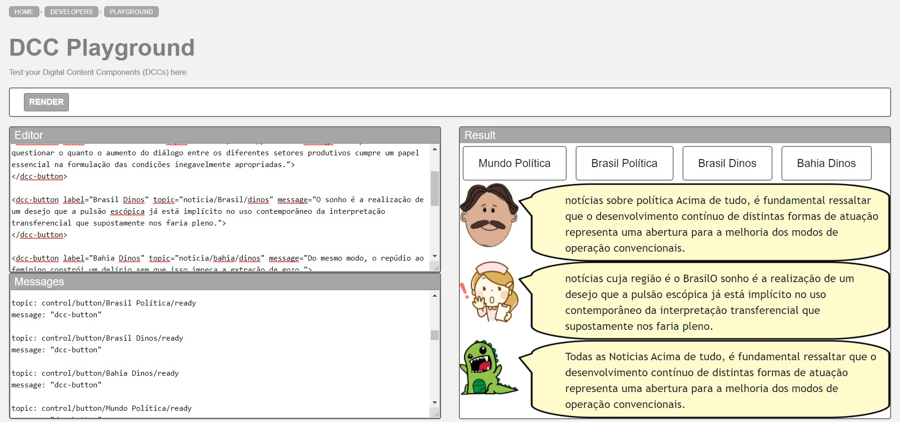
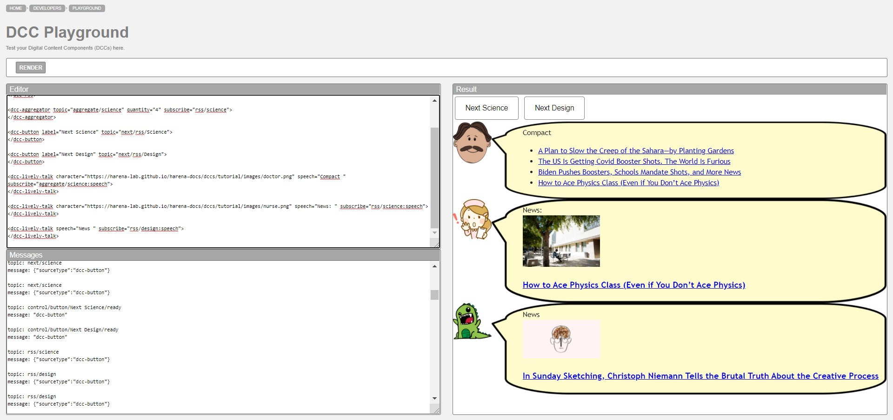
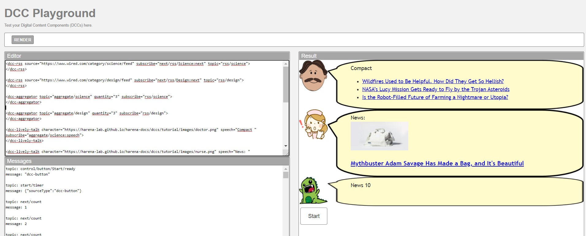

# Modelo para Apresentação do Lab04 - Componentes, Mensagens, Eventos e Barramento

Estrutura de pastas:

~~~
├── README.md  <- arquivo apresentando a tarefa
│
└── images     <- arquivos de imagens usadas no documento
~~~

# Aluno
* `Jonatas Cortez`

## Tarefa 1 - Web Components e Tópicos

> Escreva aqui o código da sua composição de componentes Web, como mostra o exemplo a seguir:

~~~html
<dcc-button label="Mundo Política" topic="noticia/mundo/politica" message="Acima de tudo, é fundamental ressaltar que o desenvolvimento contínuo de distintas formas de atuação representa uma abertura para a melhoria dos modos de operação convencionais.">
</dcc-button>

<dcc-button label="Brasil Política" topic="noticia/brasil/politica" message="É importante questionar o quanto o aumento do diálogo entre os diferentes setores produtivos cumpre um papel essencial na formulação das condições inegavelmente apropriadas.">
</dcc-button>

<dcc-button label="Brasil Dinos" topic="noticia/brasil/dinos" message="O sonho é a realização de um desejo que a pulsão escópica já está implícito no uso contemporâneo da interpretação transferencial que supostamente nos faria pleno.">
</dcc-button>

<dcc-button label="Bahia Dinos" topic="noticia/bahia/dinos" message="Do mesmo modo, o repúdio ao feminino constrói um delírio sem que isso impeça a extração de gozo.">
</dcc-button>

<dcc-lively-talk character="https://harena-lab.github.io/harena-docs/dccs/tutorial/images/doctor.png" speech="notícias sobre política " subscribe="noticia/#/politica:speech">
</dcc-lively-talk>

<dcc-lively-talk character="https://harena-lab.github.io/harena-docs/dccs/tutorial/images/nurse.png" speech="notícias cuja região é o Brasil " subscribe="noticia/Brasil/#:speech">
</dcc-lively-talk>

<dcc-lively-talk speech="Todas as Noticias " subscribe="#:speech">
</dcc-lively-talk>
~~~

> Acrescente uma imagem da composição em funcionamento, como o exemplo a seguir:

## Tarefa 2 - Web Components e RSS
> Escreva aqui o código da sua composição de componentes Web seguida de uma imagem que captura o funcionamento, como foi feito na tarefa anterior.
<dcc-rss source="https://www.wired.com/category/science/feed" subscribe="next/rss/Science:next" topic="rss/science">
</dcc-rss>
~~~html
<dcc-rss source="https://www.wired.com/category/design/feed" subscribe="next/rss/Design:next" topic="rss/design">
</dcc-rss>

<dcc-aggregator topic="aggregate/science" quantity="4" subscribe="rss/science">
</dcc-aggregator>

<dcc-button label="Next Science" topic="next/rss/Science">
</dcc-button>

<dcc-button label="Next Design" topic="next/rss/Design">
</dcc-button>

<dcc-lively-talk character="https://harena-lab.github.io/harena-docs/dccs/tutorial/images/doctor.png" speech="Compact " subscribe="aggregate/science:speech">
</dcc-lively-talk>

<dcc-lively-talk character="https://harena-lab.github.io/harena-docs/dccs/tutorial/images/nurse.png" speech="News: " subscribe="rss/science:speech">
</dcc-lively-talk>

<dcc-lively-talk speech="News " subscribe="rss/design:speech">
</dcc-lively-talk>
~~~

## Tarefa 3 - Painéis de Mensagens com Timer
> Escreva aqui o código da sua composição de componentes Web seguida de uma imagem que captura o funcionamento, como foi feito na tarefa anterior.
<dcc-rss source="https://www.wired.com/category/science/feed" subscribe="next/rss/Science:next" topic="rss/science">
</dcc-rss>
~~~html
<dcc-rss source="https://www.wired.com/category/design/feed" subscribe="next/rss/Design:next" topic="rss/design">
</dcc-rss>

<dcc-aggregator topic="aggregate/science" quantity="3" subscribe="rss/science">
</dcc-aggregator>

<dcc-aggregator topic="aggregate/design" quantity="3" subscribe="rss/design">
</dcc-aggregator>

<dcc-lively-talk character="https://harena-lab.github.io/harena-docs/dccs/tutorial/images/doctor.png" speech="Compact " subscribe="aggregate/science:speech">
</dcc-lively-talk>

<dcc-lively-talk character="https://harena-lab.github.io/harena-docs/dccs/tutorial/images/nurse.png" speech="News: " subscribe="rss/design:speech">
</dcc-lively-talk>

<dcc-lively-talk speech="News " subscribe="rss/#:speech">
</dcc-lively-talk>

<dcc-timer cycles="10" interval="1000" topic="next/rss/Science" subscribe="start/timer:start">
</dcc-timer>

<dcc-timer cycles="10" interval="2000" topic="next/rss/Design" subscribe="start/timer:start">
</dcc-timer>

<dcc-timer cycles="10" interval="2000" topic="rss/#" subscribe="start/timer:start">
</dcc-timer>

<dcc-button label="Start" topic="start/timer">
</dcc-button>
~~~
