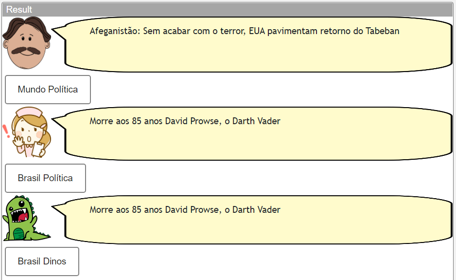
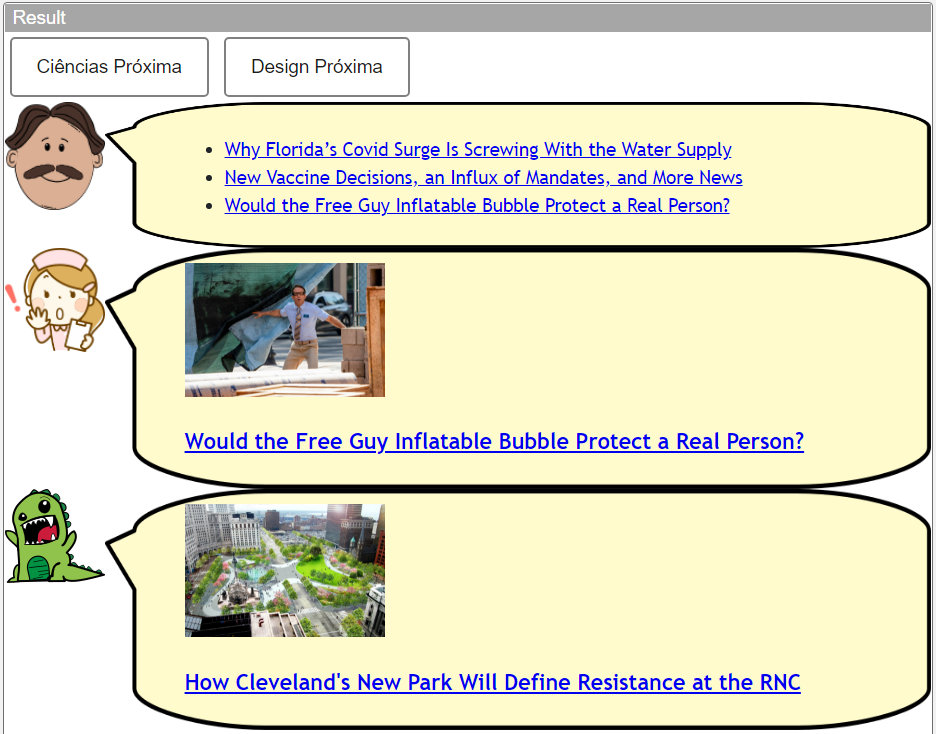
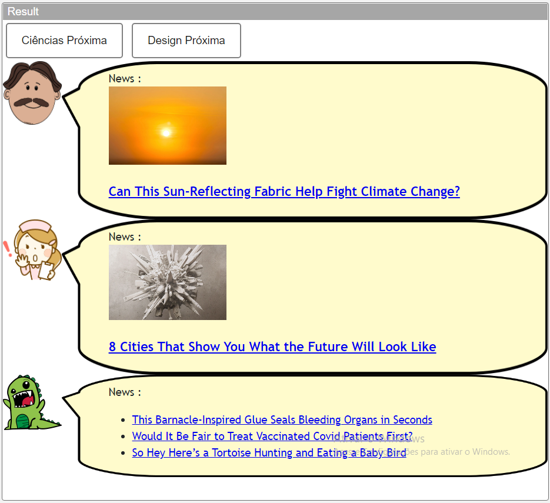

# Modelo para Apresentação do Lab04 - Componentes, Mensagens, Eventos e Barramento

Estrutura de pastas:

~~~
├── README.md  <- arquivo apresentando a tarefa
│
└── images     <- arquivos de imagens usadas no documento
~~~

# Aluno
* `Maximiliano Pires - RA: ex150318`

## Tarefa 1 - Web Components e Tópicos
~~~html
<dcc-lively-talk character="https://harena-lab.github.io/harena-docs/dccs/tutorial/images/doctor.png" subscribe="noticia/mundo/politica:speech">  </dcc-lively-talk>
<dcc-button label="Mundo Política" topic="noticia/mundo/politica" message="Afeganistão: Sem acabar com o terror, EUA pavimentam retorno do Tabeban"></dcc-button>

<dcc-lively-talk character="https://harena-lab.github.io/harena-docs/dccs/tutorial/images/nurse.png"
subscribe="noticia/brasil/#:speech"></dcc-lively-talk>
<dcc-button label="Brasil Política" topic="noticia/brasil/politica" message="Bolsonaro veta fundão eleitoral e Congresso discutirá novo valor"></dcc-button>

<dcc-lively-talk " subscribe="noticia/#:speech"></dcc-lively-talk>
<dcc-button label="Brasil Dinos" topic="noticia/brasil/dino" message="Morre aos 85 anos David Prowse, o Darth Vader"></dcc-button>
~~~

## Tarefa 2 - Web Components e RSS
~~~html
<dcc-button label="Ciências Próxima" topic="next/ciencia/rss"></dcc-button>
<dcc-rss source="https://www.wired.com/category/science/feed" subscribe="next/ciencia/rss:next" topic="rss/science"></dcc-rss>

<dcc-button label="Design Próxima" topic="next/design/rss"></dcc-button>
<dcc-rss source="https://www.wired.com/category/design/feed" subscribe="next/design/rss:next" topic="rss/design">
</dcc-rss>

<dcc-aggregator topic="aggregate/science" quantity="3" subscribe="rss/science">
</dcc-aggregator>
<dcc-lively-talk character="https://harena-lab.github.io/harena-docs/dccs/tutorial/images/doctor.png" subscribe="aggregate/science:speech"></dcc-lively-talk>

<dcc-lively-talk character="https://harena-lab.github.io/harena-docs/dccs/tutorial/images/nurse.png"
subscribe="rss/science:speech"></dcc-lively-talk>

<dcc-lively-talk " subscribe="rss/design:speech"></dcc-lively-talk>
~~~

## Tarefa 3 - Painéis de Mensagens com Timer
~~~html
<dcc-timer cycles="10" interval="1000" topic="next/rss" subscribe="start/science/feed:start"></dcc-timer>
<dcc-timer cycles="10" interval="2000" topic="next/design" subscribe="start/design/feed:start"></dcc-timer>

<dcc-button label="Ciências Próxima" topic="start/science/feed"></dcc-button>
<dcc-button label="Design Próxima" topic="start/design/feed"></dcc-button>

<dcc-rss source="https://www.wired.com/category/science/feed" subscribe="next/rss:next" topic="rss/science"></dcc-rss>
<dcc-rss source="https://www.wired.com/category/design/feed" subscribe="next/design:next" topic="rss/design"></dcc-rss>

<dcc-aggregator topic="aggregate/science" quantity="3" subscribe="rss/science"></dcc-aggregator>

<dcc-lively-talk character="https://harena-lab.github.io/harena-docs/dccs/tutorial/images/doctor.png" speech="News :" subscribe="rss/science:speech"></dcc-lively-talk>

<dcc-lively-talk character="https://harena-lab.github.io/harena-docs/dccs/tutorial/images/nurse.png" speech="News :" subscribe="rss/design:speech"></dcc-lively-talk>

<dcc-lively-talk speech="News :" subscribe="aggregate/science:speech"></dcc-lively-talk>
~~~
