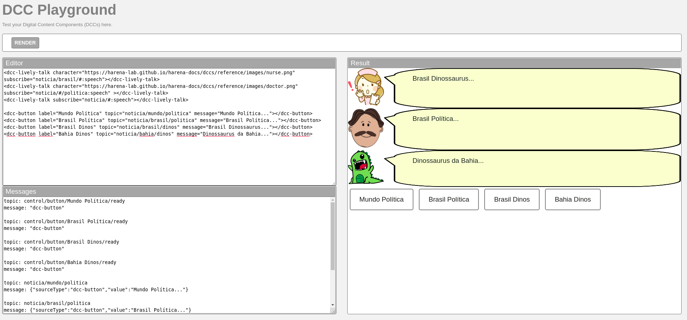
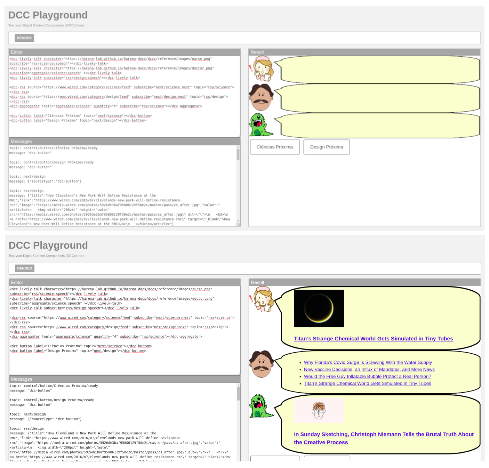
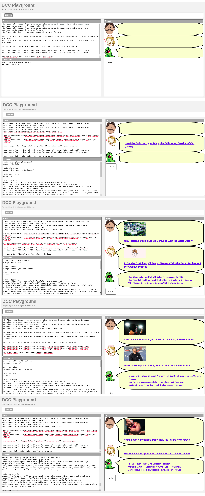

# Aluno
* `Paulo Sérgio do Nascimento RA: 150352`

## Tarefa 1 - Web Components e Tópicos
~~~html
<dcc-lively-talk character="https://harena-lab.github.io/harena-docs/dccs/reference/images/nurse.png" subscribe="noticia/brasil/#:speech"></dcc-lively-talk>
<dcc-lively-talk character="https://harena-lab.github.io/harena-docs/dccs/reference/images/doctor.png" subscribe="noticia/#/politica:speech" ></dcc-lively-talk>
<dcc-lively-talk subscribe="noticia/#:speech"></dcc-lively-talk>

<dcc-button label="Mundo Política" topic="noticia/mundo/politica" message="Mundo Política..."></dcc-button>
<dcc-button label="Brasil Política" topic="noticia/brasil/politica" message="Brasil Política..."></dcc-button>
<dcc-button label="Brasil Dinos" topic="noticia/brasil/dinos" message="Brasil Dinossaurus..."></dcc-button>
<dcc-button label="Bahia Dinos" topic="noticia/bahia/dinos" message="Dinossaurus da Bahia..."></dcc-button>
~~~

## Tarefa 2 - Web Components e RSS
~~~html
<dcc-lively-talk character="https://harena-lab.github.io/harena-docs/dccs/reference/images/nurse.png" subscribe="rss/science:speech"></dcc-lively-talk>
<dcc-lively-talk character="https://harena-lab.github.io/harena-docs/dccs/reference/images/doctor.png" subscribe="aggregate/science:speech" ></dcc-lively-talk>
<dcc-lively-talk subscribe="rss/design:speech"></dcc-lively-talk>

<dcc-rss source="https://www.wired.com/category/science/feed" subscribe="next/science:next" topic="rss/science"></dcc-rss>
<dcc-rss source="https://www.wired.com/category/design/feed" subscribe="next/design:next" topic="rss/design"></dcc-rss>
<dcc-aggregator topic="aggregate/science" quantity="4" subscribe="rss/science"></dcc-aggregator>

<dcc-button label="Ciências Próxima" topic="next/science"></dcc-button>
<dcc-button label="Design Próxima" topic="next/design"></dcc-button>
~~~

## Tarefa 3 - Painéis de Mensagens com Timer
~~~html
<dcc-lively-talk character="https://harena-lab.github.io/harena-docs/dccs/reference/images/doctor.png" subscribe="rss/science:speech" ></dcc-lively-talk>
<dcc-lively-talk character="https://harena-lab.github.io/harena-docs/dccs/reference/images/nurse.png" subscribe="rss/design:speech"></dcc-lively-talk>
<dcc-lively-talk subscribe="aggregate/feed:speech"></dcc-lively-talk>

<dcc-rss source="https://www.wired.com/category/science/feed" subscribe="next/science:next" topic="rss/science"></dcc-rss>
<dcc-rss source="https://www.wired.com/category/design/feed" subscribe="next/design:next" topic="rss/design"></dcc-rss>

<dcc-aggregator topic="aggregate/feed" quantity="3" subscribe="rss/#"></dcc-aggregator>

<dcc-timer cycles="50" interval="2000" topic="next/science" subscribe="start/feed:start"></dcc-timer>
<dcc-timer cycles="50" interval="1000" topic="next/design" subscribe="start/feed:start"></dcc-timer>

<dcc-button label="Inicia" topic="start/feed"></dcc-button>
~~~
