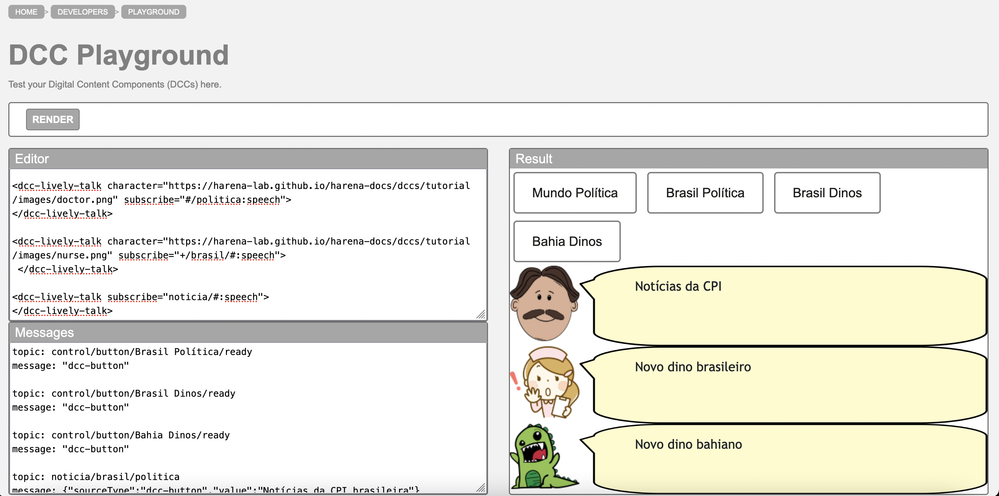

# Lab04 - Componentes, Mensagens, Eventos e Barramento

Estrutura de pastas:

~~~
├── README.md  <- arquivo apresentando a tarefa
│
└── images     <- arquivos de imagens usadas no documento
~~~

# Aluno
Rodrigo Leonel Sartorato

## Tarefa 1 - Web Components e Tópicos

Seguindo as intruções do execício, temos:

~~~html
<dcc-button label="Mundo Política" topic="noticia/mundo/politica" message="Notícias da CPI">
</dcc-button>

<dcc-button label="Brasil Política" topic="noticia/brasil/politica" message="Notícias da CPI brasileira">
</dcc-button>

<dcc-button label="Brasil Dinos" topic="noticia/brasil/dinos" message="Novo dino brasileiro">
</dcc-button>

<dcc-button label="Bahia Dinos" topic="noticia/bahia/dinos" message="Novo dino bahiano">
</dcc-button>

<dcc-lively-talk character="https://harena-lab.github.io/harena-docs/dccs/tutorial/images/doctor.png" subscribe="#/politica:speech">
</dcc-lively-talk>

<dcc-lively-talk character="https://harena-lab.github.io/harena-docs/dccs/tutorial/images/nurse.png" subscribe="+/brasil/#:speech">
 </dcc-lively-talk>

<dcc-lively-talk subscribe="noticia/#:speech">
</dcc-lively-talk>
~~~

> Imagem da composição em funcionamento, como o exemplo a seguir:

## Tarefa 2 - Web Components e RSS
> Escreva aqui o código da sua composição de componentes Web seguida de uma imagem que captura o funcionamento, como foi feito na tarefa anterior.

## Tarefa 3 - Painéis de Mensagens com Timer
> Escreva aqui o código da sua composição de componentes Web seguida de uma imagem que captura o funcionamento, como foi feito na tarefa anterior.

