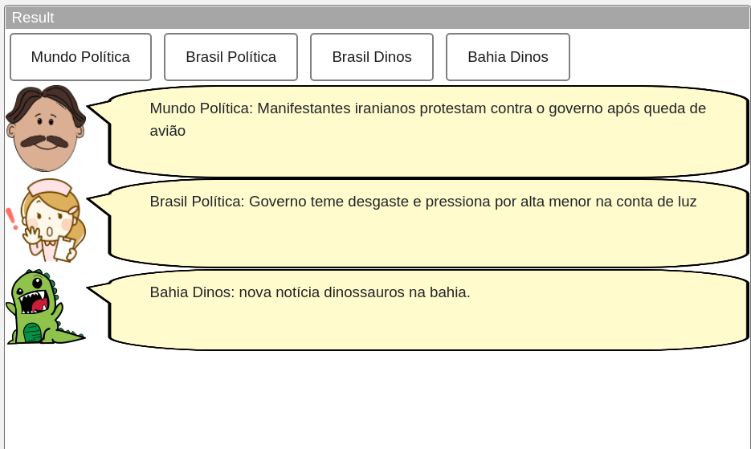
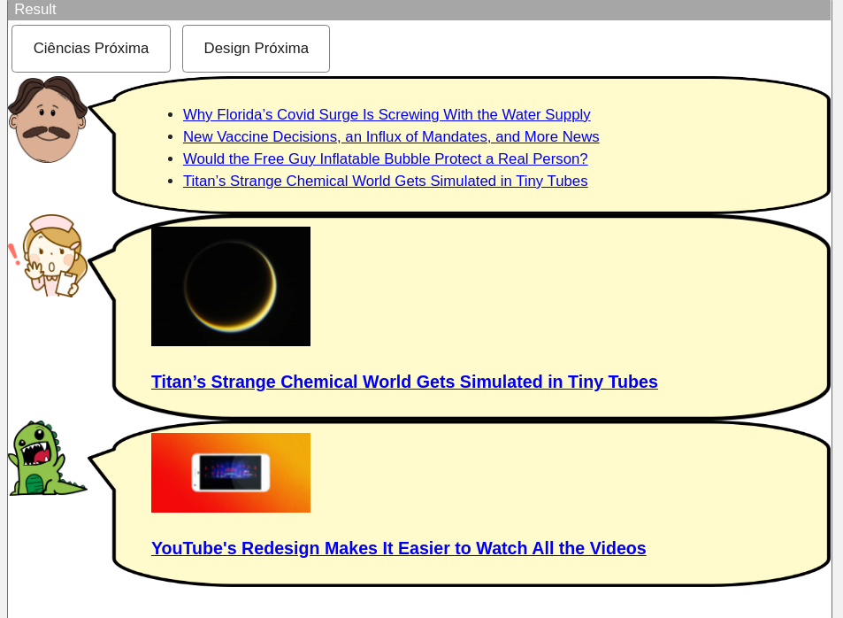
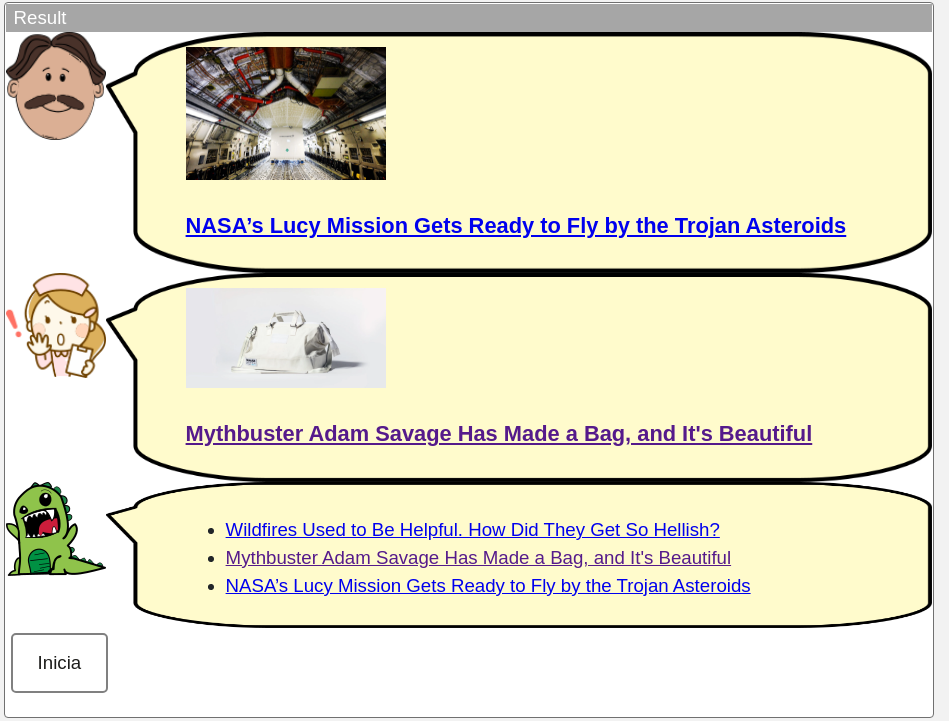

# Modelo para Apresentação do Lab04 - Componentes, Mensagens, Eventos e Barramento

Estrutura de pastas:

~~~
├── README.md  <- arquivo apresentando a tarefa
│
└── images     <- arquivos de imagens usadas no documento
~~~

# Aluno
* `Bernardo Fonseca Andrade de Carvalho`

## Tarefa 1 - Web Components e Tópicos

> Código:

~~~html
<dcc-button
label="Mundo Política"
topic="noticia/mundo/politica"
message="Mundo Política: Manifestantes iranianos protestam contra o governo após queda de avião"
>
</dcc-button>
<dcc-button
label="Brasil Política"
topic="noticia/brasil/politica"
message="Brasil Política: Governo teme desgaste e pressiona por alta menor na conta de luz"
>
</dcc-button>
<dcc-button
label="Brasil Dinos"
topic="noticia/brasil/dinos"
message="Brasil Dinos: nova notícia urgente."
>
</dcc-button>
<dcc-button
label="Bahia Dinos"
topic="noticia/bahia/dinos"
message="Bahia Dinos: nova notícia dinossauros na bahia."
>
</dcc-button>
<dcc-lively-talk character="https://harena-lab.github.io/harena-docs/dccs/tutorial/images/doctor.png" subscribe="noticia/#/politica:speech">
</dcc-lively-talk>

<dcc-lively-talk character="https://harena-lab.github.io/harena-docs/dccs/tutorial/images/nurse.png" subscribe="noticia/brasil/#:speech">
</dcc-lively-talk>

<dcc-lively-talk subscribe="noticia/#:speech">
</dcc-lively-talk>
~~~

## Tarefa 2 - Web Components e RSS
> Código:
~~~html
<dcc-rss source="https://www.wired.com/category/science/feed" subscribe="next/rss/science:next" topic="rss/science">
</dcc-rss>

<dcc-rss source="https://www.wired.com/category/design/feed" subscribe="next/rss/design:next" topic="rss/design">
</dcc-rss>

<dcc-aggregator topic="aggregate/science" quantity="4" subscribe="rss/science">
</dcc-aggregator>

<dcc-button
label="Ciências Próxima"
topic="next/rss/science"
>
</dcc-button>

<dcc-button
label="Design Próxima"
topic="next/rss/design"
>
</dcc-button>
<dcc-lively-talk character="https://harena-lab.github.io/harena-docs/dccs/tutorial/images/doctor.png" subscribe="aggregate/science:speech">
</dcc-lively-talk>

<dcc-lively-talk character="https://harena-lab.github.io/harena-docs/dccs/tutorial/images/nurse.png" subscribe="rss/science:speech">
</dcc-lively-talk>

<dcc-lively-talk subscribe="rss/design:speech">
</dcc-lively-talk>
~~~

## Tarefa 3 - Painéis de Mensagens com Timer
> Código:
~~~html
<dcc-rss source="https://www.wired.com/category/science/feed" subscribe="next/rss/science:next" topic="rss/science">
</dcc-rss>

<dcc-rss source="https://www.wired.com/category/design/feed" subscribe="next/rss/design:next" topic="rss/design">
</dcc-rss>

<dcc-aggregator topic="aggregate/all" quantity="3" subscribe="rss/#">
</dcc-aggregator>

<dcc-lively-talk character="https://harena-lab.github.io/harena-docs/dccs/tutorial/images/doctor.png" subscribe="rss/science:speech">
</dcc-lively-talk>

<dcc-lively-talk character="https://harena-lab.github.io/harena-docs/dccs/tutorial/images/nurse.png" subscribe="rss/design:speech">
</dcc-lively-talk>

<dcc-lively-talk subscribe="aggregate/all:speech">
</dcc-lively-talk>

<dcc-timer cycles="20" interval="1000" topic="next/rss/science" subscribe="start/feed:start">
</dcc-timer>

<dcc-timer cycles="10" interval="2000" topic="next/rss/design" subscribe="start/feed:start">
</dcc-timer>

<dcc-button
label="Inicia"
topic="start/feed"
>
</dcc-button>
~~~

