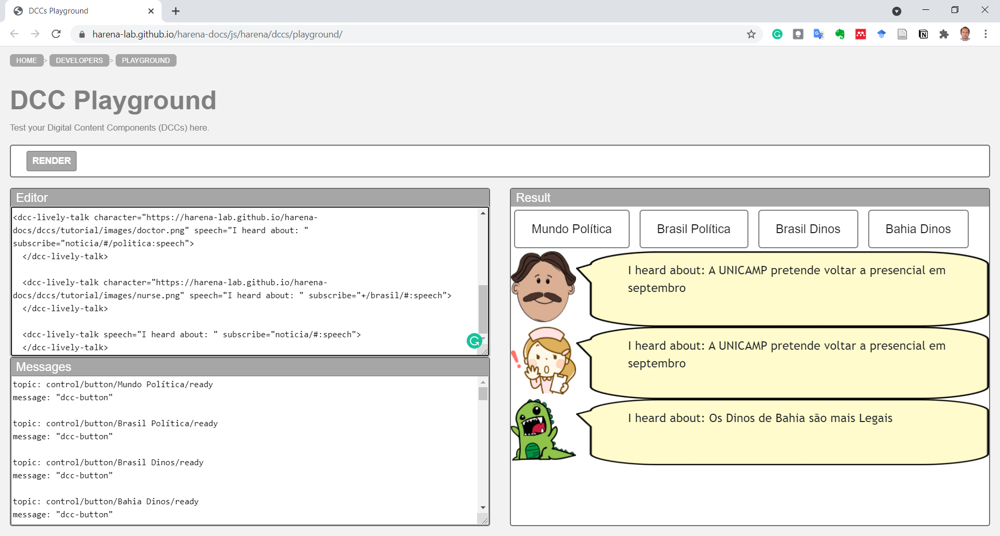
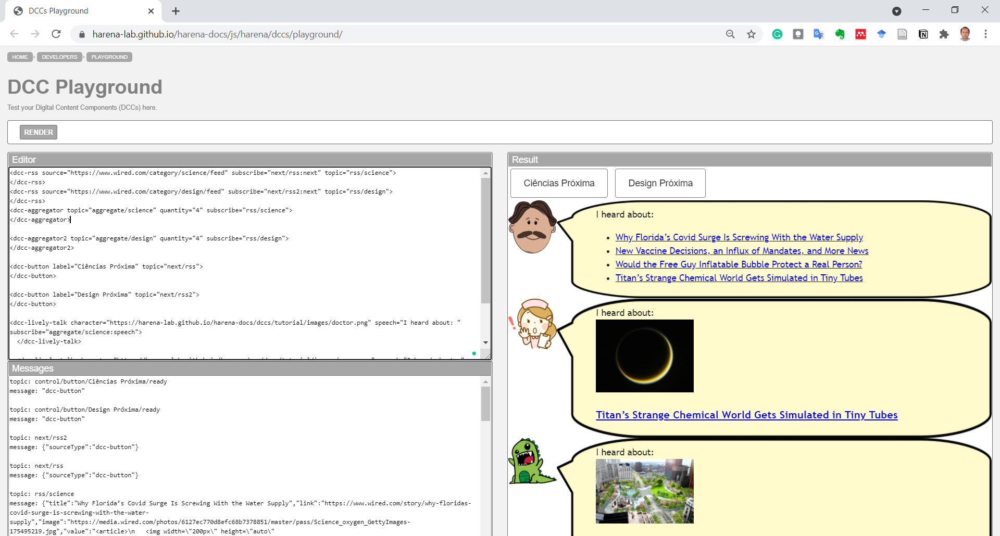
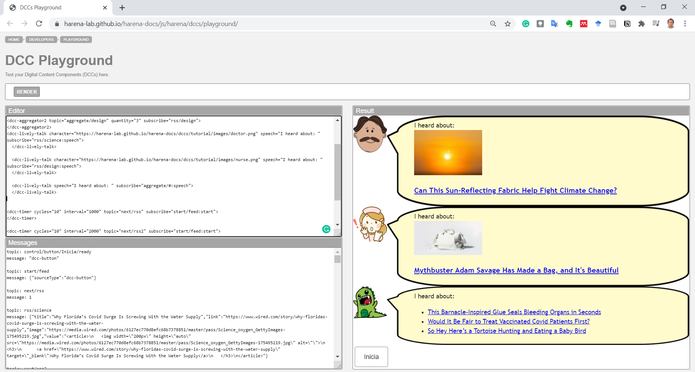

# Modelo para Apresentação do Lab04 - Componentes, Mensagens, Eventos e Barramento

Estrutura de pastas:

~~~
├── README.md  <- arquivo apresentando a tarefa
│
└── images     <- arquivos de imagens usadas no documento
~~~

# Aluno
* `Byron Alejandro Acuña Acurio`

## Tarefa 1 - Web Components e Tópicos

> Código da composição de componentes Web:

~~~html
<dcc-button label="Mundo Política" topic="noticia/mundo/politica" message="USA esta indo em bora de Afganistan">
</dcc-button>

<dcc-button label="Brasil Política" topic="noticia/brasil/politica" message="A UNICAMP pretende voltar a presencial em septembro">
</dcc-button>

<dcc-button label="Brasil Dinos" topic="noticia/brasil/dinos" message="Os Dinos de Brasil são legais">
</dcc-button>

<dcc-button label="Bahia Dinos" topic="noticia/bahia/dinos" message="Os Dinos de Bahia são mais Legais">
</dcc-button>

<dcc-lively-talk character="https://harena-lab.github.io/harena-docs/dccs/tutorial/images/doctor.png" speech="I heard about: " subscribe="noticia/#/politica:speech">
  </dcc-lively-talk>

  <dcc-lively-talk character="https://harena-lab.github.io/harena-docs/dccs/tutorial/images/nurse.png" speech="I heard about: " subscribe="+/brasil/#:speech">
  </dcc-lively-talk>

  <dcc-lively-talk speech="I heard about: " subscribe="noticia/#:speech">
  </dcc-lively-talk>
~~~

> Imagem da composição em funcionamento:

## Tarefa 2 - Web Components e RSS
> Código da composição de componentes Web:
~~~html
<dcc-rss source="https://www.wired.com/category/science/feed" subscribe="next/rss:next" topic="rss/science">
</dcc-rss>
<dcc-rss source="https://www.wired.com/category/design/feed" subscribe="next/rss2:next" topic="rss/design">
</dcc-rss>
<dcc-aggregator topic="aggregate/science" quantity="4" subscribe="rss/science">
</dcc-aggregator>

<dcc-aggregator2 topic="aggregate/design" quantity="4" subscribe="rss/design">
</dcc-aggregator2>

<dcc-button label="Ciências Próxima" topic="next/rss">
</dcc-button>

<dcc-button label="Design Próxima" topic="next/rss2">
</dcc-button>

<dcc-lively-talk character="https://harena-lab.github.io/harena-docs/dccs/tutorial/images/doctor.png" speech="I heard about: " subscribe="aggregate/science:speech">
  </dcc-lively-talk>

  <dcc-lively-talk character="https://harena-lab.github.io/harena-docs/dccs/tutorial/images/nurse.png" speech="I heard about: " subscribe="rss/science:speech">
  </dcc-lively-talk>

  <dcc-lively-talk speech="I heard about: " subscribe="rss/design:speech">
  </dcc-lively-talk>
~~~
> Imagem da composição em funcionamento:

## Tarefa 3 - Painéis de Mensagens com Timer
> Código da composição de componentes Web:
~~~html
<dcc-rss source="https://www.wired.com/category/science/feed" subscribe="next/rss:next" topic="rss/science">
</dcc-rss>
<dcc-rss source="https://www.wired.com/category/design/feed" subscribe="next/rss2:next" topic="rss/design">
</dcc-rss>
<dcc-aggregator topic="aggregate/science" quantity="3" subscribe="rss/science">
</dcc-aggregator>

<dcc-aggregator2 topic="aggregate/design" quantity="3" subscribe="rss/design">
</dcc-aggregator2>
<dcc-lively-talk character="https://harena-lab.github.io/harena-docs/dccs/tutorial/images/doctor.png" speech="I heard about: " subscribe="rss/science:speech">
  </dcc-lively-talk>

  <dcc-lively-talk character="https://harena-lab.github.io/harena-docs/dccs/tutorial/images/nurse.png" speech="I heard about: " subscribe="rss/design:speech">
  </dcc-lively-talk>

  <dcc-lively-talk speech="I heard about: " subscribe="aggregate/#:speech">
  </dcc-lively-talk>

<dcc-timer cycles="10" interval="1000" topic="next/rss" subscribe="start/feed:start">
</dcc-timer>

<dcc-timer cycles="10" interval="2000" topic="next/rss2" subscribe="start/feed:start">
</dcc-timer>

<dcc-timer cycles="10" interval="2000" topic="next/rss3" subscribe="start/feed:start">
</dcc-timer>

<dcc-button label="Inicia" topic="start/feed">
</dcc-button>
~~~
> Imagem da composição em funcionamento:

