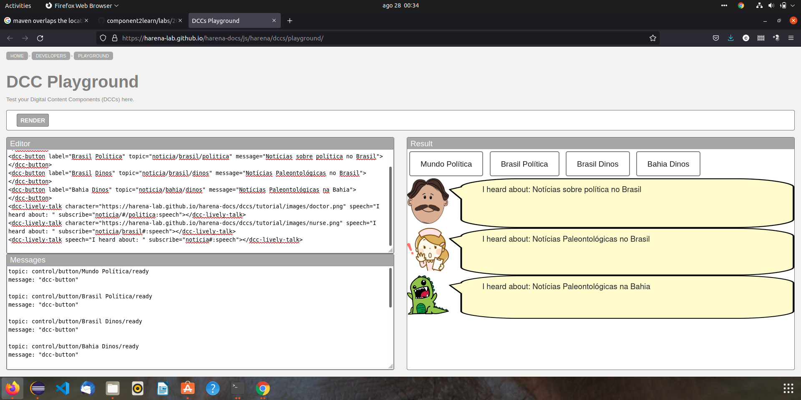
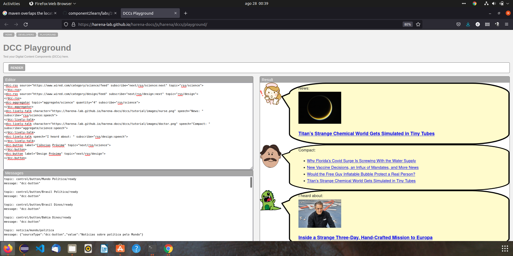
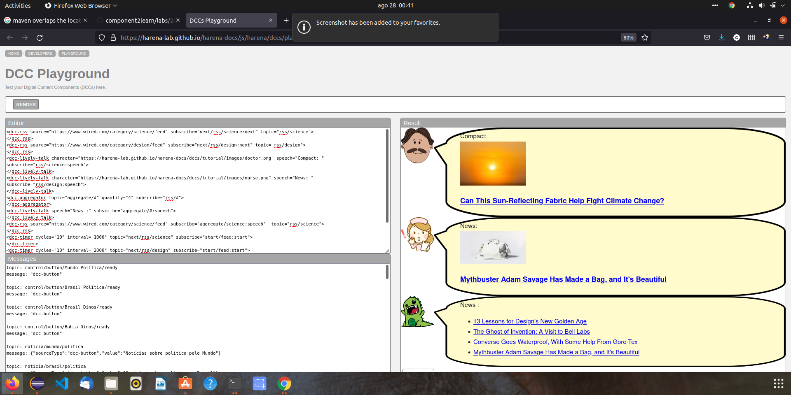

# Modelo para Apresentação do Lab04 - Componentes, Mensagens, Eventos e Barramento

Estrutura de pastas:

~~~
├── README.md  <- arquivo apresentando a tarefa
│
└── images     <- arquivos de imagens usadas no documento
~~~

# Aluno
* `Carlos Eduardo Araujo dos Santos`

## Tarefa 1 - Web Components e Tópicos

> Escreva aqui o código da sua composição de componentes Web, como mostra o exemplo a seguir:

~~~html
<dcc-button label="Mundo Política" topic="noticia/mundo/politica" message="Notícias sobre política pelo Mundo">
</dcc-button>
<dcc-button label="Brasil Política" topic="noticia/brasil/politica" message="Notícias sobre política no Brasil">
</dcc-button>
<dcc-button label="Brasil Dinos" topic="noticia/brasil/dinos" message="Notícias Paleontológicas no Brasil">
</dcc-button>
<dcc-button label="Bahia Dinos" topic="noticia/bahia/dinos" message="Notícias Paleontológicas na Bahia">
</dcc-button>
<dcc-lively-talk character="https://harena-lab.github.io/harena-docs/dccs/tutorial/images/doctor.png" speech="I heard about: " subscribe="noticia/#/politica:speech"></dcc-lively-talk>
<dcc-lively-talk character="https://harena-lab.github.io/harena-docs/dccs/tutorial/images/nurse.png" speech="I heard about: " subscribe="noticia/brasil#:speech"></dcc-lively-talk>
<dcc-lively-talk speech="I heard about: " subscribe="noticia#:speech"></dcc-lively-talk>
~~~

> Acrescente uma imagem da composição em funcionamento, como o exemplo a seguir:

## Tarefa 2 - Web Components e RSS
> Escreva aqui o código da sua composição de componentes Web seguida de uma imagem que captura o funcionamento, como foi feito na tarefa anterior.

~~~html
<dcc-rss source="https://www.wired.com/category/science/feed" subscribe="next/rss/science:next" topic="rss/science">
</dcc-rss>
<dcc-rss source="https://www.wired.com/category/design/feed" subscribe="next/rss/design:next" topic="rss/design">
</dcc-rss>
<dcc-aggregator topic="aggregate/science" quantity="4" subscribe="rss/science">
</dcc-aggregator>
<dcc-lively-talk character="https://harena-lab.github.io/harena-docs/dccs/tutorial/images/nurse.png" speech="News: " subscribe="rss/science:speech">
</dcc-lively-talk>
<dcc-lively-talk character="https://harena-lab.github.io/harena-docs/dccs/tutorial/images/doctor.png" speech="Compact: " subscribe="aggregate/science:speech">
</dcc-lively-talk>
<dcc-lively-talk speech="I heard about: " subscribe="rss/design:speech">
</dcc-lively-talk>
<dcc-button label="Ciências Próxima" topic="next/rss/science">
</dcc-button>
<dcc-button label="Design Próxima" topic="next/rss/design">
</dcc-button>
~~~

## Tarefa 3 - Painéis de Mensagens com Timer
> Escreva aqui o código da sua composição de componentes Web seguida de uma imagem que captura o funcionamento, como foi feito na tarefa anterior.

~~~html
<dcc-rss source="https://www.wired.com/category/science/feed" subscribe="next/rss/science:next" topic="rss/science">
</dcc-rss>
<dcc-rss source="https://www.wired.com/category/design/feed" subscribe="next/rss/design:next" topic="rss/design">
</dcc-rss>
<dcc-lively-talk character="https://harena-lab.github.io/harena-docs/dccs/tutorial/images/doctor.png" speech="Compact: " subscribe="rss/science:speech">
</dcc-lively-talk>
<dcc-lively-talk character="https://harena-lab.github.io/harena-docs/dccs/tutorial/images/nurse.png" speech="News: " subscribe="rss/design:speech">
</dcc-lively-talk>
<dcc-aggregator topic="aggregate/#" quantity="4" subscribe="rss/#">
</dcc-aggregator>
<dcc-lively-talk speech="News :" subscribe="aggregate/#:speech">
</dcc-lively-talk>
<dcc-rss source="https://www.wired.com/category/science/feed" subscribe="aggregate/science:speech"  topic="rss/science">
</dcc-rss>
<dcc-timer cycles="10" interval="1000" topic="next/rss/science" subscribe="start/feed:start">
</dcc-timer>
<dcc-timer cycles="10" interval="2000" topic="next/rss/design" subscribe="start/feed:start">
</dcc-timer>

<dcc-button label="Inicia" topic="start/feed">
</dcc-button>
~~~

