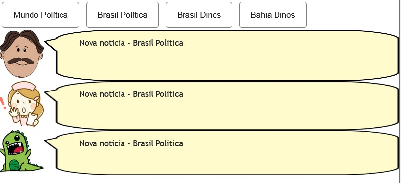
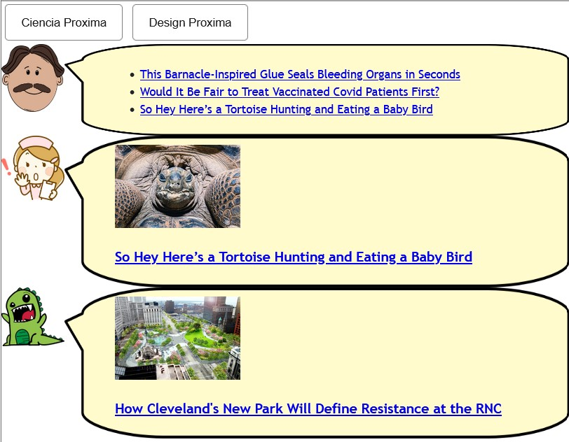
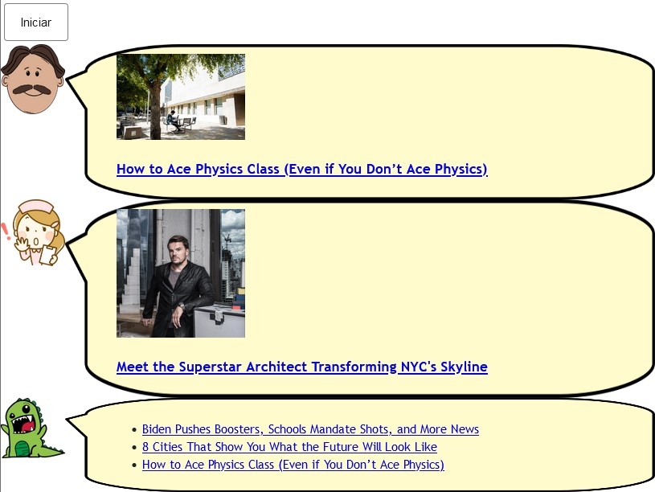

Lab04 - Componentes, Mensagens, Eventos e Barramento

# Aluno
* André Fagundes Carvalho - ex150375

## Tarefa 1 - Web Components e Tópicos

> Código:

~~~html
<dcc-button id="botaoMundoPolitica" label="Mundo Política" topic="noticia/mundo/politica" message="Nova noticia - Mundo Politica">
</dcc-button>

<dcc-button id="botaoBrasilPolitica" label="Brasil Política" topic="noticia/brasil/politica" message="Nova noticia - Brasil Politica">
</dcc-button>

<dcc-button id="botaoBrasilDinos" label="Brasil Dinos" topic="noticia/brasil/dinos" message="Nova noticia - Brasil Dinos">
</dcc-button>

<dcc-button id="botaoBahiaDinos" label="Bahia Dinos" topic="noticia/bahia/dinos" message="Nova noticia - Bahia Dinos">
</dcc-button>

<dcc-lively-talk character="https://harena-lab.github.io/harena-docs/dccs/tutorial/images/doctor.png" speech="" subscribe="noticia/+/politica:speech">
</dcc-lively-talk>

<dcc-lively-talk character="https://harena-lab.github.io/harena-docs/dccs/tutorial/images/nurse.png" speech="" subscribe="noticia/brasil/#:speech">
</dcc-lively-talk>

<dcc-lively-talk speech="" subscribe="#:speech">
</dcc-lively-talk>
~~~

> Imagem da composição em funcionamento ao apertar o botão "Brasil Politica" 

## Tarefa 2 - Web Components e RSS

> Código:

~~~html
<dcc-rss source="https://www.wired.com/category/science/feed" subscribe="next/ciencia/rss:next" topic="rss/science">
</dcc-rss>

<dcc-aggregator topic="aggregate/science" quantity="3" subscribe="rss/science">
</dcc-aggregator>

<dcc-rss source="https://www.wired.com/category/design/feed" subscribe="next/design/rss:next" topic="rss/design">
</dcc-rss>

<dcc-aggregator topic="aggregate/design" quantity="3" subscribe="rss/design">
</dcc-aggregator>

<dcc-button id="botaoCienciaProxima" label="Ciencia Proxima" topic="next/ciencia/rss">
</dcc-button>

<dcc-button id="botaoDesignProxima" label="Design Proxima" topic="next/design/rss">
</dcc-button>

<dcc-lively-talk character="https://harena-lab.github.io/harena-docs/dccs/tutorial/images/doctor.png" speech="" subscribe="aggregate/science:speech">
</dcc-lively-talk>

<dcc-lively-talk character="https://harena-lab.github.io/harena-docs/dccs/tutorial/images/nurse.png" speech="" subscribe="rss/science:speech">
</dcc-lively-talk>

<dcc-lively-talk speech="" subscribe="rss/design:speech">
</dcc-lively-talk>
~~~

> Imagem da composição em funcionamento ao apertar o botão "Ciencia Proxima" 3 vezes e "Design Proxima" uma vez

## Tarefa 3 - Painéis de Mensagens com Timer

> Código:

~~~html
<dcc-rss source="https://www.wired.com/category/science/feed" subscribe="next/count1s:next" topic="rss/science">
</dcc-rss>

<dcc-rss source="https://www.wired.com/category/design/feed" subscribe="next/count2s:next" topic="rss/design">
</dcc-rss>

<dcc-aggregator topic="aggregate/both" quantity="3" subscribe="rss/+">
</dcc-aggregator>

<dcc-timer cycles="10" interval="1000" topic="next/count1s" subscribe="start/timer:start">

<dcc-timer cycles="10" interval="2000" topic="next/count2s" subscribe="start/timer:start">

<dcc-button id="botaoIniciar" label="Iniciar" topic="start/timer">
</dcc-button>

<dcc-lively-talk character="https://harena-lab.github.io/harena-docs/dccs/tutorial/images/doctor.png" speech="" subscribe="rss/science:speech">
</dcc-lively-talk>

<dcc-lively-talk character="https://harena-lab.github.io/harena-docs/dccs/tutorial/images/nurse.png" speech="" subscribe="rss/design:speech">
</dcc-lively-talk>

<dcc-lively-talk speech="" subscribe="aggregate/both:speech">
</dcc-lively-talk>
~~~

> Imagem da composição em funcionamento após um certo tempo ao apertar o botão "Inicar"

