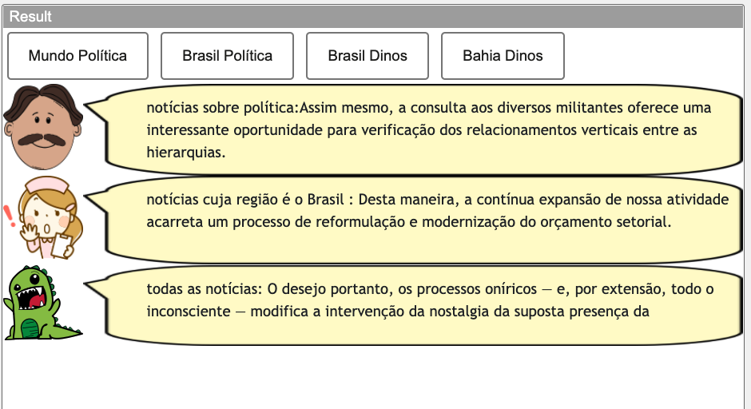
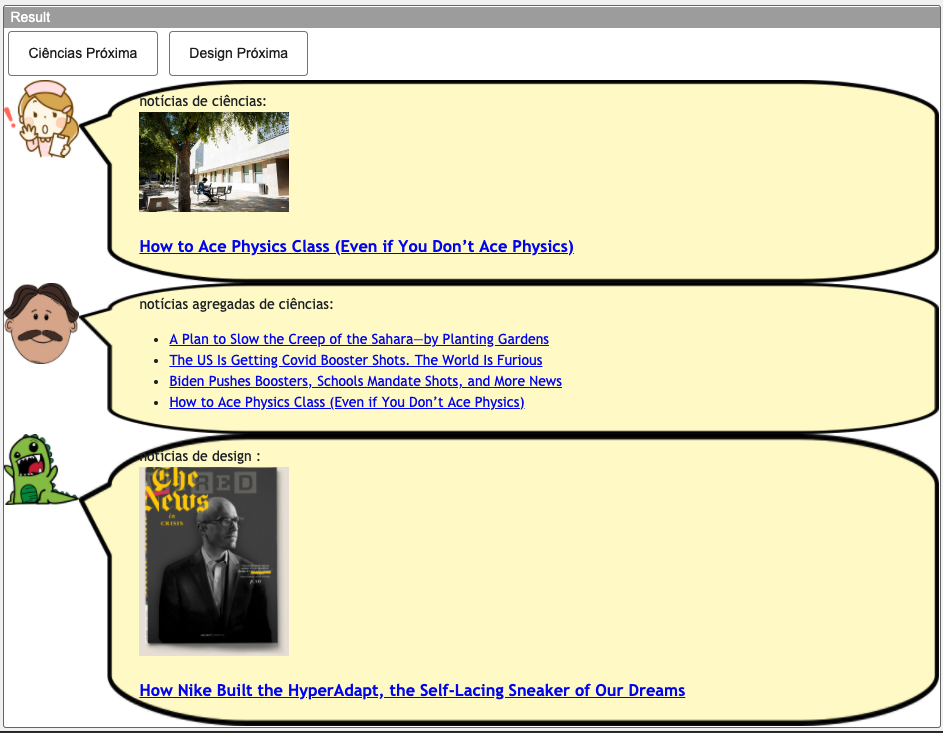
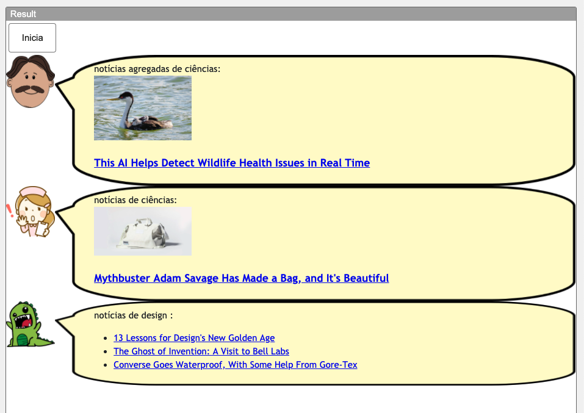

# Lab04 - Componentes, Mensagens, Eventos e Barramento

Estrutura de pastas:

# Aluno
* `Amanda Souza Macedo Bacelli`

## Tarefa 1 - Web Components e Tópicos

~~~html
<dcc-button label="Mundo Política" topic="noticia/mundo/politica" message="Do mesmo modo, o início da atividade geral de formação de atitudes causa impacto indireto na reavaliação das formas de ação.">
</dcc-button>

topic: control/button/Mundo Política/ready
message: "dcc-button"

topic: noticia/mundo/politica
message: {"sourceType":"dcc-button","value":"Do mesmo modo, o início da atividade geral de formação de atitudes causa impacto indireto na reavaliação das formas de ação."}
~~~

~~~html
<dcc-button label="Brasil Política" topic="noticia/brasil/politica" message="Assim mesmo, a consulta aos diversos militantes oferece uma interessante oportunidade para verificação dos relacionamentos verticais entre as hierarquias.">
</dcc-button>

topic: control/button/Brasil Política/ready
message: "dcc-button"

topic: noticia/brasil/politica
message: {"sourceType":"dcc-button","value":"Assim mesmo, a consulta aos diversos militantes oferece uma interessante oportunidade para verificação dos relacionamentos verticais entre as hierarquias."}
~~~

~~~html
<dcc-button label="Brasil Dinos" topic="noticia/brasil/dinos" message="Desta maneira, a contínua expansão de nossa atividade acarreta um processo de reformulação e modernização do orçamento setorial.">
</dcc-button>

topic: control/button/Brasil Dinos/ready
message: "dcc-button"

topic: noticia/brasil/dinos
message: {"sourceType":"dcc-button","value":"Desta maneira, a contínua expansão de nossa atividade acarreta um processo de reformulação e modernização do orçamento setorial."}
~~~

~~~html
<dcc-button label="Bahia Dinos" topic="noticia/bahia/dinos" message="O desejo portanto, os processos oníricos — e, por extensão, todo o inconsciente — modifica a intervenção da nostalgia da suposta presença da "Coisa" que teria nos salvado do desamparo.">
</dcc-button>

topic: control/button/Bahia Dinos/ready
message: "dcc-button"

topic: noticia/bahia/dinos
message: {"sourceType":"dcc-button","value":"O desejo portanto, os processos oníricos — e, por extensão, todo o inconsciente — modifica a intervenção da nostalgia da suposta presença da "}
~~~

~~~html
<dcc-lively-talk character="https://harena-lab.github.io/harena-docs/dccs/tutorial/images/doctor.png" speech="notícias sobre política:" subscribe="noticia/#/politica:speech">
</dcc-lively-talk>

<dcc-lively-talk character="https://harena-lab.github.io/harena-docs/dccs/tutorial/images/nurse.png" speech="notícias cuja região é o Brasil : " subscribe="noticia/brasil/#:speech">
</dcc-lively-talk>

<dcc-lively-talk speech="todas as notícias: " subscribe="#:speech">
</dcc-lively-talk>
~~~

## Tarefa 2 - Web Components e RSS
~~~html
<dcc-rss source="https://www.wired.com/category/science/feed" subscribe="next/rss/ciencia:next" topic="rss/ciencia">
</dcc-rss>

<dcc-rss source="https://www.wired.com/category/design/feed" subscribe="next/rss/design:next" topic="rss/design">
</dcc-rss>

<dcc-button label="Ciências Próxima" topic="next/rss/ciencia">
</dcc-button>

<dcc-button label="Design Próxima" topic="next/rss/design">
</dcc-button>

<dcc-aggregator topic="aggregate/ciencia" quantity="4" subscribe="rss/ciencia">
</dcc-aggregator>
~~~

~~~html
<dcc-lively-talk character="https://harena-lab.github.io/harena-docs/dccs/tutorial/images/nurse.png" speech="notícias de ciências: " subscribe="rss/ciencia:speech">
</dcc-lively-talk>

<dcc-lively-talk character="https://harena-lab.github.io/harena-docs/dccs/tutorial/images/doctor.png" speech="notícias agregadas de ciências: " subscribe="aggregate/ciencia:speech">
</dcc-lively-talk>

<dcc-lively-talk speech="notícias de design :" subscribe="rss/design:speech">
</dcc-lively-talk>
~~~

## Tarefa 3 - Painéis de Mensagens com Timer

~~~html
<dcc-rss source="https://www.wired.com/category/science/feed" subscribe="next/rss/ciencia:next" topic="rss/ciencia">
</dcc-rss>

<dcc-rss source="https://www.wired.com/category/design/feed" subscribe="next/rss/design:next" topic="rss/design">
</dcc-rss>

<dcc-button label="Inicia" topic="start/feed">
</dcc-button>

<dcc-aggregator topic="aggregate/ciencia" quantity="3" subscribe="rss/ciencia">
</dcc-aggregator>

<dcc-aggregator topic="aggregate/design" quantity="3" subscribe="rss/design">
</dcc-aggregator>

<dcc-lively-talk character="https://harena-lab.github.io/harena-docs/dccs/tutorial/images/doctor.png" speech="notícias agregadas de ciências: " subscribe="rss/ciencia:speech">
</dcc-lively-talk>

<dcc-timer cycles="10" interval="1000" topic="next/rss/ciencia" subscribe="start/feed:start">
</dcc-timer>

<dcc-lively-talk character="https://harena-lab.github.io/harena-docs/dccs/tutorial/images/nurse.png" speech="notícias de ciências: " subscribe="rss/design:speech">
</dcc-lively-talk>

<dcc-timer cycles="10" interval="2000" topic="next/rss/design" subscribe="start/feed:start">
</dcc-timer>

<dcc-lively-talk speech="notícias de design :" subscribe="aggregate/#:speech">
</dcc-lively-talk>

<dcc-timer cycles="10" interval="3000" topic="next/rss/#" subscribe="start/feed:start">
</dcc-timer>
~~~

