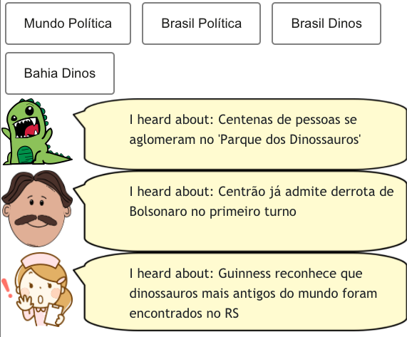
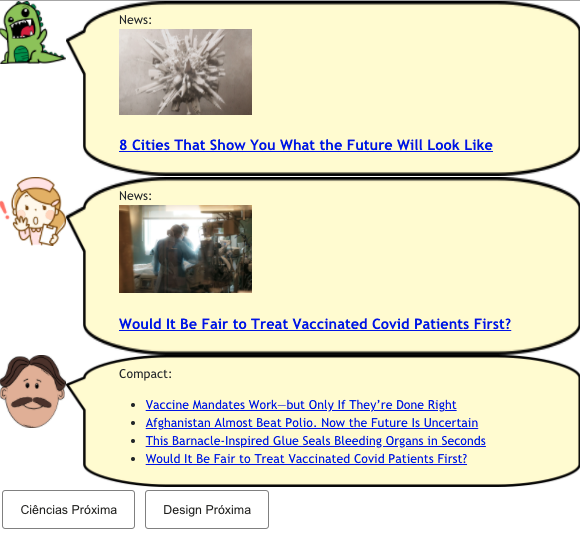
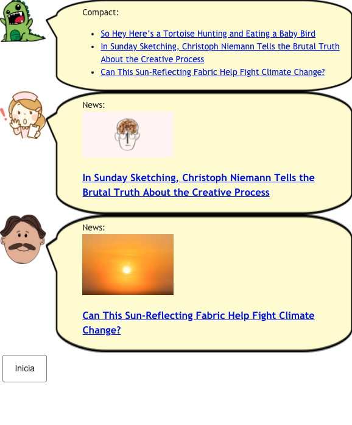

# Lab04 - Componentes, Mensagens, Eventos e Barramento

Estrutura de pastas:

~~~
├── README.md  <- arquivo apresentando a tarefa
│
└── images     <- arquivos de imagens usadas no documento
~~~

# Aluno
* `Juliana Fernandes`

## Tarefa 1 - Web Components e Tópicos

~~~html
<dcc-button label="Mundo Política" topic="noticia/mundo/politica" message="Biden to Kabul attackers: 'We will hunt you down and make you pay'">
</dcc-button>
<dcc-button label="Brasil Política" topic="noticia/brasil/politica" message="Centrão já admite derrota de Bolsonaro no primeiro turno">
</dcc-button>
<dcc-button label="Brasil Dinos" topic="noticia/brasil/dinos" message="Guinness reconhece que dinossauros mais antigos do mundo foram encontrados no RS">
</dcc-button>
<dcc-button label="Bahia Dinos" topic="noticia/bahia/dinos" message="Centenas de pessoas se aglomeram no 'Parque dos Dinossauros'">
</dcc-button>

<dcc-lively-talk speech="I heard about: " subscribe="noticia/#:speech">
</dcc-lively-talk>
<dcc-lively-talk character="https://harena-lab.github.io/harena-docs/dccs/tutorial/images/doctor.png" speech="I heard about: " subscribe="noticia/#/politica:speech">
</dcc-lively-talk>
<dcc-lively-talk character="https://harena-lab.github.io/harena-docs/dccs/tutorial/images/nurse.png" speech="I heard about: " subscribe="noticia/brasil/#:speech">
</dcc-lively-talk>
~~~

## Tarefa 2 - Web Components e RSS

~~~html
<dcc-rss source="https://www.wired.com/category/science/feed" subscribe="next/rss/science:next" topic="rss/science">
</dcc-rss>
<dcc-rss source="https://www.wired.com/category/design/feed" subscribe="next/rss/design:next" topic="rss/design">
</dcc-rss>

<dcc-aggregator topic="aggregate/science" quantity="4" subscribe="rss/science">
</dcc-aggregator>

<dcc-lively-talk speech="News: " subscribe="rss/design:speech">
</dcc-lively-talk>
<dcc-lively-talk character="https://harena-lab.github.io/harena-docs/dccs/tutorial/images/nurse.png" speech="News: " subscribe="rss/science:speech">
</dcc-lively-talk>
<dcc-lively-talk character="https://harena-lab.github.io/harena-docs/dccs/tutorial/images/doctor.png" speech="Compact: " subscribe="aggregate/science:speech">
</dcc-lively-talk>

<dcc-button label="Ciências Próxima" topic="next/rss/science">
</dcc-button>
<dcc-button label="Design Próxima" topic="next/rss/design">
</dcc-button>
~~~

## Tarefa 3 - Painéis de Mensagens com Timer

~~~html
<dcc-rss source="https://www.wired.com/category/science/feed" subscribe="next/rss/science:next" topic="rss/science">
</dcc-rss>
<dcc-rss source="https://www.wired.com/category/design/feed" subscribe="next/rss/design:next" topic="rss/design">
</dcc-rss>

<dcc-aggregator topic="aggregate" quantity="3" subscribe="rss/#">
</dcc-aggregator>

<dcc-lively-talk speech="Compact: " subscribe="aggregate:speech">
</dcc-lively-talk>
<dcc-lively-talk character="https://harena-lab.github.io/harena-docs/dccs/tutorial/images/nurse.png" speech="News: " subscribe="rss/design:speech">
</dcc-lively-talk>
<dcc-lively-talk character="https://harena-lab.github.io/harena-docs/dccs/tutorial/images/doctor.png" speech="News: " subscribe="rss/science:speech">
</dcc-lively-talk>

<dcc-timer interval="1000" topic="next/rss/science" subscribe="start/timer:start">
</dcc-timer>
<dcc-timer interval="2000" topic="next/rss/design" subscribe="start/timer:start">
</dcc-timer>
<dcc-timer interval="2000" topic="next/rss/#" subscribe="start/timer:start">
</dcc-timer>

<dcc-button label="Inicia" topic="start/timer">
</dcc-button>
~~~

