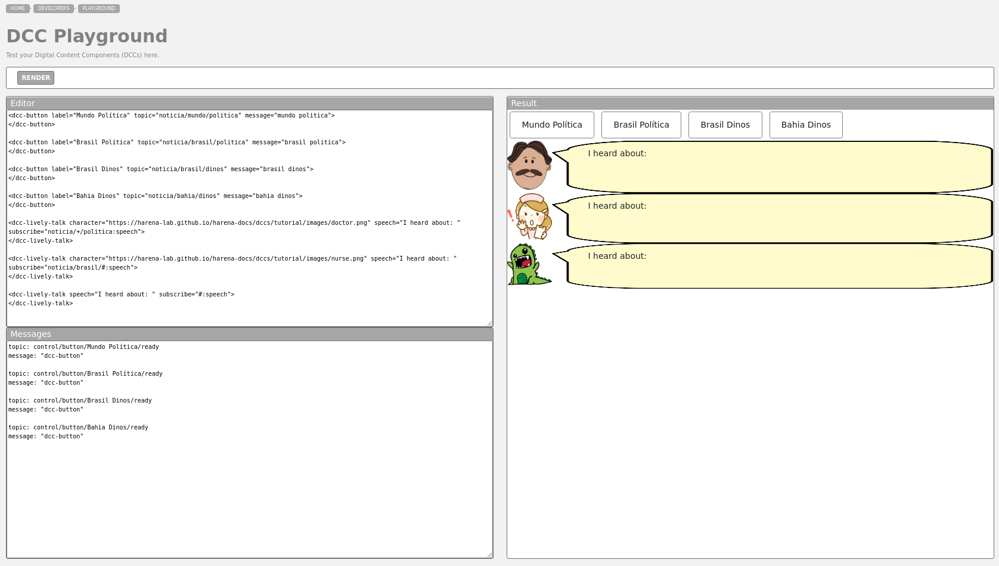
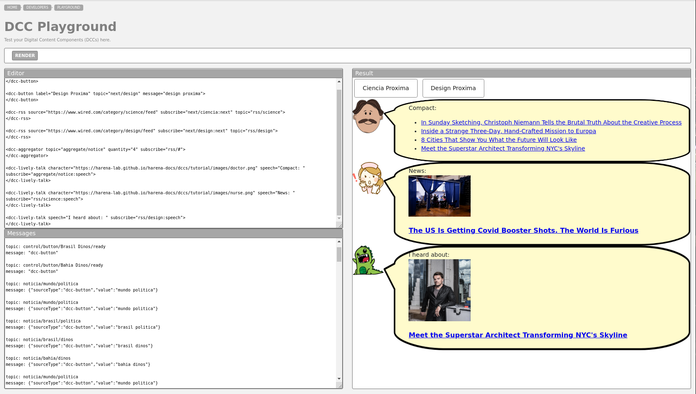

# Modelo para Apresentação do Lab04 - Componentes, Mensagens, Eventos e Barramento

Estrutura de pastas:

~~~
├── README.md  <- arquivo apresentando a tarefa
│
└── images     <- arquivos de imagens usadas no documento
~~~

# Aluno
* `Felipe Iada Tomitar`

## Tarefa 1 - Web Components e Tópicos

> Escreva aqui o código da sua composição de componentes Web, como mostra o exemplo a seguir:

~~~html
<dcc-button label="Mundo Política" topic="noticia/mundo/politica" message="mundo politica">
</dcc-button>

<dcc-button label="Brasil Política" topic="noticia/brasil/politica" message="brasil politica">
</dcc-button>

<dcc-button label="Brasil Dinos" topic="noticia/brasil/dinos" message="brasil dinos">
</dcc-button>

<dcc-button label="Bahia Dinos" topic="noticia/bahia/dinos" message="bahia dinos">
</dcc-button>

<dcc-lively-talk character="https://harena-lab.github.io/harena-docs/dccs/tutorial/images/doctor.png" speech="I heard about: " subscribe="noticia/+/politica:speech">
</dcc-lively-talk>

<dcc-lively-talk character="https://harena-lab.github.io/harena-docs/dccs/tutorial/images/nurse.png" speech="I heard about: " subscribe="noticia/brasil/#:speech">
</dcc-lively-talk>

<dcc-lively-talk speech="I heard about: " subscribe="#:speech">
</dcc-lively-talk>
~~~

> Acrescente uma imagem da composição em funcionamento, como o exemplo a seguir:

## Tarefa 2 - Web Components e RSS

~~~html
<dcc-button label="Ciencia Proxima" topic="next/ciencia" message="ciencia proxima">
</dcc-button>

<dcc-button label="Design Proxima" topic="next/design" message="design proxima">
</dcc-button>

<dcc-rss source="https://www.wired.com/category/science/feed" subscribe="next/ciencia:next" topic="rss/science">
</dcc-rss>

<dcc-rss source="https://www.wired.com/category/design/feed" subscribe="next/design:next" topic="rss/design">
</dcc-rss>

<dcc-aggregator topic="aggregate/notice" quantity="4" subscribe="rss/#">
</dcc-aggregator>

<dcc-lively-talk character="https://harena-lab.github.io/harena-docs/dccs/tutorial/images/doctor.png" speech="Compact: " subscribe="aggregate/notice:speech">
</dcc-lively-talk>

<dcc-lively-talk character="https://harena-lab.github.io/harena-docs/dccs/tutorial/images/nurse.png" speech="News: " subscribe="rss/science:speech">
</dcc-lively-talk>

<dcc-lively-talk speech="I heard about: " subscribe="rss/design:speech">
</dcc-lively-talk>
~~~

> Acrescente uma imagem da composição em funcionamento, como o exemplo a seguir:

## Tarefa 3 - Painéis de Mensagens com Timer

~~~html
<dcc-button label="Inicia" topic="start/timer" message="Inicia">
</dcc-button>

<dcc-rss source="https://www.wired.com/category/science/feed" subscribe="next/science:next" topic="rss/science">
</dcc-rss>

<dcc-rss source="https://www.wired.com/category/design/feed" subscribe="next/design:next" topic="rss/design">
</dcc-rss>

<dcc-aggregator topic="rss/aggreagator" quantity="3" subscribe="rss/#">
</dcc-aggregator>

<dcc-timer cycles="5" interval="1000" topic="next/science" subscribe="start/timer:start">
</dcc-timer>

<dcc-timer cycles="5" interval="2000" topic="next/design" subscribe="start/timer:start">
</dcc-timer>

<dcc-lively-talk character="https://harena-lab.github.io/harena-docs/dccs/tutorial/images/doctor.png" speech="Compact: " subscribe="rss/science:speech">
</dcc-lively-talk>

<dcc-lively-talk character="https://harena-lab.github.io/harena-docs/dccs/tutorial/images/nurse.png" speech="News: " subscribe="rss/design:speech">
</dcc-lively-talk>

<dcc-lively-talk speech="I heard about: " subscribe="rss/aggreagator:speech">
</dcc-lively-talk>
~~~

> Acrescente uma imagem da composição em funcionamento, como o exemplo a seguir:

