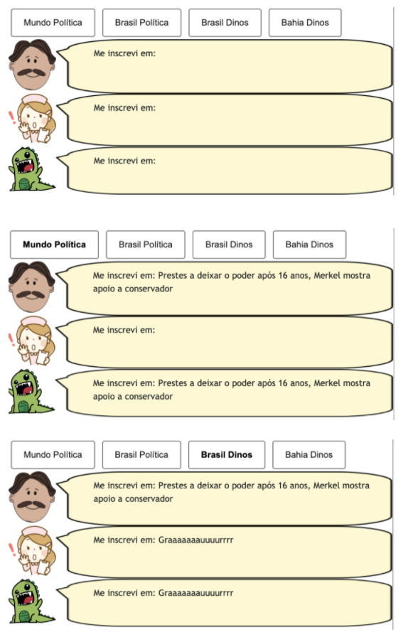
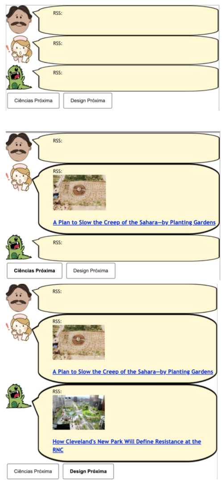
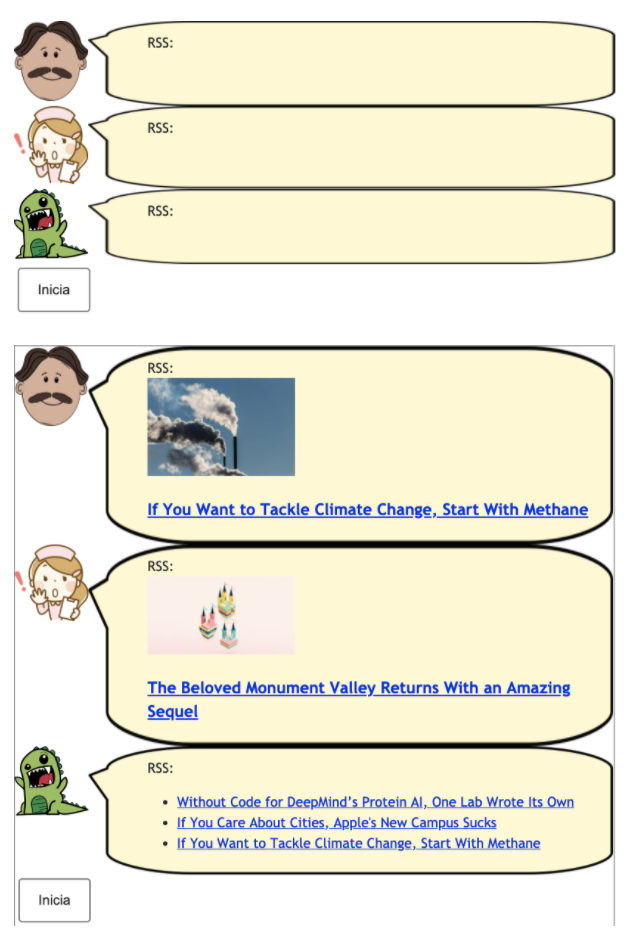

# Lab04 - Componentes, Mensagens, Eventos e Barramento

Estrutura de pastas:

~~~
├── README.md  <- arquivo apresentando a tarefa
│
└── images     <- arquivos de imagens usadas no documento
~~~

# Aluno
* Hélio De Rosa Junior

## Tarefa 1 - Web Components e Tópicos

~~~html
<dcc-button label="Mundo Política" topic="noticia/mundo/politica" message="Prestes a deixar o poder após 16 anos, Merkel mostra apoio a conservador">
</dcc-button>

<dcc-button label="Brasil Política" topic="noticia/brasil/politica" message="Presidente da CPI limita acesso a documentos para evitar vazamento">
</dcc-button>

<dcc-button label="Brasil Dinos" topic="noticia/brasil/dinos" message="Graaaaaaauuuurrrr">
</dcc-button>

<dcc-button label="Bahia Dinos" topic="noticia/bahia/dinos" message="Abertura do Jurassic Park">
</dcc-button>

<dcc-lively-talk character="https://harena-lab.github.io/harena-docs/dccs/reference/images/doctor.png" subscribe="#/politica:speech" speech="Me inscrevi em: ">
</dcc-lively-talk>

<dcc-lively-talk character="https://harena-lab.github.io/harena-docs/dccs/reference/images/nurse.png" subscribe="noticia/brasil/#:speech" speech="Me inscrevi em: ">
</dcc-lively-talk>

<dcc-lively-talk character="https://harena-lab.github.io/harena-docs/dccs/reference/images/character.png" subscribe="noticia/#:speech" speech="Me inscrevi em: ">
</dcc-lively-talk>
~~~

## Tarefa 2 - Web Components e RSS

~~~html
<dcc-rss source="https://www.wired.com/category/science/feed" subscribe="next/rss/science:next" topic="rss/science">
</dcc-rss>

<dcc-rss source="https://www.wired.com/category/design/feed" subscribe="next/rss/design:next" topic="rss/design">
</dcc-rss>

<dcc-aggregator topic="aggregate/science" quantity="4" subscribe="rss/science">
</dcc-aggregator>

<dcc-lively-talk character="https://harena-lab.github.io/harena-docs/dccs/reference/images/doctor.png" subscribe="aggregate/science:speech" speech="RSS: ">
</dcc-lively-talk>

<dcc-lively-talk character="https://harena-lab.github.io/harena-docs/dccs/reference/images/nurse.png" subscribe="rss/science:speech" speech="RSS: ">
</dcc-lively-talk>

<dcc-lively-talk character="https://harena-lab.github.io/harena-docs/dccs/reference/images/character.png" subscribe="rss/design:speech" speech="RSS: ">
</dcc-lively-talk>

<dcc-button label="Ciências Próxima" topic="next/rss/science">
</dcc-button>

<dcc-button label="Design Próxima" topic="next/rss/design">
</dcc-button>
~~~

## Tarefa 3 - Painéis de Mensagens com Timer

~~~html
<dcc-rss source="https://www.wired.com/category/science/feed" subscribe="next/rss/#:next" topic="rss/science">
</dcc-rss>

<dcc-rss source="https://www.wired.com/category/design/feed" subscribe="next/rss/#:next" topic="rss/design">
</dcc-rss>

<dcc-aggregator topic="aggregate/scienceAndDesign" quantity="3" subscribe="rss/#:speech">
</dcc-aggregator>

<dcc-lively-talk character="https://harena-lab.github.io/harena-docs/dccs/reference/images/doctor.png" subscribe="rss/science:speech" speech="RSS: ">
</dcc-lively-talk>

<dcc-lively-talk character="https://harena-lab.github.io/harena-docs/dccs/reference/images/nurse.png" subscribe="rss/design:speech" speech="RSS: ">
</dcc-lively-talk>

<dcc-lively-talk character="https://harena-lab.github.io/harena-docs/dccs/reference/images/character.png" subscribe="aggregate/scienceAndDesign:speech" speech="RSS: ">
</dcc-lively-talk>

<dcc-timer cycles="10" interval="1000" topic="next/rss/science" subscribe="start/feed:start">
</dcc-timer>

<dcc-timer cycles="10" interval="2000" topic="next/rss/design" subscribe="start/feed:start">
</dcc-timer>

<dcc-button label="Inicia" topic="start/feed">
</dcc-button>
~~~

