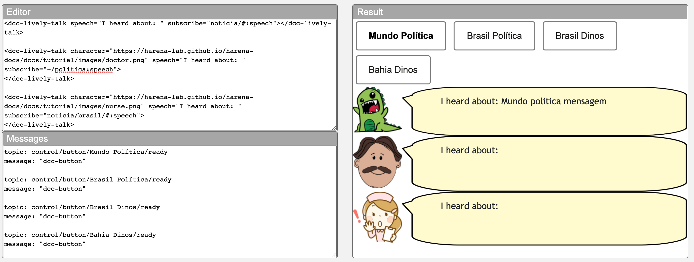
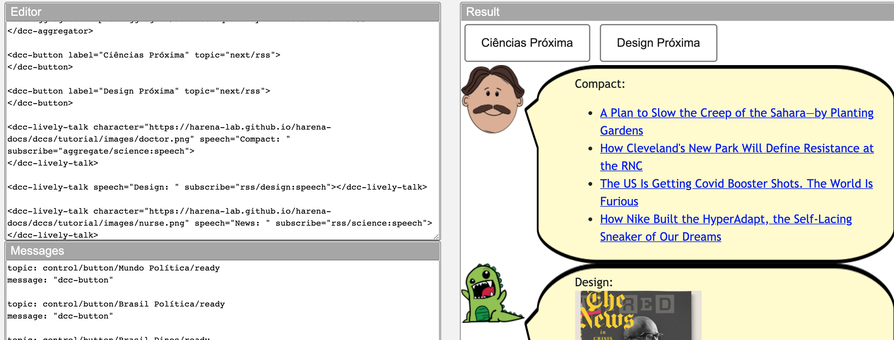
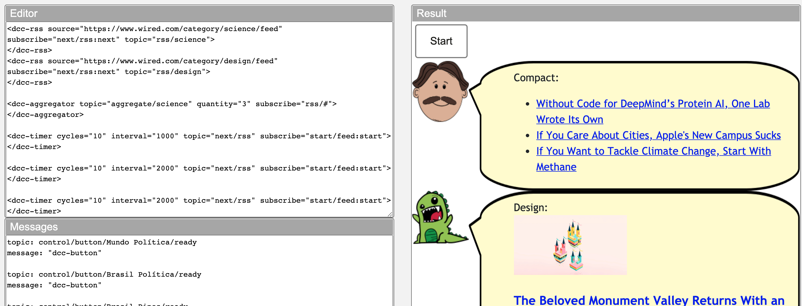

# Modelo para Apresentação do Lab04 - Componentes, Mensagens, Eventos e Barramento

# Aluno
* `Tiago Fernandes de Oliveira`

## Tarefa 1 - Web Components e Tópicos

~~~html
<dcc-button label="Mundo Política" topic="noticia/mundo/politica" message="Mundo politica mensagem">
</dcc-button>
<dcc-button label="Brasil Política" topic="noticia/brasil/politica" message="Brasil politica mensagem">
</dcc-button>
<dcc-button label="Brasil Dinos" topic="noticia/brasil/dinos" message="Brasil dinos mensagem">
</dcc-button>
<dcc-button label="Bahia Dinos" topic="noticia/bahia/dinos" message="Bahia dinos mensagem">
</dcc-button>

<dcc-lively-talk speech="I heard about: " subscribe="noticia/#:speech"></dcc-lively-talk>

<dcc-lively-talk character="https://harena-lab.github.io/harena-docs/dccs/tutorial/images/doctor.png" speech="I heard about: " subscribe="+/politica:speech">
</dcc-lively-talk>

<dcc-lively-talk character="https://harena-lab.github.io/harena-docs/dccs/tutorial/images/nurse.png" speech="I heard about: " subscribe="noticia/brasil/#:speech">
</dcc-lively-talk>
~~~

## Tarefa 2 - Web Components e RSS

~~~html
<dcc-rss source="https://www.wired.com/category/science/feed" subscribe="next/rss:next" topic="rss/science">
</dcc-rss>
<dcc-rss source="https://www.wired.com/category/design/feed" subscribe="next/rss:next" topic="rss/design">
</dcc-rss>

<dcc-aggregator topic="aggregate/science" quantity="4" subscribe="rss/#">
</dcc-aggregator>

<dcc-button label="Ciências Próxima" topic="next/rss">
</dcc-button>

<dcc-button label="Design Próxima" topic="next/rss">
</dcc-button>

<dcc-lively-talk character="https://harena-lab.github.io/harena-docs/dccs/tutorial/images/doctor.png" speech="Compact: " subscribe="aggregate/science:speech">
</dcc-lively-talk>

<dcc-lively-talk speech="Design: " subscribe="rss/design:speech"></dcc-lively-talk>

<dcc-lively-talk character="https://harena-lab.github.io/harena-docs/dccs/tutorial/images/nurse.png" speech="News: " subscribe="rss/science:speech">
</dcc-lively-talk>
~~~

## Tarefa 3 - Painéis de Mensagens com Timer

~~~html
<dcc-rss source="https://www.wired.com/category/science/feed" subscribe="next/rss:next" topic="rss/science">
</dcc-rss>
<dcc-rss source="https://www.wired.com/category/design/feed" subscribe="next/rss:next" topic="rss/design">
</dcc-rss>

<dcc-aggregator topic="aggregate/science" quantity="3" subscribe="rss/#">
</dcc-aggregator>

<dcc-timer cycles="10" interval="1000" topic="next/rss" subscribe="start/feed:start">
</dcc-timer>

<dcc-timer cycles="10" interval="2000" topic="next/rss" subscribe="start/feed:start">
</dcc-timer>

<dcc-timer cycles="10" interval="2000" topic="next/rss" subscribe="start/feed:start">
</dcc-timer>

<dcc-button label="Start" topic="start/feed">
</dcc-button>

<dcc-lively-talk character="https://harena-lab.github.io/harena-docs/dccs/tutorial/images/doctor.png" speech="Compact: " subscribe="aggregate/science:speech">
</dcc-lively-talk>

<dcc-lively-talk speech="Design: " subscribe="rss/design:speech"></dcc-lively-talk>

<dcc-lively-talk character="https://harena-lab.github.io/harena-docs/dccs/tutorial/images/nurse.png" speech="News: " subscribe="rss/science:speech">
</dcc-lively-talk>
~~~

