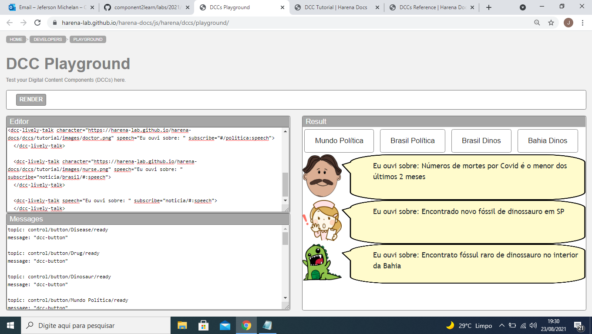
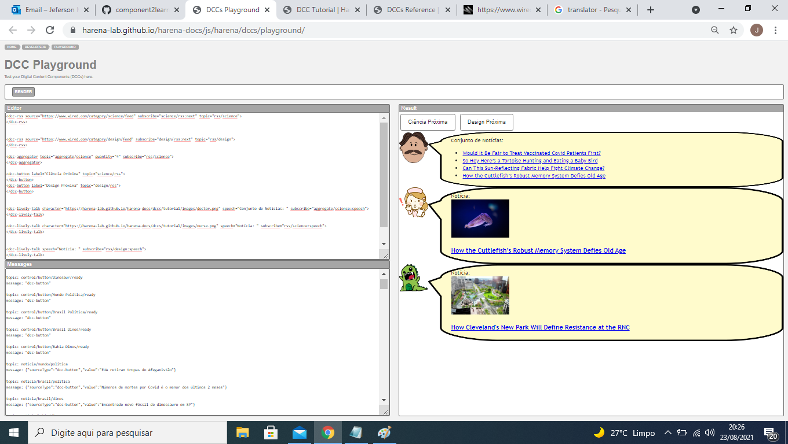
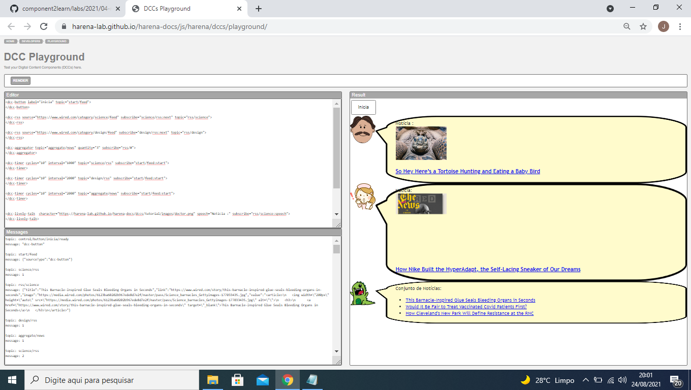

# Aluno
* Jeferson Luis Michelan

## Tarefa 1 - Web Components e Tópicos

> Escreva aqui o código da sua composição de componentes Web:

~~~html
<dcc-button label="Mundo Política" topic="noticia/mundo/politica" message="EUA retiram tropas do Afeganistão">
</dcc-button>

<dcc-button label="Brasil Política" topic="noticia/brasil/politica" message="Números de mortes por Covid é o menor dos últimos 2 meses">
</dcc-button>

<dcc-button label="Brasil Dinos" topic="noticia/brasil/dinos" message="Encontrado novo fóssil de dinossauro em SP">
</dcc-button>

<dcc-button label="Bahia Dinos" topic="noticia/bahia/dinos" message="Encontrato fóssul raro de dinossauro no interior da Bahia">
</dcc-button>

<dcc-lively-talk character="https://harena-lab.github.io/harena-docs/dccs/tutorial/images/doctor.png" speech="Eu ouvi sobre: " subscribe="#/politica:speech">
  </dcc-lively-talk>

  <dcc-lively-talk character="https://harena-lab.github.io/harena-docs/dccs/tutorial/images/nurse.png" speech="Eu ouvi sobre: " subscribe="noticia/brasil/#:speech">
  </dcc-lively-talk>

  <dcc-lively-talk speech="Eu ouvi sobre: " subscribe="noticia/#:speech">
  </dcc-lively-talk>
~~~

> Acrescente uma imagem da composição em funcionamento:

## Tarefa 2 - Web Components e RSS
> Escreva aqui o código da sua composição de componentes Web seguida de uma imagem que captura o funcionamento, como foi feito na tarefa anterior.
~~~html
<dcc-rss source="https://www.wired.com/category/science/feed" subscribe="science/rss:next" topic="rss/science">
</dcc-rss>

<dcc-rss source="https://www.wired.com/category/design/feed" subscribe="design/rss:next" topic="rss/design">
</dcc-rss>

<dcc-aggregator topic="aggregate/science" quantity="4" subscribe="rss/science">
</dcc-aggregator>

<dcc-button label="Ciência Próxima" topic="science/rss">
</dcc-button>
<dcc-button label="Design Próxima" topic="design/rss">
</dcc-button>

<dcc-lively-talk character="https://harena-lab.github.io/harena-docs/dccs/tutorial/images/doctor.png" speech="Conjunto de Notícias: " subscribe="aggregate/science:speech">
</dcc-lively-talk>

<dcc-lively-talk character="https://harena-lab.github.io/harena-docs/dccs/tutorial/images/nurse.png" speech="Notícia: " subscribe="rss/science:speech">
</dcc-lively-talk>

<dcc-lively-talk speech="Notícia: " subscribe="rss/design:speech">
</dcc-lively-talk>
~~~

> Imagem da composição em funcionamento:

## Tarefa 3 - Painéis de Mensagens com Timer
> Escreva aqui o código da sua composição de componentes Web seguida de uma imagem que captura o funcionamento, como foi feito na tarefa anterior.
~~~html
<dcc-button label="Inicia" topic="start/feed">
</dcc-button>

<dcc-rss source="https://www.wired.com/category/science/feed" subscribe="science/rss:next" topic="rss/science">
</dcc-rss>

<dcc-rss source="https://www.wired.com/category/design/feed" subscribe="design/rss:next" topic="rss/design">
</dcc-rss>

<dcc-aggregator topic="aggregate/news" quantity="3" subscribe="rss/#">
</dcc-aggregator>

<dcc-timer cycles="10" interval="1000" topic="science/rss" subscribe="start/feed:start">
</dcc-timer>

<dcc-timer cycles="10" interval="2000" topic="design/rss" subscribe="start/feed:start">
</dcc-timer>

<dcc-timer cycles="10" interval="2000" topic="aggregate/news" subscribe="start/feed:start">
</dcc-timer>

<dcc-lively-talk  character="https://harena-lab.github.io/harena-docs/dccs/tutorial/images/doctor.png" speech="Notícia :" subscribe="rss/science:speech">
</dcc-lively-talk>

<dcc-lively-talk character="https://harena-lab.github.io/harena-docs/dccs/tutorial/images/nurse.png" speech="Notícia: " subscribe="rss/design:speech">
</dcc-lively-talk>

<dcc-lively-talk  speech="Conjunto de Notícias: " subscribe="aggregate/news:speech">
</dcc-lively-talk>
~~~
> Imagem da composição em funcionamento:

