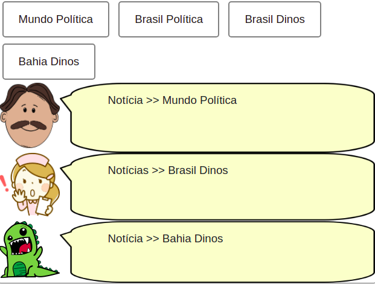
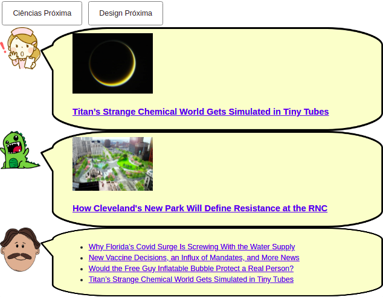
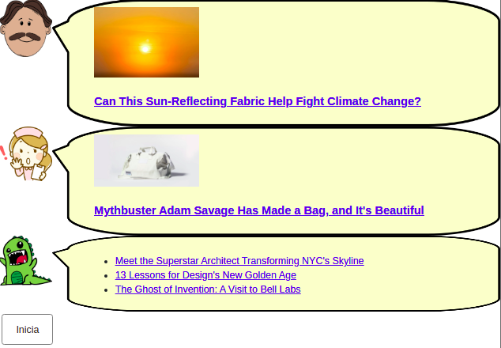

# Modelo para Apresentação do Lab04 - Componentes, Mensagens, Eventos e Barramento

# Aluno
* `Juliana Cardoso Malton`

## Tarefa 1 - Web Components e Tópicos
~~~html
<!-- Tarefa 1 -->
<dcc-button label="Mundo Política" topic="noticia/mundo/politica" message="Mundo Política"></dcc-button>
<dcc-button label="Brasil Política" topic="noticia/brasil/politica" message="Brasil Política"></dcc-button>
<dcc-button label="Brasil Dinos" topic="noticia/brasil/dinos" message="Brasil Dinos"></dcc-button>
<dcc-button label="Bahia Dinos" topic="noticia/bahia/dinos" message="Bahia Dinos"></dcc-button>

<dcc-lively-talk character="https://harena-lab.github.io/harena-docs/dccs/tutorial/images/doctor.png" speech="Notícia >> " subscribe="noticia/+/politica:speech"></dcc-lively-talk>
<dcc-lively-talk character="https://harena-lab.github.io/harena-docs/dccs/tutorial/images/nurse.png" speech="Notícias >> " subscribe="noticia/brasil/+:speech"></dcc-lively-talk>
<dcc-lively-talk speech="Notícia >> " subscribe="noticia/#:speech"></dcc-lively-talk>
~~~

## Tarefa 2 - Web Components e RSS
~~~html
<!-- Tarefa 2 -->
<dcc-rss source="https://www.wired.com/category/science/feed" subscribe="ciencias/rss:next" topic="rss/science"></dcc-rss>
<dcc-rss source="https://www.wired.com/category/design/feed" subscribe="design/rss:next" topic="rss/design"></dcc-rss>

<dcc-button label="Ciências Próxima" topic="ciencias/rss"></dcc-button>
<dcc-button label="Design Próxima" topic="design/rss"></dcc-button>

<dcc-aggregator topic="aggregate/science" quantity="4" subscribe="rss/science"></dcc-aggregator>

<dcc-lively-talk character="https://harena-lab.github.io/harena-docs/dccs/tutorial/images/nurse.png" subscribe="rss/science:speech"></dcc-lively-talk>
<dcc-lively-talk subscribe="rss/design:speech"></dcc-lively-talk>
<dcc-lively-talk character="https://harena-lab.github.io/harena-docs/dccs/tutorial/images/doctor.png" subscribe="aggregate/science:speech"></dcc-lively-talk>
~~~

## Tarefa 3 - Painéis de Mensagens com Timer
~~~html
<!-- Tarefa 3 -->
<dcc-rss source="https://www.wired.com/category/science/feed" subscribe="nextScience/rss:next" topic="rss/science"></dcc-rss>
<dcc-rss source="https://www.wired.com/category/design/feed" subscribe="nextDesign/rss:next" topic="rss/design"></dcc-rss>

<dcc-aggregator topic="aggregate/news" quantity="3" subscribe="rss/#"></dcc-aggregator>

<dcc-lively-talk character="https://harena-lab.github.io/harena-docs/dccs/tutorial/images/doctor.png" subscribe="rss/science:speech"></dcc-lively-talk>
<dcc-lively-talk character="https://harena-lab.github.io/harena-docs/dccs/tutorial/images/nurse.png" subscribe="rss/design:speech"></dcc-lively-talk>
<dcc-lively-talk subscribe="aggregate/news:speech"></dcc-lively-talk>

<dcc-timer interval="1000" topic="nextScience/rss" subscribe="start/feed:start"></dcc-timer>
<dcc-timer interval="2000" topic="nextDesign/rss" subscribe="start/feed:start"></dcc-timer>
<dcc-timer interval="2000" topic="nextAgregado/rss" subscribe="start/feed:start"></dcc-timer>

<dcc-button label="Inicia" topic="start/feed"></dcc-button>
~~~

