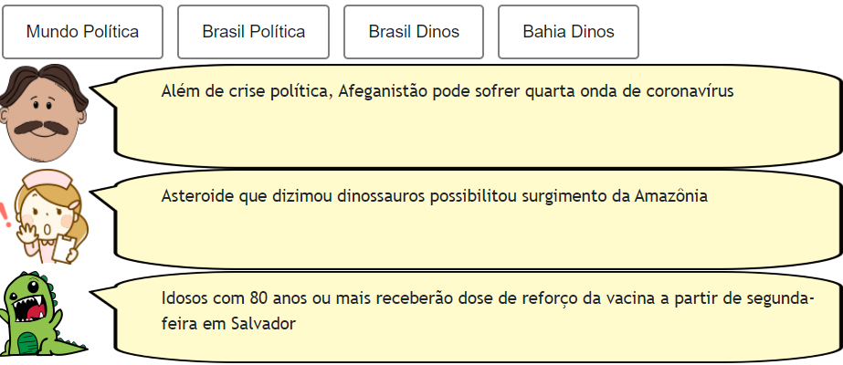
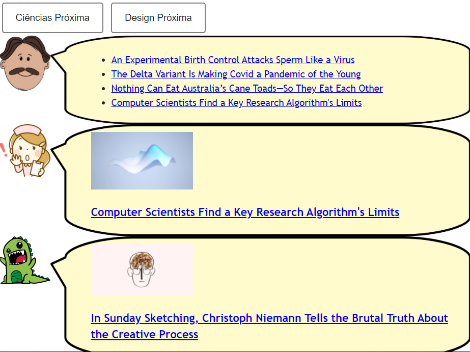
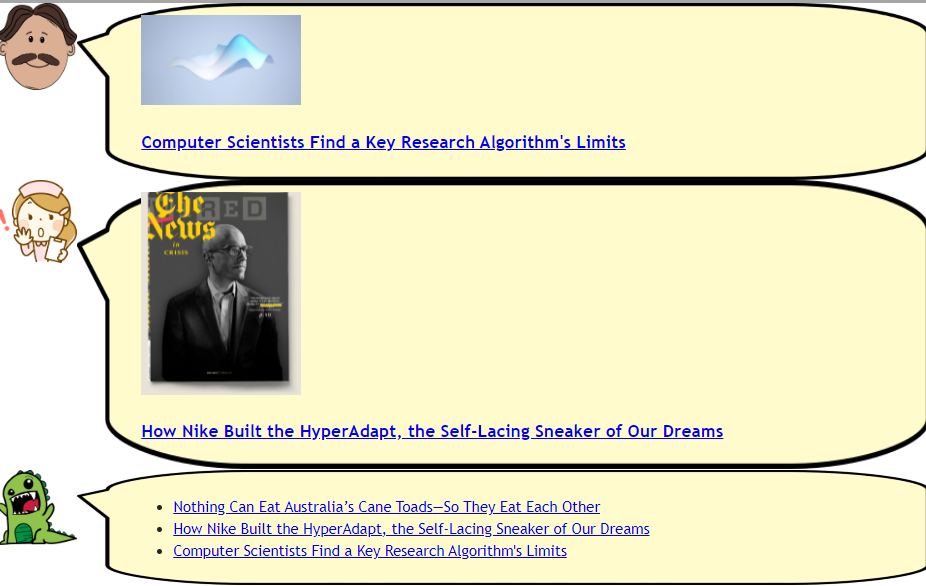

# Lab04 - Componentes, Mensagens, Eventos e Barramento

# Aluno

- `Lucas Franzolin - EX150621`

## Tarefa 1 - Web Components e Tópicos

```html
<!-- BOTÕES -->
<dcc-button
  label="Mundo Política"
  topic="noticia/mundo/politica"
  message="Além de crise política, Afeganistão pode sofrer quarta onda de coronavírus"
>
</dcc-button>

<dcc-button
  label="Brasil Política"
  topic="noticia/brasil/politica"
  message="Temer pede a Moraes distensionamento político"
>
</dcc-button>

<dcc-button
  label="Brasil Dinos"
  topic="noticia/brasil/dinos"
  message="Asteroide que dizimou dinossauros possibilitou surgimento da Amazônia"
>
</dcc-button>

<dcc-button
  label="Bahia Dinos"
  topic="noticia/bahia/dinos"
  message="Idosos com 80 anos ou mais receberão dose de reforço da vacina a partir de segunda-feira em Salvador"
>
</dcc-button>

<!-- PERSONAGENS -->
<dcc-lively-talk
  character="https://harena-lab.github.io/harena-docs/dccs/tutorial/images/doctor.png"
  subscribe="noticia/+/politica:speech"
>
</dcc-lively-talk>

<dcc-lively-talk
  character="https://harena-lab.github.io/harena-docs/dccs/tutorial/images/nurse.png"
  subscribe="noticia/brasil/#:speech"
>
</dcc-lively-talk>

<dcc-lively-talk subscribe="noticia/#:speech"> </dcc-lively-talk>
```



## Tarefa 2 - Web Components e RSS

```html
<!-- RSS -->
<dcc-rss
  source="https://www.wired.com/category/science/feed"
  subscribe="next/rss/science:next"
  topic="rss/science"
>
</dcc-rss>

<dcc-rss
  source="https://www.wired.com/category/design/feed"
  topic="rss/design"
  subscribe="next/rss/design:next"
>
</dcc-rss>

<dcc-aggregator topic="aggregate/science" quantity="4" subscribe="rss/science">
</dcc-aggregator>

<!-- BOTÕES -->
<dcc-button label="Ciências Próxima" topic="next/rss/science"> </dcc-button>

<dcc-button label="Design Próxima" topic="next/rss/design"> </dcc-button>

<!-- PERSONAGENS -->
<dcc-lively-talk
  subscribe="aggregate/science:speech"
  character="https://harena-lab.github.io/harena-docs/dccs/tutorial/images/doctor.png"
>
</dcc-lively-talk>

<dcc-lively-talk
  character="https://harena-lab.github.io/harena-docs/dccs/tutorial/images/nurse.png"
  subscribe="rss/science:speech"
>
</dcc-lively-talk>

<dcc-lively-talk subscribe="rss/design:speech"> </dcc-lively-talk>
```



## Tarefa 3 - Painéis de Mensagens com Timer

```html
<!-- RSS -->
<dcc-rss
  subscribe="next/rss/science:next"
  source="https://www.wired.com/category/science/feed"
  topic="rss/science"
>
</dcc-rss>

<dcc-rss
  source="https://www.wired.com/category/design/feed"
  subscribe="next/rss/design:next"
  topic="rss/design"
>
</dcc-rss>

<dcc-aggregator topic="aggregate" quantity="3">
  <subscribe-dcc topic="rss/science"></subscribe-dcc>
  <subscribe-dcc topic="rss/design"></subscribe-dcc>
</dcc-aggregator>

<!-- PERSONAGENS -->
<dcc-lively-talk
  subscribe="+/science:speech"
  character="https://harena-lab.github.io/harena-docs/dccs/tutorial/images/doctor.png"
>
</dcc-lively-talk>

<dcc-lively-talk
  character="https://harena-lab.github.io/harena-docs/dccs/tutorial/images/nurse.png"
  subscribe="+/design:speech"
>
</dcc-lively-talk>

<dcc-lively-talk subscribe="aggregate:speech"> </dcc-lively-talk>

<!-- TIMERS -->
<dcc-timer
  cycles="4"
  interval="1000"
  topic="next/rss/science"
  subscribe="timer/start:start"
>
</dcc-timer>
<dcc-timer
  cycles="2"
  interval="2000"
  topic="next/rss/design"
  subscribe="timer/start:start"
>
</dcc-timer>

<!-- BOTÃO -->
<dcc-button label="Inicia" topic="timer/start"> </dcc-button>
```


