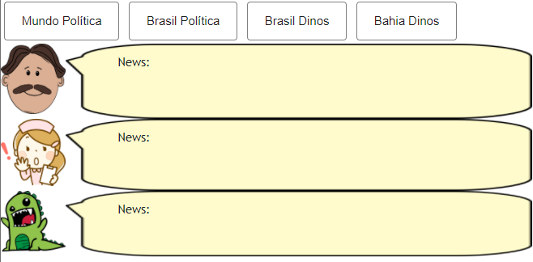
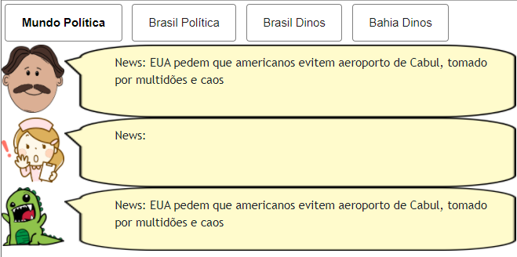
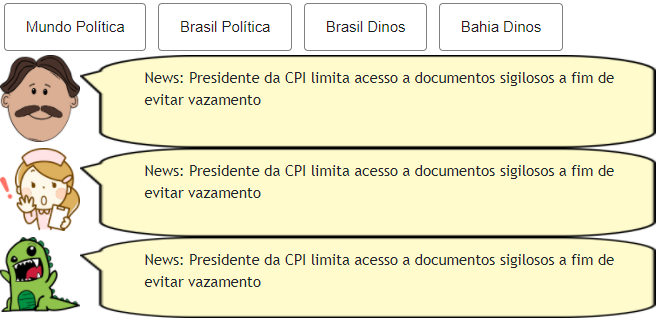
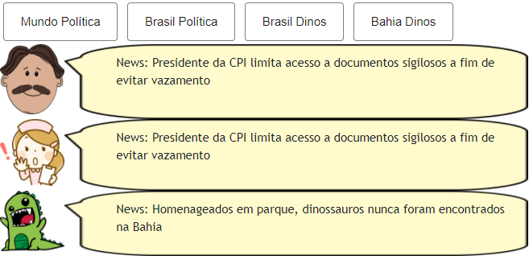
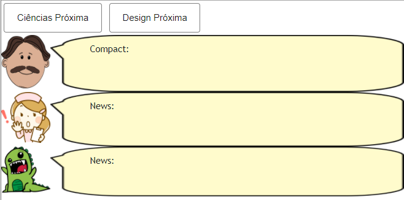
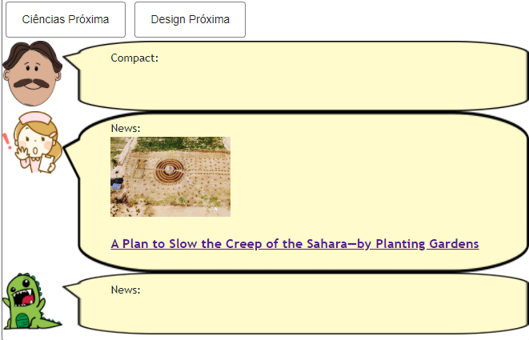
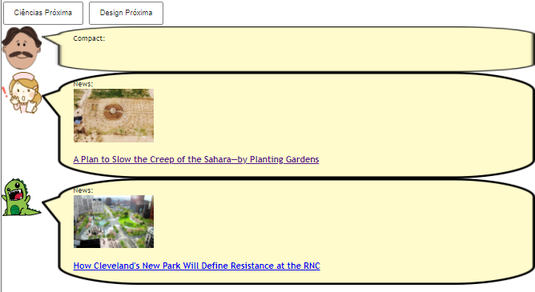
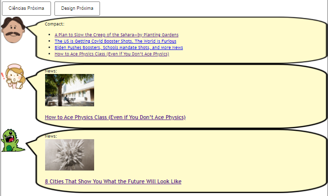
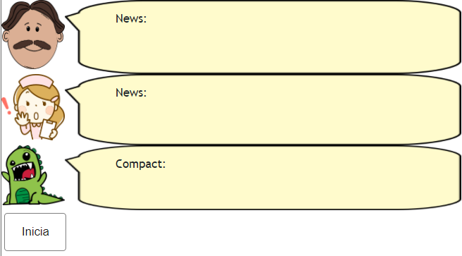
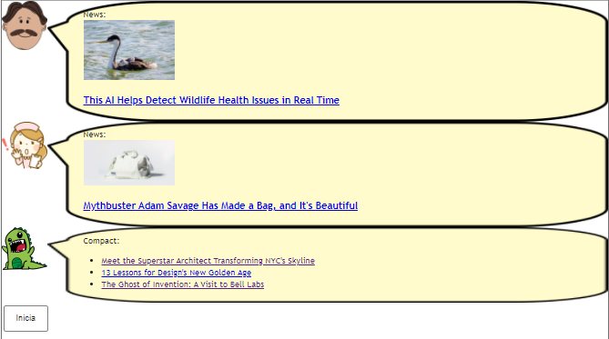

# Lab04 - Componentes, Mensagens, Eventos e Barramento

# Aluno
* Luciano Sávio de Oliveira

## Tarefa 1 - Web Components e Tópicos

> Código da composição de componentes Web:

~~~html
<dcc-button label="Mundo Política" topic="mundo/politica" message="EUA pedem que americanos evitem aeroporto de Cabul, tomado por multidões e caos">
</dcc-button>

<dcc-button label="Brasil Política" topic="brasil/politica" message="Presidente da CPI limita acesso a documentos sigilosos a fim de evitar vazamento">
</dcc-button>

<dcc-button label="Brasil Dinos" topic="brasil/dinos" message="Museu Nacional e instituto chinês descobrem novas espécies de dinossauros">
</dcc-button>

<dcc-button label="Bahia Dinos" topic="bahia/dinos" message="Homenageados em parque, dinossauros nunca foram encontrados na Bahia">
</dcc-button>

<dcc-lively-talk character="https://harena-lab.github.io/harena-docs/dccs/tutorial/images/doctor.png" speech="News: " subscribe="+/politica:speech">
</dcc-lively-talk>

<dcc-lively-talk character="https://harena-lab.github.io/harena-docs/dccs/tutorial/images/nurse.png" speech="News: " subscribe="brasil/#:speech">
</dcc-lively-talk>

<dcc-lively-talk speech="News: " subscribe="#:speech">
</dcc-lively-talk>
~~~

## Tarefa 2 - Web Components e RSS

> Código da composição de componentes Web:

~~~html
<dcc-rss source="https://www.wired.com/category/science/feed" subscribe="next/rss/ciência:next" topic="rss/ciência">
</dcc-rss>

<dcc-rss source="https://www.wired.com/category/design/feed" subscribe="next/rss/design:next" topic="rss/design">
</dcc-rss>

<dcc-aggregator topic="aggregate/ciência" quantity="4" subscribe="+/ciência">
</dcc-aggregator>

<dcc-button label="Ciências Próxima" topic="next/rss/ciência">
</dcc-button>

<dcc-button label="Design Próxima" topic="next/rss/design">
</dcc-button>

<dcc-lively-talk character="https://harena-lab.github.io/harena-docs/dccs/tutorial/images/doctor.png" speech="Compact: " subscribe="aggregate/ciência:speech">
</dcc-lively-talk>

<dcc-lively-talk character="https://harena-lab.github.io/harena-docs/dccs/tutorial/images/nurse.png" speech="News: " subscribe="+/ciência:speech">
</dcc-lively-talk>

<dcc-lively-talk speech="News: " subscribe="+/design:speech">
</dcc-lively-talk>
~~~

## Tarefa 3 - Painéis de Mensagens com Timer

> Código da composição de componentes Web:

~~~html
<dcc-rss source="https://www.wired.com/category/science/feed" subscribe="next/rss/ciência:next" topic="rss/ciência">
</dcc-rss>

<dcc-rss source="https://www.wired.com/category/design/feed" subscribe="next/rss/design:next" topic="rss/design">
</dcc-rss>

<dcc-aggregator topic="aggregate/#" quantity="3" subscribe="rss/#">
</dcc-aggregator>

<dcc-lively-talk character="https://harena-lab.github.io/harena-docs/dccs/tutorial/images/doctor.png" speech="News: " subscribe="+/ciência:speech">
</dcc-lively-talk>

<dcc-lively-talk character="https://harena-lab.github.io/harena-docs/dccs/tutorial/images/nurse.png" speech="News: " subscribe="+/design:speech">
</dcc-lively-talk>

<dcc-lively-talk speech="Compact: " subscribe="aggregate/#:speech">
</dcc-lively-talk>

<dcc-timer cycles="10" interval="1000" topic="next/rss/ciência" subscribe="start/feed:start">
</dcc-timer>

<dcc-timer cycles="10" interval="2000" topic="next/rss/design" subscribe="start/feed:start">
</dcc-timer>

<dcc-timer cycles="10" interval="3000" topic="next/aggregate/#" subscribe="start/feed:start">
</dcc-timer>

<dcc-button label="Inicia" topic="start/feed">
</dcc-button>
~~~

