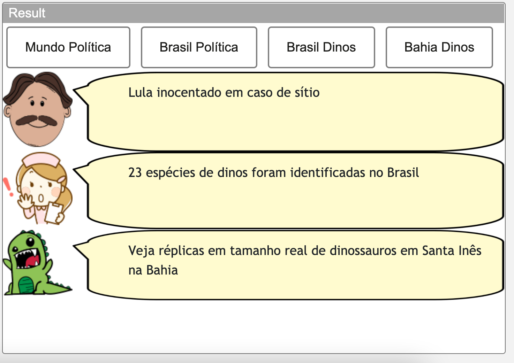
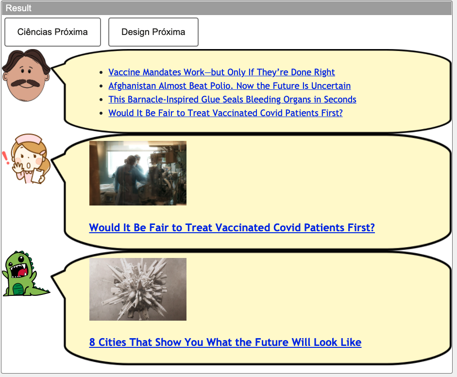
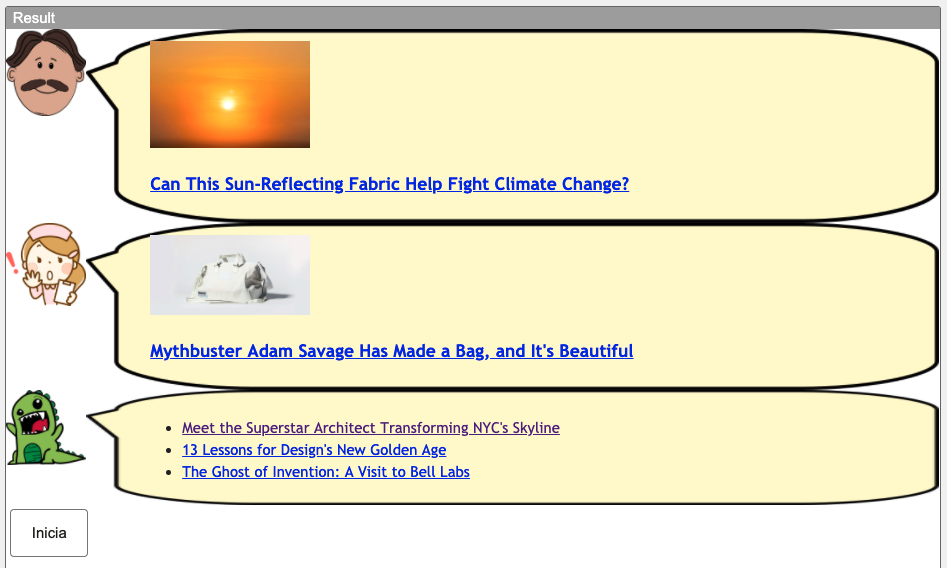

# Lab04 - Componentes, Mensagens, Eventos e Barramento

# Aluno
* `Marina Azevedo Ferreira Soares - EX150301`

## Tarefa 1 - Web Components e Tópicos

~~~html
<dcc-button label="Mundo Política" topic="noticia/mundo/politica" message="Talibã volta ao poder no Afeganistão">
</dcc-button>

<dcc-button label="Brasil Política" topic="noticia/brasil/politica" message="Lula inocentado em caso de sítio">
</dcc-button>

<dcc-button label="Brasil Dinos" topic="noticia/brasil/dinos" message="23 espécies de dinos foram identificadas no Brasil">
</dcc-button>

<dcc-button label="Bahia Dinos" topic="noticia/bahia/dinos" message="Veja réplicas em tamanho real de dinossauros em Santa Inês na Bahia">
</dcc-button>

<dcc-lively-talk character="https://harena-lab.github.io/harena-docs/dccs/tutorial/images/doctor.png" subscribe="noticia/+/politica:speech">
</dcc-lively-talk>

<dcc-lively-talk character="https://harena-lab.github.io/harena-docs/dccs/tutorial/images/nurse.png" subscribe="noticia/brasil/#:speech">
</dcc-lively-talk>

<dcc-lively-talk subscribe="noticia/#:speech">
</dcc-lively-talk>
~~~

## Tarefa 2 - Web Components e RSS

~~~html
<dcc-rss source="https://www.wired.com/category/science/feed" subscribe="next/rss/science:next" topic="rss/science">
</dcc-rss>

<dcc-rss source="https://www.wired.com/category/design/feed" subscribe="next/rss/design:next" topic="rss/design">
</dcc-rss>

<dcc-aggregator topic="aggregate/science" quantity="4" subscribe="rss/science">
</dcc-aggregator>

<dcc-button label="Ciências Próxima" topic="next/rss/science">
</dcc-button>

<dcc-button label="Design Próxima" topic="next/rss/design">
</dcc-button>

<dcc-lively-talk character="https://harena-lab.github.io/harena-docs/dccs/tutorial/images/doctor.png" subscribe="aggregate/science:speech">
</dcc-lively-talk>

<dcc-lively-talk character="https://harena-lab.github.io/harena-docs/dccs/tutorial/images/nurse.png" subscribe="rss/science:speech">
</dcc-lively-talk>

<dcc-lively-talk subscribe="rss/design:speech">
</dcc-lively-talk>
~~~

## Tarefa 3 - Painéis de Mensagens com Timer

~~~html
<dcc-rss source="https://www.wired.com/category/science/feed" subscribe="next/rss/science:next" topic="rss/science">
</dcc-rss>

<dcc-rss source="https://www.wired.com/category/design/feed" subscribe="next/rss/design:next" topic="rss/design">
</dcc-rss>

<dcc-aggregator topic="aggregate" quantity="3">
  <subscribe-dcc topic="rss/science"></subscribe-dcc>
  <subscribe-dcc topic="rss/design"></subscribe-dcc>
</dcc-aggregator>

<dcc-lively-talk character="https://harena-lab.github.io/harena-docs/dccs/tutorial/images/doctor.png" subscribe="+/science:speech">
</dcc-lively-talk>

<dcc-lively-talk character="https://harena-lab.github.io/harena-docs/dccs/tutorial/images/nurse.png" subscribe="+/design:speech">
</dcc-lively-talk>

<dcc-lively-talk subscribe="aggregate:speech">
</dcc-lively-talk>

<dcc-timer interval="1000" topic="next/rss/science" subscribe="timer/start:start">
</dcc-timer>
<dcc-timer interval="2000" topic="next/rss/design" subscribe="timer/start:start">
</dcc-timer>

<dcc-button label="Inicia" topic="timer/start" >
</dcc-button>

~~~

