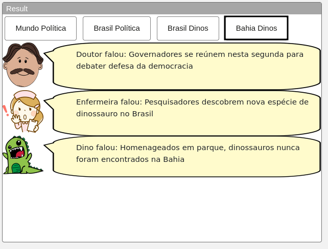

# Modelo para Apresentação do Lab04 - Componentes, Mensagens, Eventos e Barramento

Estrutura de pastas:

~~~
├── README.md  <- arquivo apresentando a tarefa
│
└── images     <- arquivos de imagens usadas no documento
~~~

# Aluno
* `Pablo Gabriel Rodrigues Neves Bedoya`

## Tarefa 1 - Web Components e Tópicos

> Código da composição de componentes Web da tarefa 1:

~~~html
<dcc-button label="Mundo Política" topic="noticia/mundo/politica" message="Cofundador do Talibã que negociou com Trump chega a Cabul para iniciar formação de novo governo afegão"></dcc-button>
<dcc-button label="Brasil Política" topic="noticia/brasil/politica" message="Governadores se reúnem nesta segunda para debater defesa da democracia"></dcc-button>
<dcc-button label="Brasil Dinos" topic="noticia/brasil/dinos" message="Pesquisadores descobrem nova espécie de dinossauro no Brasil"></dcc-button>
<dcc-button label="Bahia Dinos" topic="noticia/bahia/dinos" message="Homenageados em parque, dinossauros nunca foram encontrados na Bahia"></dcc-button>

<dcc-lively-talk character="https://harena-lab.github.io/harena-docs/dccs/reference/images/doctor.png" subscribe="noticia/#/politica:speech" speech="Doutor falou: ">
</dcc-lively-talk>

<dcc-lively-talk character="https://harena-lab.github.io/harena-docs/dccs/reference/images/nurse.png" subscribe="#/brasil/#:speech" speech="Enfermeira falou: ">
</dcc-lively-talk>

<dcc-lively-talk subscribe="noticia/#:speech" speech="Dino falou: ">
</dcc-lively-talk>
~~~

> Tarefa 1 - Tela 1 (Mundo Política):

> Tarefa 1 - Tela 2 (Brasil Política):

> Tarefa 1 - Tela 3 (Brasil Dinos):

> Tarefa 1 - Tela 4 (Bahia Dinos):

## Tarefa 2 - Web Components e RSS

> Código da composição de componentes Web da tarefa 2:

~~~html
<dcc-rss source="https://www.wired.com/category/science/feed" subscribe="next/science/rss:next" topic="rss/science">
</dcc-rss>

<dcc-rss source="https://www.wired.com/category/design/feed" subscribe="next/design/rss:next" topic="rss/design">
</dcc-rss>

<dcc-aggregator topic="aggregate/science" quantity="4" subscribe="rss/science">
</dcc-aggregator>

<dcc-lively-talk character="https://harena-lab.github.io/harena-docs/dccs/reference/images/doctor.png" subscribe="aggregate/science:speech" speech="News: ">
</dcc-lively-talk>

<dcc-lively-talk character="https://harena-lab.github.io/harena-docs/dccs/reference/images/nurse.png" subscribe="rss/science:speech" speech="News: ">
</dcc-lively-talk>

<dcc-lively-talk subscribe="rss/design:speech" speech="News: ">
</dcc-lively-talk>

<dcc-button label="Ciências Próxima" topic="next/science/rss">
</dcc-button>

<dcc-button label="Design Próxima" topic="next/design/rss">
</dcc-button>
~~~

> Tarefa 2 - Tela 1 (Dino News):

> Tarefa 2 - Tela 2 (Nurse News):

> Tarefa 2 - Tela 3 (Doctor News):

## Tarefa 3 - Painéis de Mensagens com Timer

> Código da composição de componentes Web da tarefa 3:

~~~html
<dcc-rss source="https://www.wired.com/category/science/feed" subscribe="next/science/rss:next" topic="rss/science">
</dcc-rss>

<dcc-rss source="https://www.wired.com/category/design/feed" subscribe="next/design/rss:next" topic="rss/design">
</dcc-rss>

<dcc-aggregator topic="aggregate" quantity="3" subscribe="rss/#">
</dcc-aggregator>

<dcc-lively-talk character="https://harena-lab.github.io/harena-docs/dccs/reference/images/doctor.png" subscribe="rss/science:speech" speech="News: ">
</dcc-lively-talk>

<dcc-lively-talk character="https://harena-lab.github.io/harena-docs/dccs/reference/images/nurse.png" subscribe="rss/design:speech" speech="News: ">
</dcc-lively-talk>

<dcc-lively-talk speech="News :" subscribe="aggregate:speech">
</dcc-lively-talk>

<dcc-timer cycles="10" interval="1000" topic="next/science/rss" subscribe="start/feed:start">
</dcc-timer>

<dcc-timer cycles="5" interval="2000" topic="next/design/rss" subscribe="start/feed:start">
</dcc-timer>

<dcc-button label="Inicia" topic="start/feed">
</dcc-button>
~~~

> Tarefa 3 - Tela 1 (Animação ilustrando o timer):

