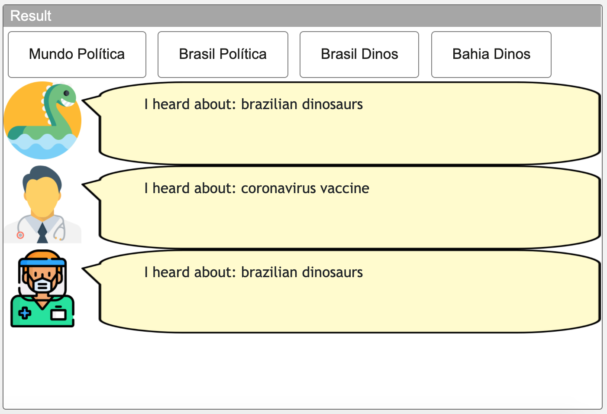
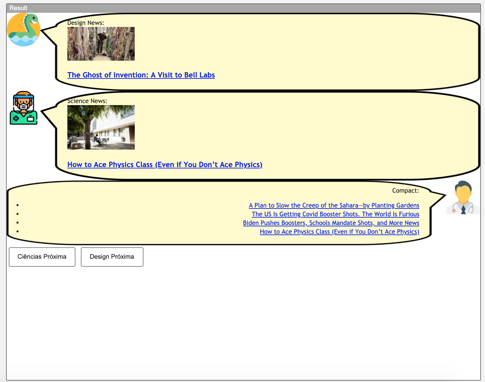

# Modelo para Apresentação do Lab04 - Componentes, Mensagens, Eventos e Barramento

Estrutura de pastas:

~~~
└── README.md  <- arquivo apresentando a tarefa
~~~

# Aluno
* `Renato Fernandes reis`

## Tarefa 1 - Web Components e Tópicos

~~~html
<dcc-button label="Mundo Política" topic="noticia/mundo/politica" message="dengue symptoms">
</dcc-button>

<dcc-button label="Brasil Política" topic="noticia/brasil/politica" message="coronavirus vaccine">
</dcc-button>

<dcc-button label="Brasil Dinos" topic="noticia/brasil/dinos" message="brazilian dinosaurs">
</dcc-button>

<dcc-button label="Bahia Dinos" topic="noticia/bahia/dinos" message="brazilian dinosaurs">
</dcc-button>

  <dcc-lively-talk character="https://renareis-content.s3.amazonaws.com/dino.png" speech="I heard about: " subscribe="noticia/#:speech">
  </dcc-lively-talk>

  <dcc-lively-talk character="https://renareis-content.s3.amazonaws.com/doctor.png" speech="I heard about: " subscribe="#/politica:speech">
  </dcc-lively-talk>

  <dcc-lively-talk character="https://renareis-content.s3.amazonaws.com/nurse.png" speech="I heard about: " subscribe="noticia/brasil/+:speech">
  </dcc-lively-talk>
~~~

> 

## Tarefa 2 - Web Components e RSS

~~~html

<dcc-rss source="https://www.wired.com/category/science/feed" subscribe="next/science/rss:next" topic="rss/science">
</dcc-rss>

<dcc-rss source="https://www.wired.com/category/design/feed" subscribe="next/design/rss:next" topic="rss/design">
</dcc-rss>

<dcc-lively-talk character="https://renareis-content.s3.amazonaws.com/dino.png" speech="Design News: " subscribe="rss/design:speech" duration="2s" delay="10s" direction="left">
</dcc-lively-talk>

<dcc-lively-talk character="https://renareis-content.s3.amazonaws.com/nurse.png" speech="Science News: " subscribe="rss/science:speech" duration="2s" delay="10s" direction="left">
</dcc-lively-talk>

<dcc-aggregator topic="aggregate/science" quantity="4" subscribe="rss/science">
</dcc-aggregator>

<dcc-lively-talk character="https://renareis-content.s3.amazonaws.com/doctor.png" speech="Compact: " subscribe="aggregate/science:speech" duration="2s" delay="10s" direction="right">
</dcc-lively-talk>

<dcc-button label="Ciências Próxima" topic="next/science/rss"></dcc-button>
<dcc-button label="Design Próxima" topic="next/design/rss"></dcc-button>
~~~

> 

## Tarefa 3 - Painéis de Mensagens com Timer
> Escreva aqui o código da sua composição de componentes Web, seguindo a mesma abordagem da tarefa anterior.

