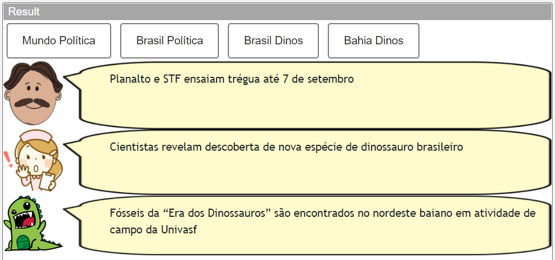
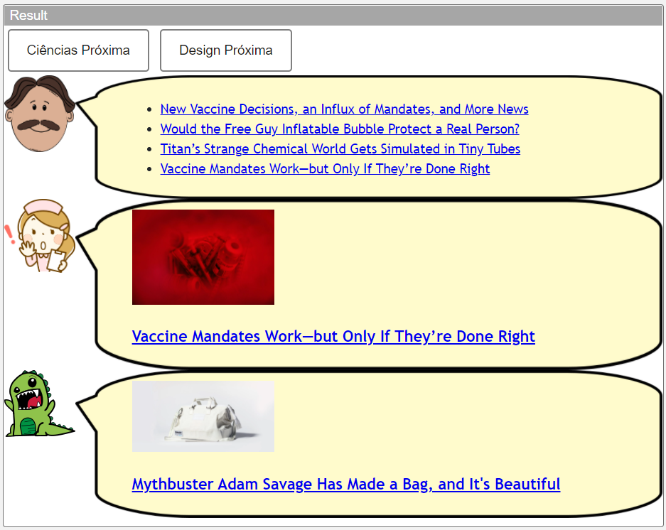
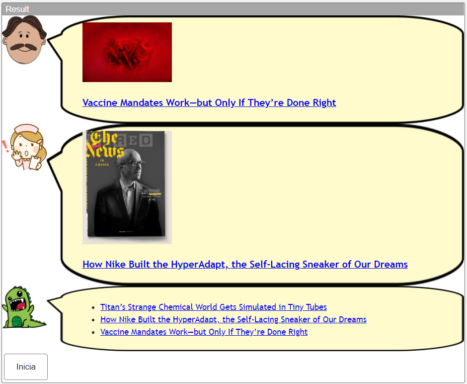

# Modelo para Apresentação do Lab04 - Componentes, Mensagens, Eventos e Barramento

Estrutura de pastas:

~~~
├── README.md  <- arquivo apresentando a tarefa
│
└── images     <- arquivos de imagens usadas no documento
~~~

# Aluno
* `Ronaldo Monteiro Lopes`

## Tarefa 1 - Web Components e Tópicos

> Escreva aqui o código da sua composição de componentes Web, como mostra o exemplo a seguir:

~~~html
<!-- button -->
<dcc-button label="Mundo Política" topic="noticia/mundo/politica" message="EUA corrigem informação e afirmam que houve uma única explosão no atentado em Cabul">
</dcc-button>

<dcc-button label="Brasil Política" topic="noticia/brasil/politica" message="Planalto e STF ensaiam trégua até 7 de setembro">
</dcc-button>

<dcc-button label="Brasil Dinos" topic="noticia/brasil/dinos" message="Cientistas revelam descoberta de nova espécie de dinossauro brasileiro">
</dcc-button>

<dcc-button label="Bahia Dinos" topic="noticia/bahia/dinos" message="Fósseis da “Era dos Dinossauros” são encontrados no nordeste baiano em atividade de campo da Univasf">
</dcc-button>

<!-- character -->
<dcc-lively-talk character="https://harena-lab.github.io/harena-docs/dccs/tutorial/images/doctor.png" subscribe="noticia/+/politica:speech">
</dcc-lively-talk>

<dcc-lively-talk character="https://harena-lab.github.io/harena-docs/dccs/tutorial/images/nurse.png" subscribe="noticia/brasil/#:speech">
</dcc-lively-talk>

<dcc-lively-talk subscribe="noticia/#:speech">
</dcc-lively-talk>
~~~

## Tarefa 2 - Web Components e RSS
> Escreva aqui o código da sua composição de componentes Web seguida de uma imagem que captura o funcionamento, como foi feito na tarefa anterior.

~~~html
<!-- rss -->
<dcc-rss source="https://www.wired.com/category/science/feed" subscribe="next/rss/science:next" topic="rss/science"></dcc-rss>

<dcc-rss source="https://www.wired.com/category/design/feed" subscribe="next/rss/design:next" topic="rss/design"></dcc-rss>

<dcc-aggregator topic="aggregate/science" quantity="4" subscribe="rss/science"></dcc-aggregator>

<!-- button -->
<dcc-button label="Ciências Próxima" topic="next/rss/science"></dcc-button>

<dcc-button label="Design Próxima" topic="next/rss/design"></dcc-button>

<!-- character -->
<dcc-lively-talk character="https://harena-lab.github.io/harena-docs/dccs/tutorial/images/doctor.png" subscribe="aggregate/science:speech">
</dcc-lively-talk>

<dcc-lively-talk character="https://harena-lab.github.io/harena-docs/dccs/tutorial/images/nurse.png" subscribe="rss/science:speech">
</dcc-lively-talk>

<dcc-lively-talk subscribe="rss/design:speech"></dcc-lively-talk>
~~~

## Tarefa 3 - Painéis de Mensagens com Timer
> Escreva aqui o código da sua composição de componentes Web seguida de uma imagem que captura o funcionamento, como foi feito na tarefa anterior.

~~~html
<!-- rss -->
<dcc-rss source="https://www.wired.com/category/science/feed" subscribe="next/rss/science:next" topic="rss/science"></dcc-rss>

<dcc-rss source="https://www.wired.com/category/design/feed" subscribe="next/rss/design:next" topic="rss/design"></dcc-rss>

<dcc-aggregator topic="aggregate" quantity="3">
  <subscribe-dcc topic="rss/science"></subscribe-dcc>
  <subscribe-dcc topic="rss/design"></subscribe-dcc>
</dcc-aggregator>

<!-- character -->
<dcc-lively-talk character="https://harena-lab.github.io/harena-docs/dccs/tutorial/images/doctor.png" subscribe="+/science:speech">
</dcc-lively-talk>

<dcc-lively-talk character="https://harena-lab.github.io/harena-docs/dccs/tutorial/images/nurse.png" subscribe="+/design:speech">
</dcc-lively-talk>

<dcc-lively-talk subscribe="aggregate:speech"></dcc-lively-talk>

<!-- timer -->
<dcc-timer cycles="4" interval="1000" topic="next/rss/science" subscribe="timer/start:start"></dcc-timer>
<dcc-timer cycles="2" interval="2000" topic="next/rss/design" subscribe="timer/start:start"></dcc-timer>

<!-- button -->
<dcc-button label="Inicia" topic="timer/start"></dcc-button>
~~~

~~~messages
topic: control/button/Inicia/ready
message: "dcc-button"

topic: timer/start
message: {"sourceType":"dcc-button"}

topic: next/rss/science
message: 1

topic: rss/science
message: {"title":"New Vaccine Decisions, an Influx of Mandates, and More News","link":"https://www.wired.com/story/vaccine-approval-boosters-mandates-coronavirus-news","image":"https://media.wired.com/photos/612901a9146a62f9d24aef91/master/pass/Science_covidnl_GettyImages-1234726767.jpg","value":"<article>\n   \n   <h3>\n      <a href=\"https://www.wired.com/story/vaccine-approval-boosters-mandates-coronavirus-news\" target=\"_blank\">New Vaccine Decisions, an Influx of Mandates, and More News</a>\n   </h3>\n</article>"}

topic: next/rss/design
message: 1

topic: next/rss/science
message: 2

topic: rss/science
message: {"title":"Would the Free Guy Inflatable Bubble Protect a Real Person?","link":"https://www.wired.com/story/would-the-free-guy-inflatable-bubble-protect-a-real-person","image":"https://media.wired.com/photos/6127d9719804e5be85a3a205/master/pass/Science_freeguy_DF-26555_R.jpg","value":"<article>\n   \n   <h3>\n      <a href=\"https://www.wired.com/story/would-the-free-guy-inflatable-bubble-protect-a-real-person\" target=\"_blank\">Would the Free Guy Inflatable Bubble Protect a Real Person?</a>\n   </h3>\n</article>"}

topic: rss/design
message: {"title":"How Cleveland's New Park Will Define Resistance at the RNC","link":"https://www.wired.com/2016/07/clevelands-new-park-will-define-resistance-rnc","image":"https://media.wired.com/photos/5926de3baf95806129f50e2c/master/pass/cs_after.jpg","value":"<article>\n   \n   <h3>\n      <a href=\"https://www.wired.com/2016/07/clevelands-new-park-will-define-resistance-rnc\" target=\"_blank\">How Cleveland's New Park Will Define Resistance at the RNC</a>\n   </h3>\n</article>"}

topic: aggregate
message: "<ul>\n<li><a href=\"https://www.wired.com/story/vaccine-approval-boosters-mandates-coronavirus-news\" target=\"_blank\">New Vaccine Decisions, an Influx of Mandates, and More News</a></li>\n<li><a href=\"https://www.wired.com/story/would-the-free-guy-inflatable-bubble-protect-a-real-person\" target=\"_blank\">Would the Free Guy Inflatable Bubble Protect a Real Person?</a></li>\n<li><a href=\"https://www.wired.com/2016/07/clevelands-new-park-will-define-resistance-rnc\" target=\"_blank\">How Cleveland's New Park Will Define Resistance at the RNC</a></li>\n\n</ul>"

topic: next/rss/science
message: 3

topic: rss/science
message: {"title":"Titan’s Strange Chemical World Gets Simulated in Tiny Tubes","link":"https://www.wired.com/story/titans-strange-chemical-world-gets-simulated-in-tiny-tubes","image":"https://media.wired.com/photos/6127f3070d8efc68b7378853/master/pass/Science_pia21625.jpg","value":"<article>\n   \n   <h3>\n      <a href=\"https://www.wired.com/story/titans-strange-chemical-world-gets-simulated-in-tiny-tubes\" target=\"_blank\">Titan’s Strange Chemical World Gets Simulated in Tiny Tubes</a>\n   </h3>\n</article>"}

topic: next/rss/design
message: 2

topic: rss/design
message: {"title":"How Nike Built the HyperAdapt, the Self-Lacing Sneaker of Our Dreams","link":"https://www.wired.com/2016/09/nike-self-lacing-design-hyperadapt","image":"https://media.wired.com/photos/59267870cefba457b079a151/master/pass/2503_cover_beige.png","value":"<article>\n   \n   <h3>\n      <a href=\"https://www.wired.com/2016/09/nike-self-lacing-design-hyperadapt\" target=\"_blank\">How Nike Built the HyperAdapt, the Self-Lacing Sneaker of Our Dreams</a>\n   </h3>\n</article>"}

topic: next/rss/science
message: 4

topic: rss/science
message: {"title":"Vaccine Mandates Work—but Only If They’re Done Right","link":"https://www.wired.com/story/vaccine-mandates-work-but-only-if-theyre-done-right","image":"https://media.wired.com/photos/6125538b4715403ae9e99919/master/pass/Science_mandates_GettyImages-1301498840.jpg","value":"<article>\n   \n   <h3>\n      <a href=\"https://www.wired.com/story/vaccine-mandates-work-but-only-if-theyre-done-right\" target=\"_blank\">Vaccine Mandates Work—but Only If They’re Done Right</a>\n   </h3>\n</article>"}

topic: aggregate
message: "<ul>\n<li><a href=\"https://www.wired.com/story/titans-strange-chemical-world-gets-simulated-in-tiny-tubes\" target=\"_blank\">Titan’s Strange Chemical World Gets Simulated in Tiny Tubes</a></li>\n<li><a href=\"https://www.wired.com/2016/09/nike-self-lacing-design-hyperadapt\" target=\"_blank\">How Nike Built the HyperAdapt, the Self-Lacing Sneaker of Our Dreams</a></li>\n<li><a href=\"https://www.wired.com/story/vaccine-mandates-work-but-only-if-theyre-done-right\" target=\"_blank\">Vaccine Mandates Work—but Only If They’re Done Right</a></li>\n\n</ul>"
~~~
