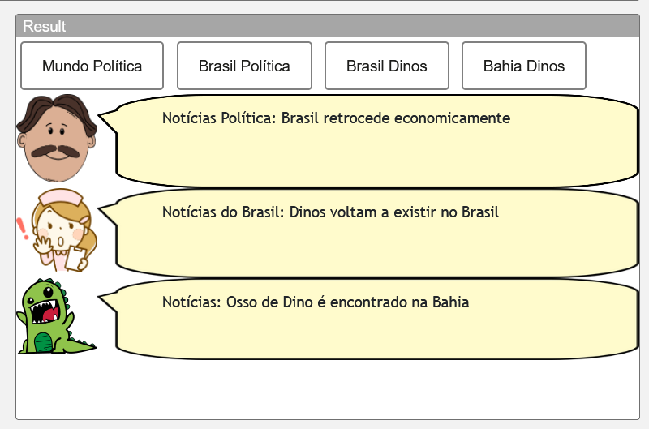
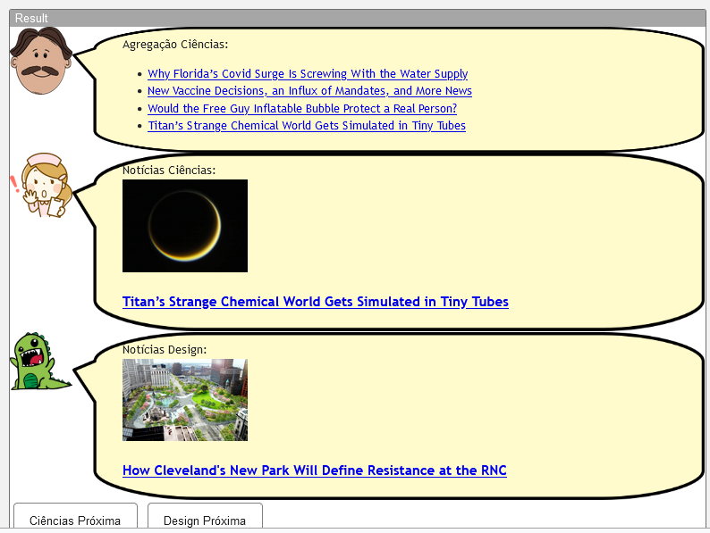
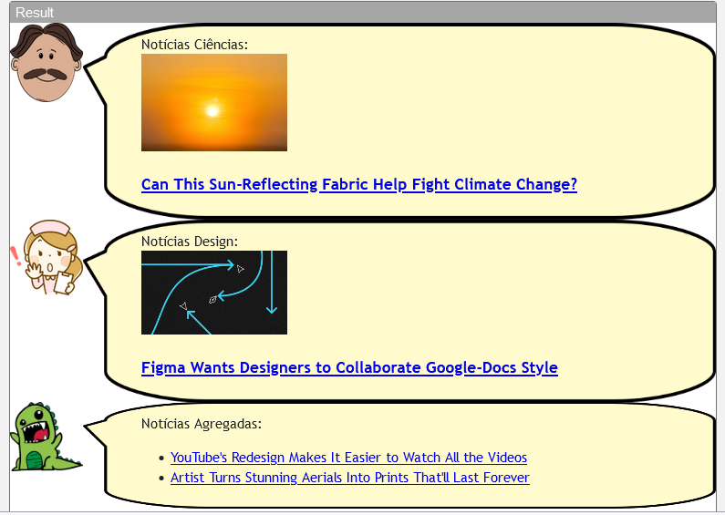

# Modelo para Apresentação do Lab04 - Componentes, Mensagens, Eventos e Barramento

Estrutura de pastas:

~~~
├── README.md  <- arquivo apresentando a tarefa
│
└── images     <- arquivos de imagens usadas no documento
~~~

# Aluno
* `Victor Hugo Gomes de Oliveira ex150379

## Tarefa 1 - Web Components e Tópicos

> Escreva aqui o código da sua composição de componentes Web, como mostra o exemplo a seguir:
~~~html
<dcc-button label="Mundo Política" topic="noticia/mundo/politica" message="Paraolimpiadas começa a todo vapor">
</dcc-button>
<dcc-button label="Brasil Política" topic="noticia/brasil/politica" message="Brasil retrocede economicamente">
</dcc-button>
<dcc-button label="Brasil Dinos" topic="noticia/brasil/dinos" message="Dinos voltam a existir no Brasil">
</dcc-button>
<dcc-button label="Bahia Dinos" topic="noticia/bahia/dinos" message="Osso de Dino é encontrado na Bahia">
</dcc-button>

  <dcc-lively-talk character="https://harena-lab.github.io/harena-docs/dccs/tutorial/images/doctor.png" speech="Notícias Política: " subscribe="noticia/+/politica:speech">
  </dcc-lively-talk>

 <dcc-lively-talk character="https://harena-lab.github.io/harena-docs/dccs/tutorial/images/nurse.png" speech="Notícias do Brasil: " subscribe="noticia/brasil/+:speech">
  </dcc-lively-talk>

  <dcc-lively-talk speech="Notícias: " subscribe="noticia/#:speech">
  </dcc-lively-talk>
~~~
> Acrescente uma imagem da composição em funcionamento:

## Tarefa 2 - Web Components e RSS

> Escreva aqui o código da sua composição de componentes Web seguida de uma imagem que captura o funcionamento, como foi feito na tarefa anterior.
~~~html
 <dcc-rss source="https://www.wired.com/category/science/feed" subscribe="next/rss/science:next" topic="rss/science">
</dcc-rss>

<dcc-rss source="https://www.wired.com/category/design/feed" subscribe="next/rss/design:next" 
topic="rss/design">
</dcc-rss>

<dcc-aggregator topic="aggregate/science" quantity="4" subscribe="rss/science">
</dcc-aggregator>

<dcc-lively-talk character="https://harena-lab.github.io/harena-docs/dccs/tutorial/images/doctor.png" speech="Agregação Ciências: " subscribe="aggregate/science:speech">
</dcc-lively-talk>

<dcc-lively-talk character="https://harena-lab.github.io/harena-docs/dccs/tutorial/images/nurse.png" speech="Notícias Ciências: " subscribe="rss/science:speech">
</dcc-lively-talk>

  <dcc-lively-talk speech="Notícias Design: " subscribe="rss/design:speech">
  </dcc-lively-talk>

<dcc-button label="Ciências Próxima" topic="next/rss/science">
</dcc-button>

<dcc-button label="Design Próxima" topic="next/rss/design">
</dcc-button>
~~~

> Acrescente uma imagem da composição em funcionamento:

## Tarefa 3 - Painéis de Mensagens com Timer

> Escreva aqui o código da sua composição de componentes Web seguida de uma imagem que captura o funcionamento, como foi feito na tarefa anterior.
~~~html
<dcc-rss source="https://www.wired.com/category/science/feed" subscribe="next/rss/science:next" topic="rss/science">
</dcc-rss>
<dcc-rss source="https://www.wired.com/category/design/feed" subscribe="next/rss/design:next" topic="rss/design">
</dcc-rss>

<dcc-aggregator topic="aggregate/next/rss" quantity="2" subscribe="rss/#">
</dcc-aggregator>

<dcc-lively-talk character="https://harena-lab.github.io/harena-docs/dccs/tutorial/images/doctor.png" speech="Notícias Ciências: " subscribe="+/science:speech">
</dcc-lively-talk>

<dcc-lively-talk character="https://harena-lab.github.io/harena-docs/dccs/tutorial/images/nurse.png" speech="Notícias Design: " subscribe="+/design:speech">
</dcc-lively-talk>

<dcc-lively-talk speech="Notícias Agregadas: " subscribe="aggregate/next/rss:speech">
</dcc-lively-talk>

<dcc-timer cycles="10" interval="1000" topic="next/rss/science" subscribe="start/timer:start">
</dcc-timer>

<dcc-timer cycles="15" interval="2000" topic="next/rss/design" subscribe="start/timer:start">
</dcc-timer>

<dcc-timer cycles="5" interval="2000" topic="aggregate/next/rss" subscribe="start/timer:start">
</dcc-timer>

<dcc-button label="Start" topic="start/timer">
</dcc-button>

~~~

> Acrescente uma imagem da composição em funcionamento:
