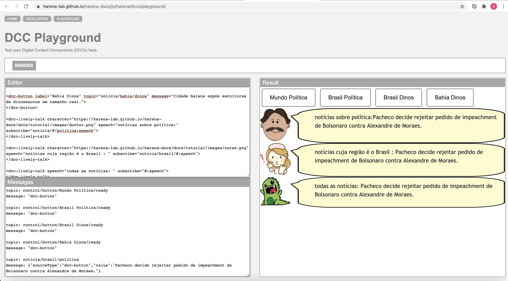
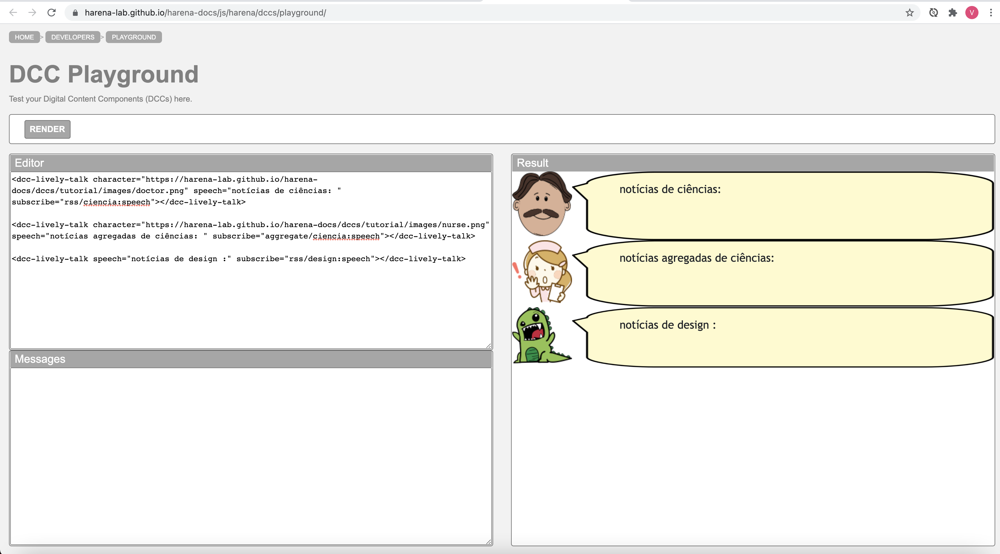
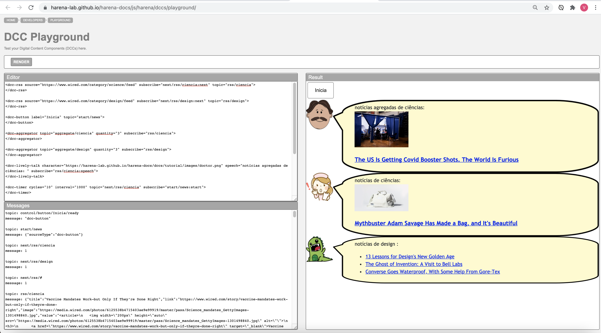

# Modelo para Apresentação do Lab04 - Componentes, Mensagens, Eventos e Barramento

Estrutura de pastas:

~~~
├── README.md  <- arquivo apresentando a tarefa
│
└── images     <- arquivos de imagens usadas no documento
~~~

# Aluno
* `Vitor Corrêa Oliveira`

## Tarefa 1 - Web Components e Tópicos

> Escreva aqui o código da sua composição de componentes Web, como mostra o exemplo a seguir:

~~~html
<dcc-button label="Mundo Política" topic="noticia/mundo/politica" message="G7 concorda que Talibã deve permitir saída do Afeganistão após o dia 31, diz premiê britânico">
</dcc-button>

topic: control/button/Mundo Política/ready
message: "dcc-button"

topic: noticia/mundo/politica
message: {"sourceType":"dcc-button","value":"G7 concorda que Talibã deve permitir saída do Afeganistão após o dia 31, diz premiê britânico"}

<dcc-button label="Brasil Política" topic="noticia/brasil/politica" message="Pacheco decide rejeitar pedido de impeachment de Bolsonaro contra Alexandre de Moraes.">
</dcc-button>

topic: control/button/Brasil Política/ready
message: "dcc-button"

topic: noticia/brasil/politica
message: {"sourceType":"dcc-button","value":"Pacheco decide rejeitar pedido de impeachment de Bolsonaro contra Alexandre de Moraes."}

<dcc-button label="Brasil Dinos" topic="noticia/brasil/dinos" message="Descoberta de dinossauro brasileiro causa polêmica na comunidade científica.">
</dcc-button>

topic: control/button/Brasil Dinos/ready
message: "dcc-button"

topic: noticia/brasil/dinos
message: {"sourceType":"dcc-button","value":"Descoberta de dinossauro brasileiro causa polêmica na comunidade científica."}

<dcc-button label="Bahia Dinos" topic="noticia/bahia/dinos" message="Cidade baiana expõe esculturas de dinossauros em tamanho real.">
</dcc-button>

topic: control/button/Bahia Dinos/ready
message: "dcc-button"

topic: noticia/bahia/dinos
message: {"sourceType":"dcc-button","value":"Cidade baiana expõe esculturas de dinossauros em tamanho real."}

<dcc-lively-talk character="https://harena-lab.github.io/harena-docs/dccs/tutorial/images/doctor.png" speech="notícias sobre política:" subscribe="noticia/#/politica:speech">
</dcc-lively-talk>

<dcc-lively-talk character="https://harena-lab.github.io/harena-docs/dccs/tutorial/images/nurse.png" speech="notícias cuja região é o Brasil : " subscribe="noticia/brasil/#:speech">
</dcc-lively-talk>

<dcc-lively-talk speech="todas as notícias: " subscribe="#:speech">
</dcc-lively-talk>
~~~

> Acrescente uma imagem da composição em funcionamento, como o exemplo a seguir:

## Tarefa 2 - Web Components e RSS
> Escreva aqui o código da sua composição de componentes Web seguida de uma imagem que captura o funcionamento, como foi feito na tarefa anterior.

~~~html
<dcc-rss source="https://www.wired.com/category/design/feed" subscribe="next/rss/design:next" topic="rss/design"></dcc-rss>

<dcc-rss source="https://www.wired.com/category/science/feed" subscribe="next/rss/ciencia:next" topic="rss/ciencia"></dcc-rss>

<dcc-button label="Design Próximo" topic="next/rss/design"></dcc-button>

<dcc-button label="Ciência Próximo" topic="next/rss/ciencia"></dcc-button>

<dcc-aggregator topic="aggregate/ciencia" quantity="4" subscribe="rss/ciencia"></dcc-aggregator>
~~~

~~~html
<dcc-lively-talk character="https://harena-lab.github.io/harena-docs/dccs/tutorial/images/doctor.png" speech="science news: " subscribe="rss/ciencia:speech"></dcc-lively-talk>

<dcc-lively-talk character="https://harena-lab.github.io/harena-docs/dccs/tutorial/images/nurse.png" speech="notícias agregadas de ciências: " subscribe="aggregate/ciencia:speech"></dcc-lively-talk>

<dcc-lively-talk speech="design news :" subscribe="rss/design:speech"></dcc-lively-talk>
~~~

## Tarefa 3 - Painéis de Mensagens com Timer
> Escreva aqui o código da sua composição de componentes Web seguida de uma imagem que captura o funcionamento, como foi feito na tarefa anterior.

~~~html
<dcc-rss source="https://www.wired.com/category/science/feed" subscribe="next/rss/ciencia:next" topic="rss/ciencia">
</dcc-rss>

<dcc-rss source="https://www.wired.com/category/design/feed" subscribe="next/rss/design:next" topic="rss/design">
</dcc-rss>

<dcc-button label="Inicia" topic="start/news">
</dcc-button>

<dcc-aggregator topic="aggregate/ciencia" quantity="3" subscribe="rss/ciencia">
</dcc-aggregator>

<dcc-aggregator topic="aggregate/design" quantity="3" subscribe="rss/design">
</dcc-aggregator>

<dcc-lively-talk character="https://harena-lab.github.io/harena-docs/dccs/tutorial/images/doctor.png" speech="notícias agregadas de ciências: " subscribe="rss/ciencia:speech">
</dcc-lively-talk>

<dcc-timer cycles="10" interval="1000" topic="next/rss/ciencia" subscribe="start/news:start">
</dcc-timer>

<dcc-lively-talk character="https://harena-lab.github.io/harena-docs/dccs/tutorial/images/nurse.png" speech="notícias de ciências: " subscribe="rss/design:speech">
</dcc-lively-talk>

<dcc-timer cycles="10" interval="1000" topic="next/rss/design" subscribe="start/news:start">
</dcc-timer>

<dcc-lively-talk speech="notícias de design :" subscribe="aggregate/#:speech">
</dcc-lively-talk>

<dcc-timer cycles="10" interval="1000" topic="next/rss/#" subscribe="start/news:start">
</dcc-timer>
~~~

