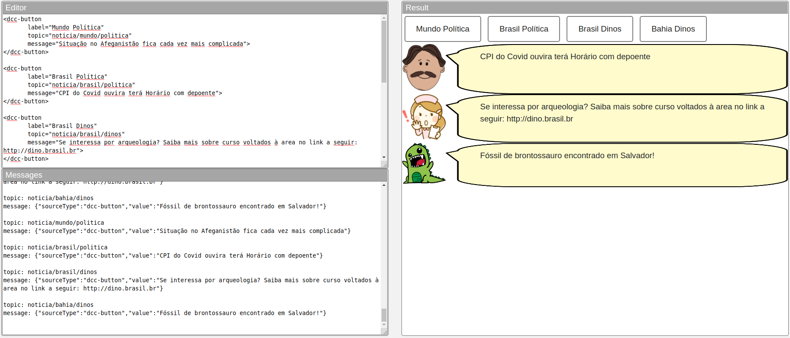
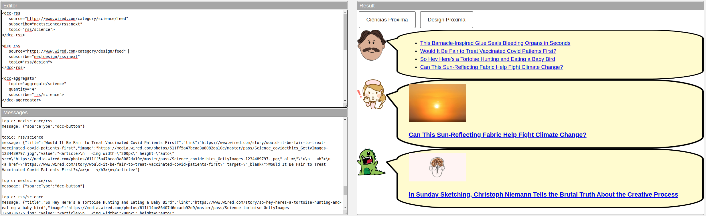
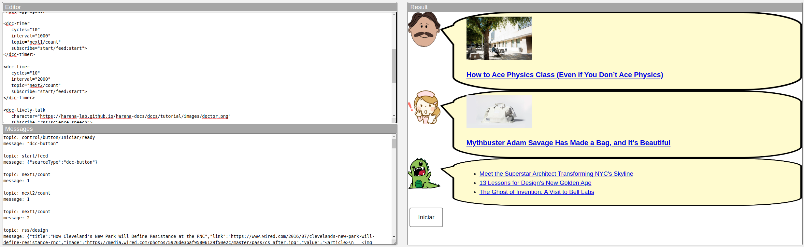

# Modelo para Apresentação do Lab04 - Componentes, Mensagens, Eventos e Barramento

Estrutura de pastas:

~~~
├── README.md  <- arquivo apresentando a tarefa
│
└── images     <- arquivos de imagens usadas no documento
~~~

# Aluno
* `Jose Octavio Vitoriano Martines Penna`

## Tarefa 1 - Web Components e Tópicos
>~~~html
><dcc-button 
>       label="Mundo Política" 
>       topic="noticia/mundo/politica" 
>       message="Situação no Afeganistão fica cada vez mais complicada">
></dcc-button>
>
><dcc-button 
>       label="Brasil Política" 
>       topic="noticia/brasil/politica" 
>       message="CPI do Covid ouvira terá Horário com depoente">
></dcc-button>
>
><dcc-button 
>       label="Brasil Dinos" 
>       topic="noticia/brasil/dinos" 
>       message="Se interessa por arqueologia? Saiba mais sobre curso voltados à area no link a seguir: http://dino.brasil.br">
></dcc-button>
>
><dcc-button 
>       label="Bahia Dinos" 
>       topic="noticia/bahia/dinos" 
>       message="Fóssil de brontossauro encontrado em Salvador!">
></dcc-button>
>
><dcc-lively-talk 
>     character="https://harena-lab.github.io/harena-docs/dccs/tutorial/images/doctor.png" 
>     subscribe="+/+/politica:speech">
></dcc-lively-talk>
>
><dcc-lively-talk 
>     character="https://harena-lab.github.io/harena-docs/dccs/tutorial/images/nurse.png" 
>     subscribe="+/brasil/#:speech">
></dcc-lively-talk>
>
><dcc-lively-talk
>     subscribe="#:speech">
></dcc-lively-talk>
>~~~

## Tarefa 2 - Web Components e RSS

>~~~html
><dcc-rss 
>   source="https://www.wired.com/category/science/feed" 
>   subscribe="nextscience/rss:next" 
>   topic="rss/science">
></dcc-rss>
>
><dcc-rss 
>   source="https://www.wired.com/category/design/feed" 
>   subscribe="nextdesign/rss:next" 
>   topic="rss/design">
></dcc-rss>
>
><dcc-aggregator 
>   topic="aggregate/science" 
>   quantity="4" 
>   subscribe="rss/science">
></dcc-aggregator>
>
><dcc-button 
>   label="Ciências Próxima" 
>   topic="nextscience/rss">
></dcc-button>
>
><dcc-button 
>   label="Design Próxima" 
>   topic="nextdesign/rss">
></dcc-button>
>
><dcc-lively-talk 
>   character="https://harena-lab.github.io/harena-docs/dccs/tutorial/images/doctor.png" 
>   subscribe="aggregate/science:speech">
></dcc-lively-talk>
>
><dcc-lively-talk 
>   character="https://harena-lab.github.io/harena-docs/dccs/tutorial/images/nurse.png" 
>   subscribe="rss/science:speech">
></dcc-lively-talk>
>
><dcc-lively-talk 
>   subscribe="rss/design:speech">
></dcc-lively-talk>
>~~~

## Tarefa 3 - Painéis de Mensagens com Timer

>~~~html
><dcc-rss 
>   source="https://www.wired.com/category/science/feed" 
>   subscribe="next1/count:next" 
>   topic="rss/science">
></dcc-rss>
>
><dcc-rss 
>   source="https://www.wired.com/category/design/feed" 
>   subscribe="next2/count:next" 
>   topic="rss/design">
></dcc-rss>
>
><dcc-aggregator 
>   topic="aggregate/all" 
>   quantity="3" 
>   subscribe="rss/#">
></dcc-aggregator>
>
><dcc-timer 
>   cycles="10" 
>   interval="1000" 
>   topic="next1/count" 
>   subscribe="start/feed:start">
></dcc-timer>
>
><dcc-timer 
>   cycles="10" 
>   interval="2000" 
>   topic="next2/count" 
>   subscribe="start/feed:start">
></dcc-timer>
>
><dcc-lively-talk 
>   character="https://harena-lab.github.io/harena-docs/dccs/tutorial/images/doctor.png" 
>   subscribe="rss/science:speech">
></dcc-lively-talk>
>
><dcc-lively-talk 
>   character="https://harena-lab.github.io/harena-docs/dccs/tutorial/images/nurse.png" 
>   subscribe="rss/design:speech">
></dcc-lively-talk>
>
><dcc-lively-talk 
>   subscribe="aggregate/all:speech">
></dcc-lively-talk>
>
><dcc-button 
>   label="Iniciar" 
>   topic="start/feed">
></dcc-button>
>~~~

