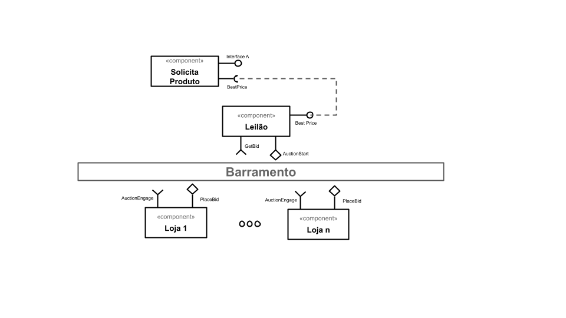
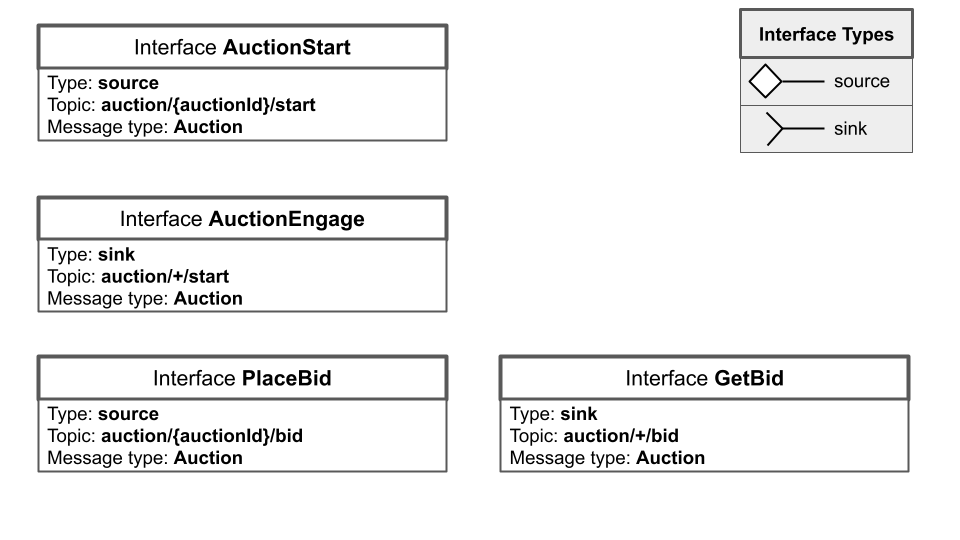
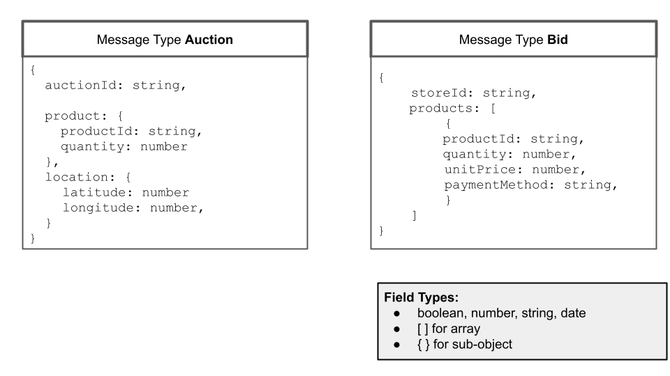

# Lab05 - Composição, Serviços e REST
 
# Aluno
* `Carlos Nihelton Santana de Oliveira`

# Bloco 1 - Diagramas relacionados com o Leilão Invertido

Componentes e barramento:

Interfaces:

Mensagens:

# Bloco 2 - Acesso REST via Jupyter

[Notebook desenvolvido para o bloco 2.](./notebook/lab5-tarefas.ipynb)
