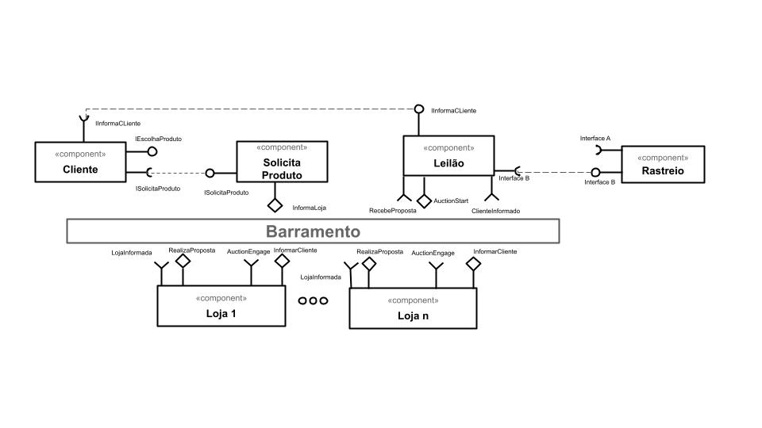
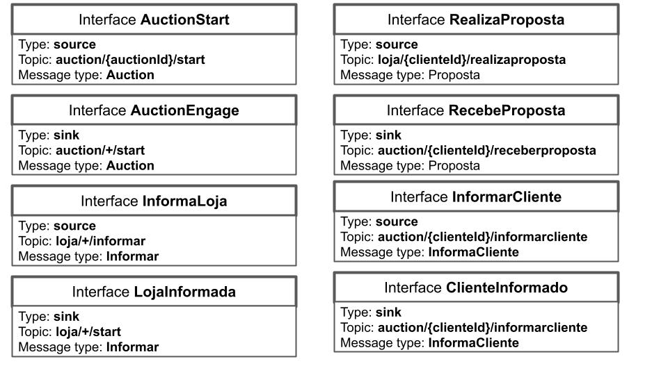
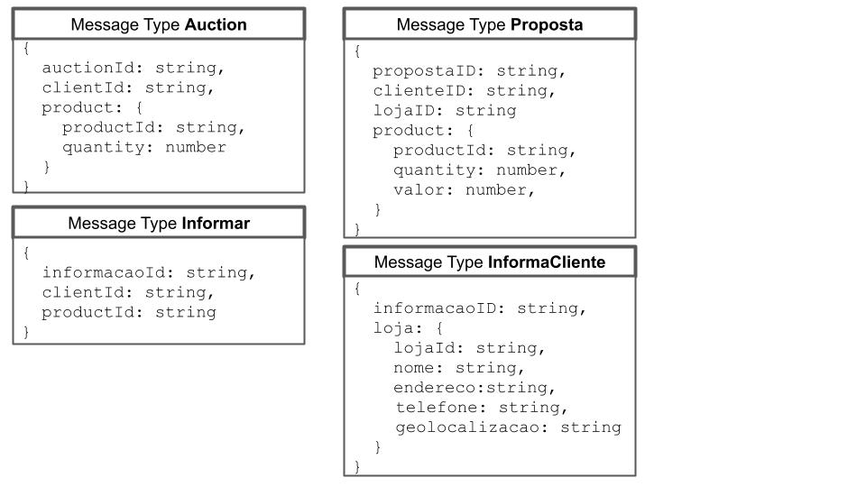

# Aluno
* `Leonardo Martins de Oliveira (ex150339)`

# Bloco 1 - Diagramas relacionados com Leilão Invertido

> * diagrama 1 - componentes e barramento

> * diagrama 2 - interface

> * diagrama 3 - mensagens

# Bloco 2 - Acesso REST via Jupyter

> Link para o arquivo: [clique aqui](notebook/lab5-tarefas.ipynb)
