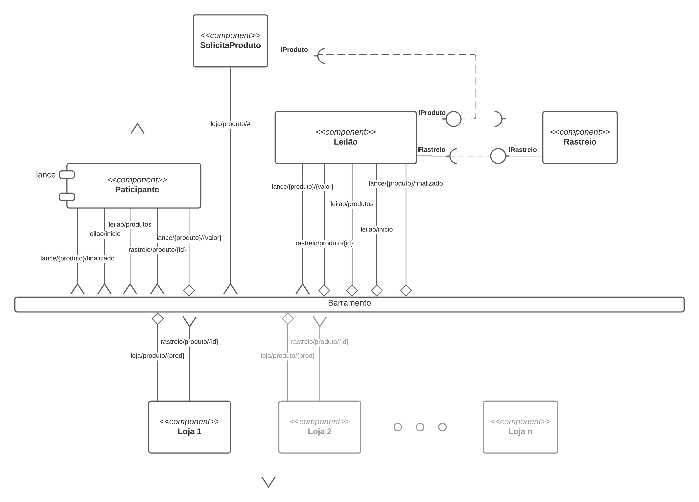
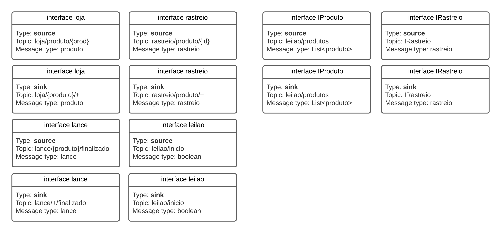
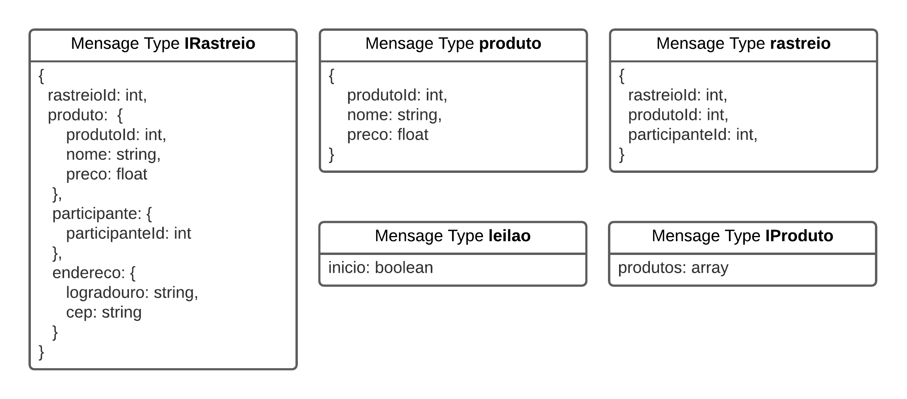

# Aluno
* `Paulo Sérgio do Nascimento RA.: ex150352`

# Bloco 1 - Diagramas relacionados com Leilão Invertido
>* diagrama 1 - Componentes e barramento

>* diagrama 2 - Interface

>* diagrama 3 - Mensagens

> Coloque as imagens PNG de (no mínimo) três diagramas:
> * diagrama 1 - componentes e barramento
> * diagrama 2 - interface
> * diagrama 3 - mensagens

# Bloco 2 - Acesso REST via Jupyter
> Link para o arquivo *.ipynb da tarefa 2: [tarefa2_lab5.ipynb](https://github.com/paulobazooka/component2learn/blob/master/labs/2021/05-services/solucoes/PauloSergioNascimento/notebook/tarefa2_lab5.ipynb) 
