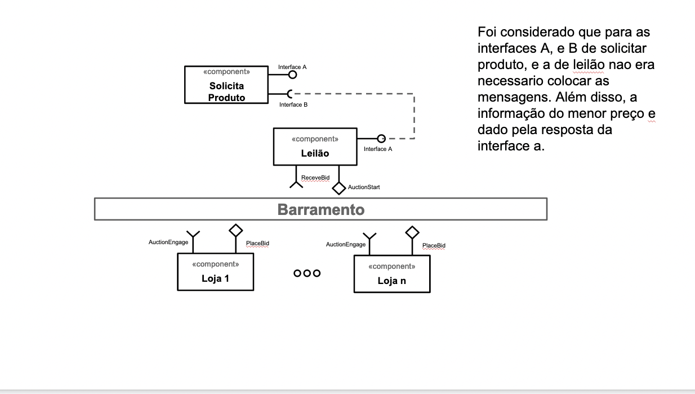
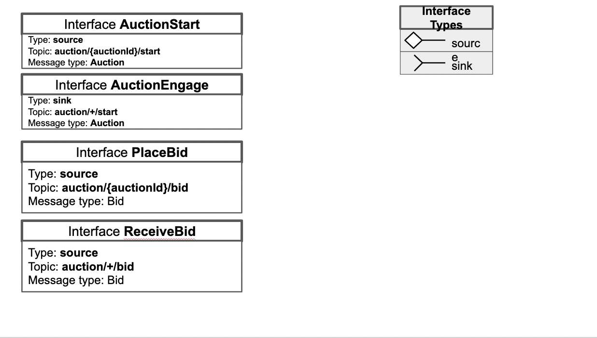
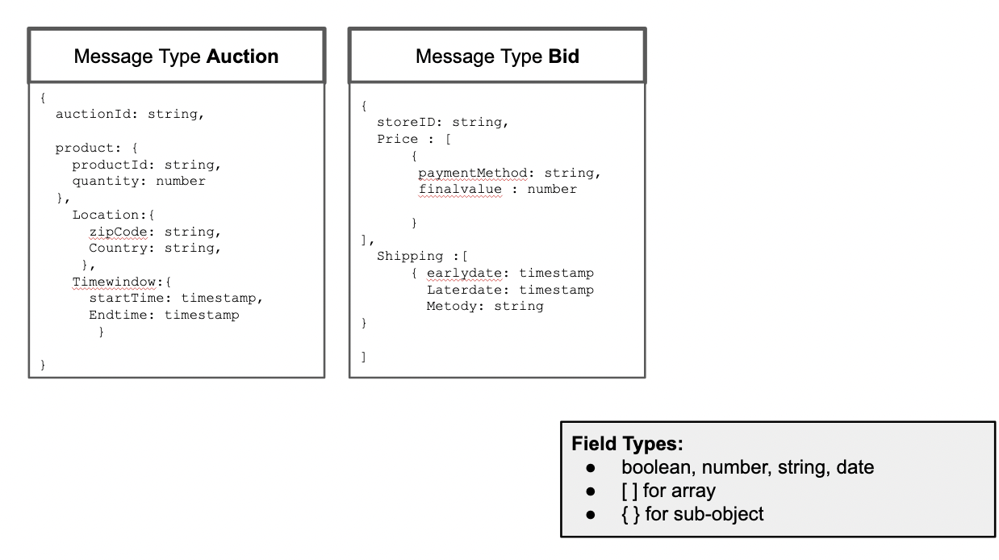

# Lab05 - Composição, Serviços e REST

Estrutura de pastas:

~~~
├── README.md  <- arquivo apresentando a tarefa
│
└── images     <- arquivos de imagens usadas no documento
│
└── notebook   <- arquivo do notebook
~~~

# Aluno
* `Rodrigo Leonel Sartorato>`

# Bloco 1 - Diagramas relacionados com Leilão Invertido

> 
> 
> 

# Bloco 2 - Acesso REST via Jupyter
> 
