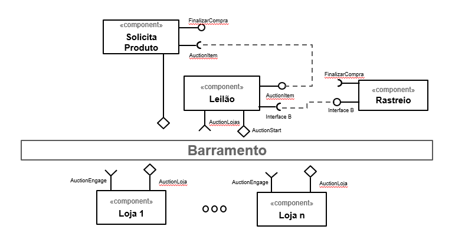
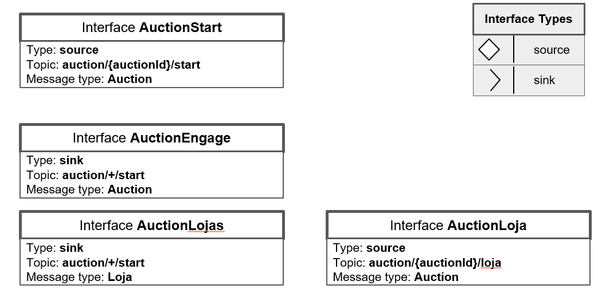
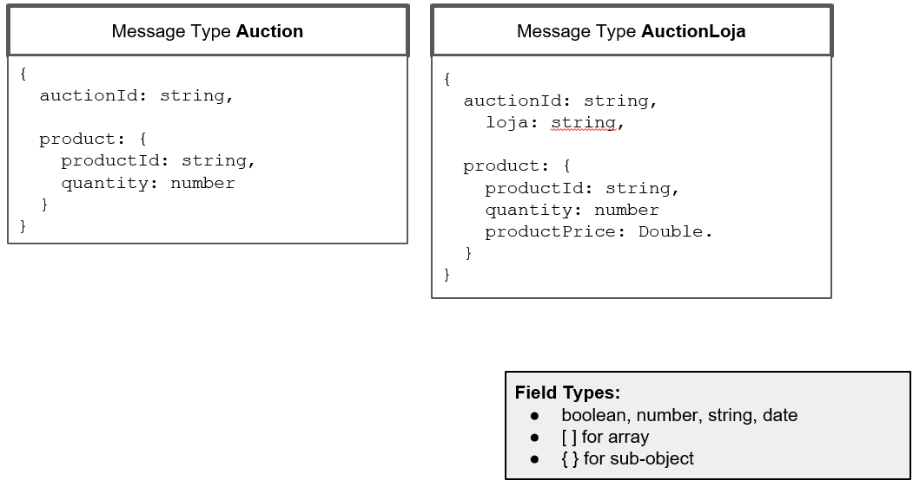

# Modelo para Apresentação do Lab05 - Composição, Serviços e REST

Estrutura de pastas:

~~~
├── README.md  <- arquivo apresentando a tarefa
│
└── images     <- arquivos de imagens usadas no documento
│
└── notebook   <- arquivo do notebook com a resolução das quatro tarefas
~~~

# Aluno
* `Byron Alejandro Acuña Acurio`

# Bloco 1 - Diagramas relacionados com Leilão Invertido

> * diagrama 1 - componentes e barramento

> * diagrama 2 - interface

> * diagrama 3 - mensagens

# Bloco 2 - Acesso REST via Jupyter

> Link para o arquivo do notebook com a resolução das quatro tarefas.
> [Link Notebook](https://github.com/byronacunia/component2learn/blob/master/labs/2021/05-services/solucoes/byronacunia/notebook/lab5-tarefas.ipynb).
